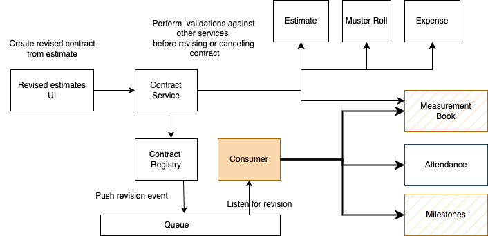

# Contracts

## Overview

The Contracts service allows users to enter, update, search and store functional details linked to works contracts.

## API Specifications

**Base path:**`/contracts`

### API Contract Link

API spec [YAML is here.](https://github.com/egovernments/DIGIT-Specs/blob/6884c3123172568af7b5edbaa5e50b17bafd99d4/Domain%20Services/Works/Contract-Service-v1.0.0.yaml) Click below to view it in Swagger Editor.

{% embed url="https://editor.swagger.io/?url=https://raw.githubusercontent.com/egovernments/DIGIT-Specs/6884c3123172568af7b5edbaa5e50b17bafd99d4/Domain%20Services/Works/Contract-Service-v1.0.0.yaml" %}

## High Level Design

#### Flow for revised contracts

<figure><figcaption>
High level design diagram
</figcaption></figure>

## Data Model&#x20;

### DB Schema Diagram

<figure><figcaption></figcaption></figure>

### Web Sequence Diagrams



<figure><figcaption></figcaption></figure>



<figure><figcaption></figcaption></figure>



<figure><figcaption></figcaption></figure>




#### Creation & Consumption Of Revised Contracts

Below are the sequence diagrams for the creation and consumption of revision contracts.&#x20;



<figure><figcaption></figcaption></figure>



<figure><figcaption></figcaption></figure>



## Related Topics

* [Functional specifications - Contracts](../../../functional-specifications/contracts.md)
* [Contracts module service configuration](../../../configuration/service-configuration/contract.md)
* [Contracts UI configuration - for MuktaSoft](../../../../programmes/muktasoft-v2.0/deployment/configuration/ui-configuration/drafts/contracts/)
* [Contracts employee user manual](../../../../programmes/muktasoft-v2.0/deployment/configuration/ui-configuration/drafts/contracts/contract-workflow.md) - for MuktaSoft
* [Contracts user stories](../../../../programmes/muktasoft-v2.0/specifications/functional-requirements/user-stories/work-order/) - for MuktaSoft
