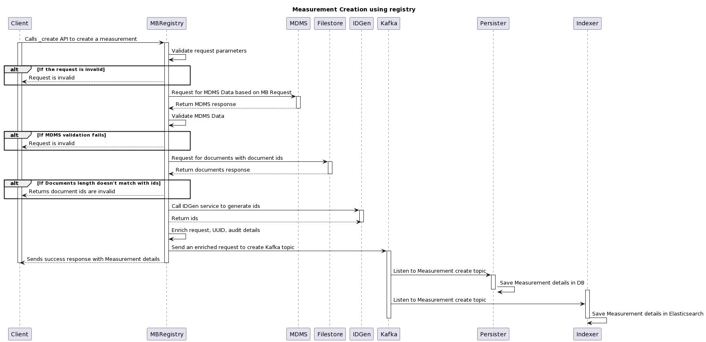
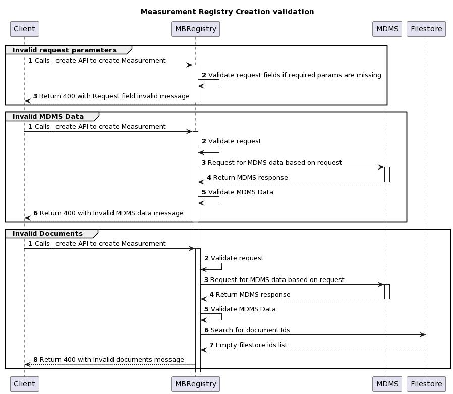
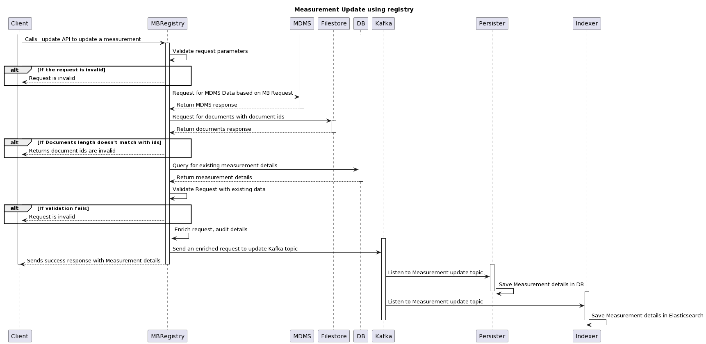
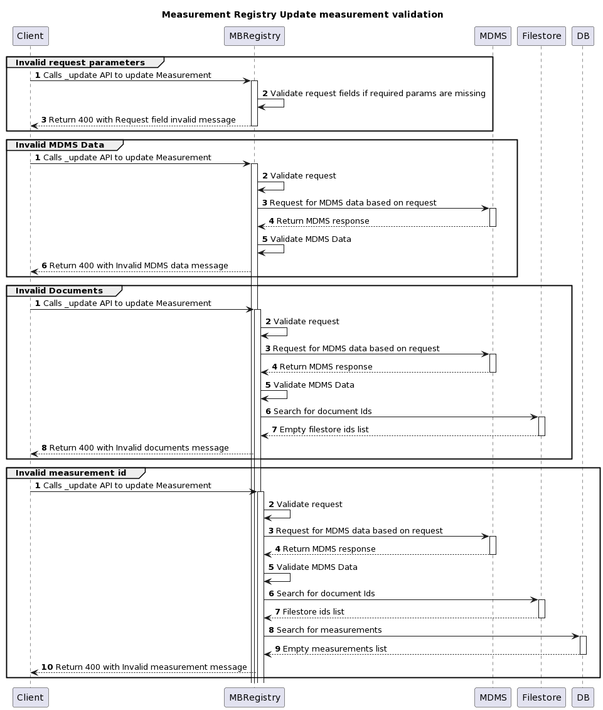
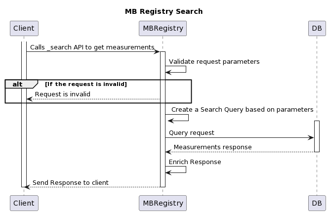
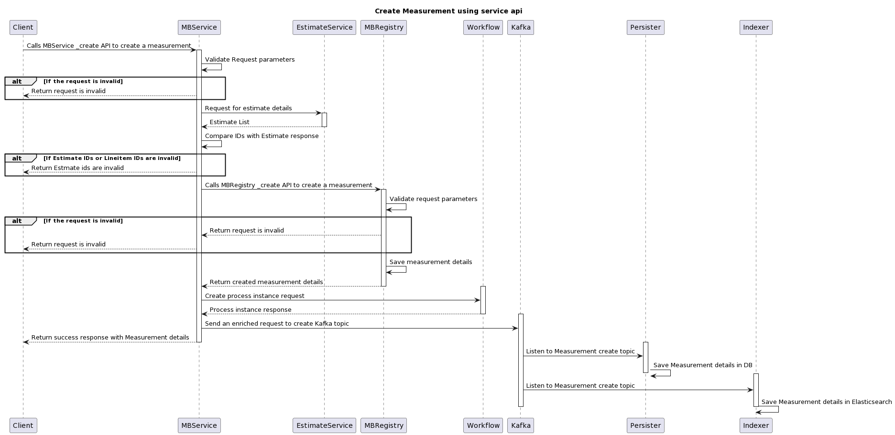
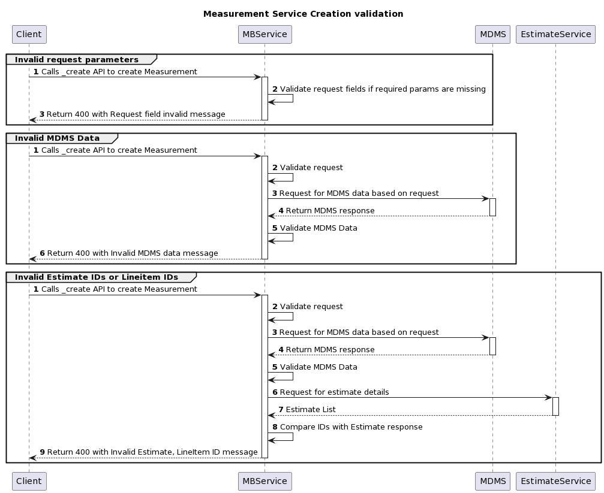
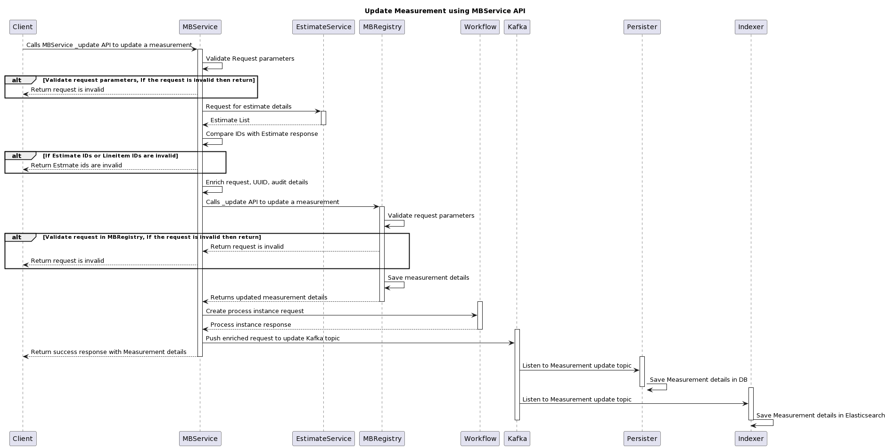

# Detailed Measurement Book

## Overview

The measurement book is a measure of progress in a Works contract.

## API Specifications

### API Contract Link

{% embed url="https://editor.swagger.io/?url=https://raw.githubusercontent.com/egovernments/DIGIT-Specs/works-v2/Domain%20Services/Works/Measurement-Book-v1.0.0.yaml" %}

### APIs


[Measurement-Book-v1.0.0.yaml](../../../../.gitbook/assets/Measurement-Book-v1.0.0.yaml)



[Measurement-Book-v1.0.0.yaml](../../../../.gitbook/assets/Measurement-Book-v1.0.0.yaml)



[Measurement-Book-v1.0.0 (1).yaml](<../../../../.gitbook/assets/Measurement-Book-v1.0.0 (1).yaml>)



[Measurement-Book-v1.0.0.yaml](../../../../.gitbook/assets/Measurement-Book-v1.0.0.yaml)



[Measurement-Book-v1.0.0.yaml](../../../../.gitbook/assets/Measurement-Book-v1.0.0.yaml)



[Measurement-Book-v1.0.0 (1).yaml](<../../../../.gitbook/assets/Measurement-Book-v1.0.0 (1).yaml>)


## Data Model&#x20;

### DB Schema Diagram

<figure><figcaption></figcaption></figure>

<figure><figcaption></figcaption></figure>

### Web Sequence Diagrams

#### Measurement Registry



<figure><figcaption></figcaption></figure>

<figure><figcaption></figcaption></figure>



<figure><figcaption></figcaption></figure>

<figure><figcaption></figcaption></figure>



<figure><figcaption></figcaption></figure>



#### Measurement Service



<figure><figcaption></figcaption></figure>

<figure><figcaption></figcaption></figure>



<figure><figcaption></figcaption></figure>



<figure><figcaption></figcaption></figure>



## Related Topics

1. [Functional Specifications - Measurement Book](../../../functional-specifications/measurements.md)
2. [Detailed Measurement Book User Stories](../../../../programmes/muktasoft-v2.0/specifications/functional-requirements/user-stories/detailed-mb/)
3. [Measurement Book UI Configuration](../../../../programmes/muktasoft-v2.0/deployment/configuration/ui-configuration/modules/measurement.md)
