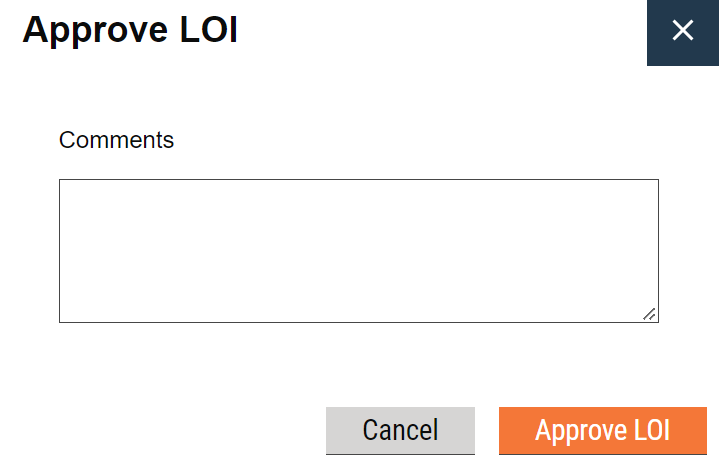

# LOI Workflow

\-> An LOI workflow looks like this

<figure><figcaption><p>LOI Workflow Diagram</p></figcaption></figure>

\-> Once the LOIs are created they will move to the respective approver's inbox as pending items.

<figure><figcaption><p>LOI Inbox</p></figcaption></figure>

#### View LOI

Clicking on the LOI number(1st column) will open the View LOI page on which the user can take available actions according to the state of the workflow the current application is in.

<figure><figcaption><p>View LOI Screen</p></figcaption></figure>

Current State of an application is returned from the processInstance search API of the workflow service. Sample processInstance object is given below


```json
{
    "ResponseInfo": null,
    "ProcessInstances": [
        {
            "id": "e6946bb2-8529-4132-93f7-0cb4a3bfed58",
            "tenantId": "pb.amritsar",
            "businessService": "loi-approval-4",
            "businessId": "LI/2022-23/10/000082",
            "action": "APPROVE",
            "moduleName": "loi-service",
            "state": {
                "auditDetails": null,
                "uuid": "375fcf31-a437-4df6-9ee0-2f751a025a05",
                "tenantId": "pb",
                "businessServiceId": "2e0930a0-cc58-44fe-a424-a0cc85e17c5a",
                "sla": null,
                "state": "APPROVED",
                "applicationStatus": "APPROVED",
                "docUploadRequired": false,
                "isStartState": false,
                "isTerminateState": true,
                "isStateUpdatable": null,
                "actions": null
            },
            "comment": "approving this",
            "documents": null,
            "assigner": {
                "id": 109,
                "userName": "Nipsyyyy",
                "name": "Nipun ",
                "type": "EMPLOYEE",
                "mobileNumber": "9667076655",
                "emailId": "",
                "roles": [
                    {
                        "id": null,
                        "name": "LOI APPROVER",
                        "code": "LOI_APPROVER",
                        "tenantId": "pb.amritsar"
                    },
                    {
                        "id": null,
                        "name": "EST_CHECKER",
                        "code": "EST_CHECKER",
                        "tenantId": "pb.amritsar"
                    },
                    {
                        "id": null,
                        "name": "EST CREATOR",
                        "code": "EST_CREATOR",
                        "tenantId": "pb.amritsar"
                    },
                    {
                        "id": null,
                        "name": "Employee",
                        "code": "EMPLOYEE",
                        "tenantId": "pb.amritsar"
                    },
                    {
                        "id": null,
                        "name": "EST TECH SANC",
                        "code": "EST_TECH_SANC",
                        "tenantId": "pb.amritsar"
                    },
                    {
                        "id": null,
                        "name": "LOI CREATOR",
                        "code": "LOI_CREATOR",
                        "tenantId": "pb.amritsar"
                    },
                    {
                        "id": null,
                        "name": "EST FIN SANC",
                        "code": "EST_FIN_SANC",
                        "tenantId": "pb.amritsar"
                    },
                    {
                        "id": null,
                        "name": "EST TECH SANC",
                        "code": "EST_ADMIN_SANC",
                        "tenantId": "pb.amritsar"
                    },
                    {
                        "id": null,
                        "name": "SUPER USER",
                        "code": "SUPERUSER",
                        "tenantId": "pb.amritsar"
                    },
                    {
                        "id": null,
                        "name": "LOI CHECKER",
                        "code": "LOI_CHECKER",
                        "tenantId": "pb.amritsar"
                    },
                    {
                        "id": null,
                        "name": "HRMS Admin",
                        "code": "HRMS_ADMIN",
                        "tenantId": "pb.amritsar"
                    }
                ],
                "tenantId": "pb.amritsar",
                "uuid": "be99b2c2-5780-4b1c-8e41-e3f8a972ebda"
            },
            "assignes": null,
            "nextActions": [],
            "stateSla": null,
            "businesssServiceSla": -2323547439,
            "previousStatus": null,
            "entity": null,
            "auditDetails": {
                "createdBy": "be99b2c2-5780-4b1c-8e41-e3f8a972ebda",
                "lastModifiedBy": "be99b2c2-5780-4b1c-8e41-e3f8a972ebda",
                "createdTime": 1665046997988,
                "lastModifiedTime": 1665046997988
            },
            "rating": 0,
            "escalated": false
        },
        {
            "id": "383cfc44-ee6a-45d9-84fd-f2928462ef1c",
            "tenantId": "pb.amritsar",
            "businessService": "loi-approval-4",
            "businessId": "LI/2022-23/10/000082",
            "action": "CHECK",
            "moduleName": "loi-service",
            "state": {
                "auditDetails": null,
                "uuid": "f0bc2eeb-fed7-41e9-a904-5fe0a74db70a",
                "tenantId": "pb",
                "businessServiceId": "2e0930a0-cc58-44fe-a424-a0cc85e17c5a",
                "sla": null,
                "state": "CHECKED",
                "applicationStatus": "CHECKED",
                "docUploadRequired": false,
                "isStartState": false,
                "isTerminateState": false,
                "isStateUpdatable": null,
                "actions": [
                    {
                        "auditDetails": null,
                        "uuid": "d588b2ee-4368-45c1-be05-988d5aa228d3",
                        "tenantId": "pb",
                        "currentState": "f0bc2eeb-fed7-41e9-a904-5fe0a74db70a",
                        "action": "REJECT",
                        "nextState": "ba94ea03-3b19-43e8-bddb-675b5a8a8dca",
                        "roles": [
                            "LOI_APPROVER"
                        ],
                        "active": null
                    },
                    {
                        "auditDetails": null,
                        "uuid": "587352b9-0561-4ddf-aaee-dd3f718dc767",
                        "tenantId": "pb",
                        "currentState": "f0bc2eeb-fed7-41e9-a904-5fe0a74db70a",
                        "action": "APPROVE",
                        "nextState": "375fcf31-a437-4df6-9ee0-2f751a025a05",
                        "roles": [
                            "LOI_APPROVER"
                        ],
                        "active": null
                    }
                ]
            },
            "comment": "checking and forwarding",
            "documents": null,
            "assigner": {
                "id": 109,
                "userName": "Nipsyyyy",
                "name": "Nipun ",
                "type": "EMPLOYEE",
                "mobileNumber": "9667076655",
                "emailId": "",
                "roles": [
                    {
                        "id": null,
                        "name": "LOI APPROVER",
                        "code": "LOI_APPROVER",
                        "tenantId": "pb.amritsar"
                    },
                    {
                        "id": null,
                        "name": "EST_CHECKER",
                        "code": "EST_CHECKER",
                        "tenantId": "pb.amritsar"
                    },
                    {
                        "id": null,
                        "name": "EST CREATOR",
                        "code": "EST_CREATOR",
                        "tenantId": "pb.amritsar"
                    },
                    {
                        "id": null,
                        "name": "Employee",
                        "code": "EMPLOYEE",
                        "tenantId": "pb.amritsar"
                    },
                    {
                        "id": null,
                        "name": "EST TECH SANC",
                        "code": "EST_TECH_SANC",
                        "tenantId": "pb.amritsar"
                    },
                    {
                        "id": null,
                        "name": "LOI CREATOR",
                        "code": "LOI_CREATOR",
                        "tenantId": "pb.amritsar"
                    },
                    {
                        "id": null,
                        "name": "EST FIN SANC",
                        "code": "EST_FIN_SANC",
                        "tenantId": "pb.amritsar"
                    },
                    {
                        "id": null,
                        "name": "EST TECH SANC",
                        "code": "EST_ADMIN_SANC",
                        "tenantId": "pb.amritsar"
                    },
                    {
                        "id": null,
                        "name": "SUPER USER",
                        "code": "SUPERUSER",
                        "tenantId": "pb.amritsar"
                    },
                    {
                        "id": null,
                        "name": "LOI CHECKER",
                        "code": "LOI_CHECKER",
                        "tenantId": "pb.amritsar"
                    },
                    {
                        "id": null,
                        "name": "HRMS Admin",
                        "code": "HRMS_ADMIN",
                        "tenantId": "pb.amritsar"
                    }
                ],
                "tenantId": "pb.amritsar",
                "uuid": "be99b2c2-5780-4b1c-8e41-e3f8a972ebda"
            },
            "assignes": [
                {
                    "id": 109,
                    "userName": "Nipsyyyy",
                    "name": "Nipun ",
                    "type": "EMPLOYEE",
                    "mobileNumber": "9667076655",
                    "emailId": "",
                    "roles": [
                        {
                            "id": null,
                            "name": "LOI APPROVER",
                            "code": "LOI_APPROVER",
                            "tenantId": "pb.amritsar"
                        },
                        {
                            "id": null,
                            "name": "EST_CHECKER",
                            "code": "EST_CHECKER",
                            "tenantId": "pb.amritsar"
                        },
                        {
                            "id": null,
                            "name": "EST CREATOR",
                            "code": "EST_CREATOR",
                            "tenantId": "pb.amritsar"
                        },
                        {
                            "id": null,
                            "name": "Employee",
                            "code": "EMPLOYEE",
                            "tenantId": "pb.amritsar"
                        },
                        {
                            "id": null,
                            "name": "EST TECH SANC",
                            "code": "EST_TECH_SANC",
                            "tenantId": "pb.amritsar"
                        },
                        {
                            "id": null,
                            "name": "LOI CREATOR",
                            "code": "LOI_CREATOR",
                            "tenantId": "pb.amritsar"
                        },
                        {
                            "id": null,
                            "name": "EST FIN SANC",
                            "code": "EST_FIN_SANC",
                            "tenantId": "pb.amritsar"
                        },
                        {
                            "id": null,
                            "name": "EST TECH SANC",
                            "code": "EST_ADMIN_SANC",
                            "tenantId": "pb.amritsar"
                        },
                        {
                            "id": null,
                            "name": "SUPER USER",
                            "code": "SUPERUSER",
                            "tenantId": "pb.amritsar"
                        },
                        {
                            "id": null,
                            "name": "LOI CHECKER",
                            "code": "LOI_CHECKER",
                            "tenantId": "pb.amritsar"
                        },
                        {
                            "id": null,
                            "name": "HRMS Admin",
                            "code": "HRMS_ADMIN",
                            "tenantId": "pb.amritsar"
                        }
                    ],
                    "tenantId": "pb.amritsar",
                    "uuid": "be99b2c2-5780-4b1c-8e41-e3f8a972ebda"
                }
            ],
            "nextActions": [
                {
                    "auditDetails": null,
                    "uuid": "587352b9-0561-4ddf-aaee-dd3f718dc767",
                    "tenantId": "pb",
                    "currentState": "f0bc2eeb-fed7-41e9-a904-5fe0a74db70a",
                    "action": "APPROVE",
                    "nextState": "375fcf31-a437-4df6-9ee0-2f751a025a05",
                    "roles": [
                        "LOI_APPROVER"
                    ],
                    "active": null
                },
                {
                    "auditDetails": null,
                    "uuid": "d588b2ee-4368-45c1-be05-988d5aa228d3",
                    "tenantId": "pb",
                    "currentState": "f0bc2eeb-fed7-41e9-a904-5fe0a74db70a",
                    "action": "REJECT",
                    "nextState": "ba94ea03-3b19-43e8-bddb-675b5a8a8dca",
                    "roles": [
                        "LOI_APPROVER"
                    ],
                    "active": null
                }
            ],
            "stateSla": null,
            "businesssServiceSla": -2323547439,
            "previousStatus": null,
            "entity": null,
            "auditDetails": {
                "createdBy": "be99b2c2-5780-4b1c-8e41-e3f8a972ebda",
                "lastModifiedBy": "be99b2c2-5780-4b1c-8e41-e3f8a972ebda",
                "createdTime": 1665046890712,
                "lastModifiedTime": 1665046890712
            },
            "rating": 0,
            "escalated": false
        },
        {
            "id": "6ba9e4ea-d82a-45e7-8d3a-097f0269e662",
            "tenantId": "pb.amritsar",
            "businessService": "loi-approval-4",
            "businessId": "LI/2022-23/10/000082",
            "action": "CREATE",
            "moduleName": "loi-service",
            "state": {
                "auditDetails": null,
                "uuid": "dff84f2b-b1df-4cba-af4b-2bada0eb360a",
                "tenantId": "pb",
                "businessServiceId": "2e0930a0-cc58-44fe-a424-a0cc85e17c5a",
                "sla": null,
                "state": "CREATED",
                "applicationStatus": "CREATED",
                "docUploadRequired": false,
                "isStartState": false,
                "isTerminateState": false,
                "isStateUpdatable": null,
                "actions": [
                    {
                        "auditDetails": null,
                        "uuid": "b7381c9e-8eb2-48de-acb1-ebfb54ad368a",
                        "tenantId": "pb",
                        "currentState": "dff84f2b-b1df-4cba-af4b-2bada0eb360a",
                        "action": "REJECT",
                        "nextState": "ba94ea03-3b19-43e8-bddb-675b5a8a8dca",
                        "roles": [
                            "LOI_CHECKER"
                        ],
                        "active": null
                    },
                    {
                        "auditDetails": null,
                        "uuid": "be68d45f-4439-421b-bfaf-cb9020dc768c",
                        "tenantId": "pb",
                        "currentState": "dff84f2b-b1df-4cba-af4b-2bada0eb360a",
                        "action": "CHECK",
                        "nextState": "f0bc2eeb-fed7-41e9-a904-5fe0a74db70a",
                        "roles": [
                            "LOI_CHECKER"
                        ],
                        "active": null
                    }
                ]
            },
            "comment": "sdljkf",
            "documents": null,
            "assigner": {
                "id": 109,
                "userName": "Nipsyyyy",
                "name": "Nipun ",
                "type": "EMPLOYEE",
                "mobileNumber": "9667076655",
                "emailId": "",
                "roles": [
                    {
                        "id": null,
                        "name": "LOI APPROVER",
                        "code": "LOI_APPROVER",
                        "tenantId": "pb.amritsar"
                    },
                    {
                        "id": null,
                        "name": "EST_CHECKER",
                        "code": "EST_CHECKER",
                        "tenantId": "pb.amritsar"
                    },
                    {
                        "id": null,
                        "name": "EST CREATOR",
                        "code": "EST_CREATOR",
                        "tenantId": "pb.amritsar"
                    },
                    {
                        "id": null,
                        "name": "Employee",
                        "code": "EMPLOYEE",
                        "tenantId": "pb.amritsar"
                    },
                    {
                        "id": null,
                        "name": "EST TECH SANC",
                        "code": "EST_TECH_SANC",
                        "tenantId": "pb.amritsar"
                    },
                    {
                        "id": null,
                        "name": "LOI CREATOR",
                        "code": "LOI_CREATOR",
                        "tenantId": "pb.amritsar"
                    },
                    {
                        "id": null,
                        "name": "EST FIN SANC",
                        "code": "EST_FIN_SANC",
                        "tenantId": "pb.amritsar"
                    },
                    {
                        "id": null,
                        "name": "EST TECH SANC",
                        "code": "EST_ADMIN_SANC",
                        "tenantId": "pb.amritsar"
                    },
                    {
                        "id": null,
                        "name": "SUPER USER",
                        "code": "SUPERUSER",
                        "tenantId": "pb.amritsar"
                    },
                    {
                        "id": null,
                        "name": "LOI CHECKER",
                        "code": "LOI_CHECKER",
                        "tenantId": "pb.amritsar"
                    },
                    {
                        "id": null,
                        "name": "HRMS Admin",
                        "code": "HRMS_ADMIN",
                        "tenantId": "pb.amritsar"
                    }
                ],
                "tenantId": "pb.amritsar",
                "uuid": "be99b2c2-5780-4b1c-8e41-e3f8a972ebda"
            },
            "assignes": [
                {
                    "id": 109,
                    "userName": "Nipsyyyy",
                    "name": "Nipun ",
                    "type": "EMPLOYEE",
                    "mobileNumber": "9667076655",
                    "emailId": "",
                    "roles": [
                        {
                            "id": null,
                            "name": "LOI APPROVER",
                            "code": "LOI_APPROVER",
                            "tenantId": "pb.amritsar"
                        },
                        {
                            "id": null,
                            "name": "EST_CHECKER",
                            "code": "EST_CHECKER",
                            "tenantId": "pb.amritsar"
                        },
                        {
                            "id": null,
                            "name": "EST CREATOR",
                            "code": "EST_CREATOR",
                            "tenantId": "pb.amritsar"
                        },
                        {
                            "id": null,
                            "name": "Employee",
                            "code": "EMPLOYEE",
                            "tenantId": "pb.amritsar"
                        },
                        {
                            "id": null,
                            "name": "EST TECH SANC",
                            "code": "EST_TECH_SANC",
                            "tenantId": "pb.amritsar"
                        },
                        {
                            "id": null,
                            "name": "LOI CREATOR",
                            "code": "LOI_CREATOR",
                            "tenantId": "pb.amritsar"
                        },
                        {
                            "id": null,
                            "name": "EST FIN SANC",
                            "code": "EST_FIN_SANC",
                            "tenantId": "pb.amritsar"
                        },
                        {
                            "id": null,
                            "name": "EST TECH SANC",
                            "code": "EST_ADMIN_SANC",
                            "tenantId": "pb.amritsar"
                        },
                        {
                            "id": null,
                            "name": "SUPER USER",
                            "code": "SUPERUSER",
                            "tenantId": "pb.amritsar"
                        },
                        {
                            "id": null,
                            "name": "LOI CHECKER",
                            "code": "LOI_CHECKER",
                            "tenantId": "pb.amritsar"
                        },
                        {
                            "id": null,
                            "name": "HRMS Admin",
                            "code": "HRMS_ADMIN",
                            "tenantId": "pb.amritsar"
                        }
                    ],
                    "tenantId": "pb.amritsar",
                    "uuid": "be99b2c2-5780-4b1c-8e41-e3f8a972ebda"
                }
            ],
            "nextActions": [
                {
                    "auditDetails": null,
                    "uuid": "be68d45f-4439-421b-bfaf-cb9020dc768c",
                    "tenantId": "pb",
                    "currentState": "dff84f2b-b1df-4cba-af4b-2bada0eb360a",
                    "action": "CHECK",
                    "nextState": "f0bc2eeb-fed7-41e9-a904-5fe0a74db70a",
                    "roles": [
                        "LOI_CHECKER"
                    ],
                    "active": null
                },
                {
                    "auditDetails": null,
                    "uuid": "b7381c9e-8eb2-48de-acb1-ebfb54ad368a",
                    "tenantId": "pb",
                    "currentState": "dff84f2b-b1df-4cba-af4b-2bada0eb360a",
                    "action": "REJECT",
                    "nextState": "ba94ea03-3b19-43e8-bddb-675b5a8a8dca",
                    "roles": [
                        "LOI_CHECKER"
                    ],
                    "active": null
                }
            ],
            "stateSla": null,
            "businesssServiceSla": -2323547439,
            "previousStatus": null,
            "entity": null,
            "auditDetails": {
                "createdBy": "be99b2c2-5780-4b1c-8e41-e3f8a972ebda",
                "lastModifiedBy": "be99b2c2-5780-4b1c-8e41-e3f8a972ebda",
                "createdTime": 1665044939467,
                "lastModifiedTime": 1665044939467
            },
            "rating": 0,
            "escalated": false
        }
    ],
    "totalCount": 0
}
```


#### Sample Curl to fetch ProcessInstance


```json
curl --location --request POST 'http://works-dev.digit.org/egov-workflow-v2/egov-wf/process/_search?tenantId=pb.amritsar&businessIds=LI/2022-23/10/000082&history=true' \
--header 'authority: qa.digit.org' \
--header 'accept: application/json, text/plain, */*' \
--header 'accept-language: en-US,en;q=0.9' \
--header 'content-type: application/json;charset=UTF-8' \
--header 'origin: https://qa.digit.org' \
--header 'referer: https://qa.digit.org/digit-ui/employee/pt/applicationsearch/application-details/PB-PT-2022-09-20-028556' \
--header 'sec-ch-ua: "Google Chrome";v="105", "Not)A;Brand";v="8", "Chromium";v="105"' \
--header 'sec-ch-ua-mobile: ?0' \
--header 'sec-ch-ua-platform: "Windows"' \
--header 'sec-fetch-dest: empty' \
--header 'sec-fetch-mode: cors' \
--header 'sec-fetch-site: same-origin' \
--header 'user-agent: Mozilla/5.0 (Windows NT 10.0; Win64; x64) AppleWebKit/537.36 (KHTML, like Gecko) Chrome/105.0.0.0 Safari/537.36' \
--data-raw '{
    "RequestInfo": {
        "apiId": "Rainmaker",
        "authToken": "89183437-3cf6-45b2-8b17-dd60639ca069",
        "msgId": "1663926782107|en_IN",
        "plainAccessRequest": {}
    }
}'
```


### Taking Actions on LOI

An Action bar on the View LOI Screen shows the list of actions available. When any action is clicked respective popup is rendered according to the selected action. We have created three popups for approve, forward and reject. They are shown below

<figure><figcaption><p>Forward LOI</p></figcaption></figure>

<figure><figcaption><p>Reject LOI</p></figcaption></figure>

<figure><figcaption><p>Approve LOI</p></figcaption></figure>

When these popups are submitted, Update LOI API is called containing the relevant updates in the workflow object contained in request body. LOI service internally calls the workflow service and updates the status of application.

#### Sample Curls for Update LOI

```json
curl 'http://localhost:3000/loi-service/v1/_update' \
  -H 'Accept: application/json, text/plain, */*' \
  -H 'Accept-Language: en-US,en;q=0.9' \
  -H 'Connection: keep-alive' \
  -H 'Content-Type: application/json;charset=UTF-8' \
  -H 'Origin: http://localhost:3000' \
  -H 'Referer: http://localhost:3000/works-ui/employee/works/view-loi?loiNumber=LI/2022-23/11/000111&subEstimateNumber=EP/2022-23/09/000092/000068' \
  -H 'Sec-Fetch-Dest: empty' \
  -H 'Sec-Fetch-Mode: cors' \
  -H 'Sec-Fetch-Site: same-origin' \
  -H 'User-Agent: Mozilla/5.0 (Windows NT 10.0; Win64; x64) AppleWebKit/537.36 (KHTML, like Gecko) Chrome/107.0.0.0 Safari/537.36' \
  -H 'sec-ch-ua: "Google Chrome";v="107", "Chromium";v="107", "Not=A?Brand";v="24"' \
  -H 'sec-ch-ua-mobile: ?0' \
  -H 'sec-ch-ua-platform: "Windows"' \
  --data-raw '{"letterOfIndent":{"tenantId":"pb.amritsar","id":"4d5f9312-7dce-359b-b201-ec1ad851afc6","letterOfIndentNumber":"LI/2022-23/11/000111","workPackageNumber":null,"workIdentificationNumber":"123423","fileNumber":"32423","fileDate":1672511399000,"negotiatedPercentage":3,"agreementDate":1640975399000,"contractorId":"324","securityDeposit":324,"bankGuarantee":"432","emdAmount":123,"contractPeriod":32,"defectLiabilityPeriod":12,"oicId":"378fa4ea-2567-39ec-8173-108299e1cb0a","status":"DRAFT","letterStatus":"CREATED","auditDetails":{"createdBy":"be99b2c2-5780-4b1c-8e41-e3f8a972ebda","lastModifiedBy":"be99b2c2-5780-4b1c-8e41-e3f8a972ebda","createdTime":1667803535690,"lastModifiedTime":1667803535690},"additionalDetails":{"formData":[{"amount":12312,"CreatedBy":"Nipun"}]}},"workflow":{"action":"APPROVE","comment":""},"RequestInfo":{"apiId":"Rainmaker","authToken":"89183437-3cf6-45b2-8b17-dd60639ca069","userInfo":{"id":109,"uuid":"be99b2c2-5780-4b1c-8e41-e3f8a972ebda","userName":"Nipsyyyy","name":"Nipun ","mobileNumber":"9667076655","emailId":"","locale":null,"type":"EMPLOYEE","roles":[{"name":"Employee","code":"EMPLOYEE","tenantId":"pb.amritsar"},{"name":"EST CREATOR","code":"EST_CREATOR","tenantId":"pb.amritsar"},{"name":"EST_CHECKER","code":"EST_CHECKER","tenantId":"pb.amritsar"},{"name":"LOI APPROVER","code":"LOI_APPROVER","tenantId":"pb.amritsar"},{"name":"EST TECH SANC","code":"EST_TECH_SANC","tenantId":"pb.amritsar"},{"name":"EST FIN SANC","code":"EST_FIN_SANC","tenantId":"pb.amritsar"},{"name":"LOI CREATOR","code":"LOI_CREATOR","tenantId":"pb.amritsar"},{"name":"SUPER USER","code":"SUPERUSER","tenantId":"pb.amritsar"},{"name":"EST TECH SANC","code":"EST_ADMIN_SANC","tenantId":"pb.amritsar"},{"name":"LOI CHECKER","code":"LOI_CHECKER","tenantId":"pb.amritsar"},{"name":"HRMS Admin","code":"HRMS_ADMIN","tenantId":"pb.amritsar"}],"active":true,"tenantId":"pb.amritsar","permanentCity":"Amritsar"},"msgId":"1667803796298|en_IN","plainAccessRequest":{}}}' \
  --compressed
```

> Note -> Users must have the respective roles for taking actions on the LOIs. Otherwise the Action Bar will not be visible. And users can only take actions on the applications assigned to them.
>
>

#### Response Screen

Upon successful update a response screen is displayed as follows

<figure><figcaption><p>Response</p></figcaption></figure>

### Role-Action Mapping

| Action  | Role          | Action Id |
| ------- | ------------- | --------- |
| Forward | LOI\_CHECKER  | 24        |
| Approve | LOI\_APPROVER | 20        |

Refer these mdms files for role-action mapping


Actions test



role actions


