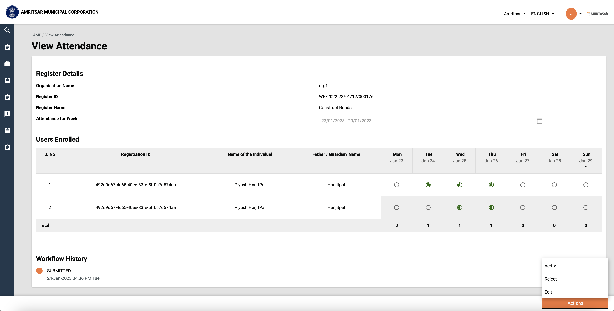

# Modify Attendance

**Objective:** To view and modify the attendance days and perform various actions like verify, reject and approve based on roles.

## Workflow Details

Users can navigate to this screen by clicking on the muster roll id on the inbox page.&#x20;

<figure><figcaption><p>View Attendance Screen</p></figcaption></figure>

Initially, the muster has '_**Submitted**_' status. Junior Engineer can view, Edit, Verify and Reject the Attendance.

* **Verify**: Clicking on the ‘Verify’ action button verifies the existing muster and the user is redirected to the success page
*   **Edit**: Clicking on the ‘Edit’ action button displays the extra details in the table. The working days can be edited. Based on that ‘Modified Amount’ is updated dynamically.


    <figure><figcaption><p>View Attendance in Edit mode</p></figcaption></figure>

    As soon as the user updates anything ‘_Action_’ button changes to the ‘_Save_’ button. On click of Save, muster is verified with updated details and the user is redirected to the success page. &#x20;

    <figure><figcaption><p>Attendance Verified Success Screen</p></figcaption></figure>


*   **Reject:** Clicking on the ‘Reject’ action displays a popup where the user can provide any comments and reject the muster.           &#x20;

    <figure><figcaption><p>Attendance Reject Modal</p></figcaption></figure>

    On 'Confirm Reject', muster will be rejected and the user will be redirected to the success page.

    <figure><figcaption><p>Attendance Rejected Success Screen</p></figcaption></figure>


The municipal Engineer can view, Approve, and Reject the attendance which is verified by Junior Engineer

*   **Approve:** Clicking on the ‘Approve action displays a popup where the user can provide any comments and approve the muster.&#x20;

    <figure><figcaption><p>Attendance Approve Modal</p></figcaption></figure>

    On 'Approve Attendance', the muster will be approved and the user will be redirected to the success page.&#x20;

    <figure><figcaption><p>Attendance Approved Success Screen</p></figcaption></figure>


* The municipal Engineer can also reject the attendance verified by Jr Engineer by clicking on the 'Reject' action.

## Technical Implementation Details

Modify attendance technical implementation where all actions are handled can be found in the below file.                                                                                                  [https://github.com/egovernments/DIGIT-Works/blob/develop/frontend/micro-ui/web/micro-ui-internals/packages/modules/templates/ApplicationDetails/Modal/AttendanceActionModal.js](https://github.com/egovernments/DIGIT-Works/blob/develop/frontend/micro-ui/web/micro-ui-internals/packages/modules/templates/ApplicationDetails/Modal/AttendanceActionModal.js)

**Hooks used**

To update muster (modify, verify, reject, approve, resubmit), ‘useUpdateAttendance’ is used which updated muster roll details.                                                                                          [https://github.com/egovernments/DIGIT-Works/blob/develop/frontend/micro-ui/web/micro-ui-internals/packages/libraries/src/hooks/attendance/useUpdateAttendance.js](https://github.com/egovernments/DIGIT-Works/blob/develop/frontend/micro-ui/web/micro-ui-internals/packages/libraries/src/hooks/attendance/useUpdateAttendance.js)                                                                             &#x20;

**APIs used**

Endpoint:

```markup
/muster-roll/v1/_update
```

Sample curl for Update muster API:

```json
curl --location --request POST 'https://works-dev.digit.org/muster-roll/v1/_update' \
--header 'Content-Type: application/json' \
--data-raw '{
  "RequestInfo": {
    "apiId": "asset-services",
    "ver": null,
    "ts": null,
    "action": null,
    "did": null,
    "key": null,
    "msgId": "search with from and to values",
    "authToken": "6ea7d654-234c-4da6-a43f-8b83a3100593",
    "userInfo": {
      "id": 172,
      "uuid": "5ce80dd3-b1c0-42fd-b8f6-a2be456db31c",
      "userName": "8070102021",
      "name": "test3",
      "mobileNumber": "8070102021",
      "emailId": "xyz@egovernments.org",
      "locale": null,
      "type": "EMPLOYEE",
      "roles": [
                {
                    "code": "JUNIOR_ENGINEER",
                    "name": "JUNIOR ENGINEER",
                    "tenantId": "pb.amritsar"
                }
        ]
    }
  },
  "musterRoll": {
    "tenantId": "pb.amritsar",
     "id":"856eb55f-48c7-4439-a046-0d53ed3a99f1"
  },
  "workflow": {
      "action": "VERIFY",
        "comments": "Verify muster roll",
        "assignees": []
        
  }
}'
```

## MDMS Used

Wage seeker skills data is fetched from MDMS using 'getMultipleTypesWithFilter' service.

```javascript
const getWageSeekerSkills = async () => {
  const skills = {}
  const response = await Digit.MDMSService.getMultipleTypesWithFilter(Digit.ULBService.getStateId(), "common-masters", [{"name": "WageSeekerSkills"}])
  response?.['common-masters']?.WageSeekerSkills.forEach(item => (skills[item.code] = item))
  return skills
}

```

## Localisation

Localisation keys are added under the ‘_rainmaker-attendencemgmt_’ locale module. In future, if any new labels are implemented in the attendance module they should also be pushed in the locale DB under _rainmaker-attendencemgmt_ locale module. Below is an example of a few locale labels for Hindi and English.

```json
{
    "code": "ATM_ACTUAL_WORKING_DAYS",
    "message": "वास्तविक कार्य दिवस",
    "module": "rainmaker-attendencemgmt",
    "locale": "hi_IN"
}
{
    "code": "ATM_ACTUAL_WORKING_DAYS",
    "message": "Actual Working Days",
    "module": "rainmaker-attendencemgmt",
    "locale": "en_IN"
}

```

## Customisation

The content on this screen is rendered based on the configuration passed on _ApplicationDetails_ template component. Its implementation can be found in the below file.                               [https://github.com/egovernments/DIGIT-Works/blob/develop/frontend/micro-ui/web/micro-ui-internals/packages/modules/templates/ApplicationDetails/index.js](https://github.com/egovernments/DIGIT-Works/blob/develop/frontend/micro-ui/web/micro-ui-internals/packages/modules/templates/ApplicationDetails/index.js)

### API Role Action Mapping

<table><thead><tr><th>API</th><th>Role Code</th><th data-type="number">Action Id</th><th>Actions</th></tr></thead><tbody><tr><td>/muster-roll/v1/_update</td><td>JUNIOR_ENGINEER</td><td>38</td><td><ul><li>Reject</li><li>Send for Approval</li><li>Modify/Verify Muster Roll</li></ul></td></tr><tr><td>/muster-roll/v1/_update</td><td>MUNICIPAL_ENGINEER</td><td>38</td><td><ul><li>Approve</li><li>Reject</li></ul></td></tr></tbody></table>
