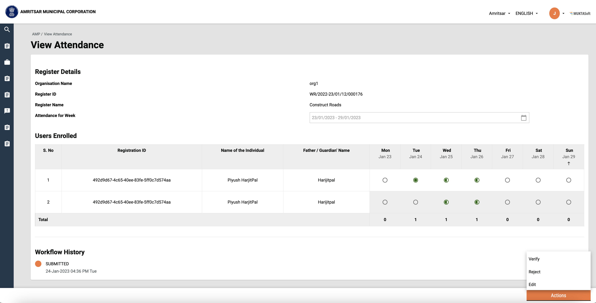

# View Attendance

**Objective:**

* To view weekly muster roll details/attendance for selected muster roll
* To view the workflow history of the muster roll

## Workflow Details

Users can navigate to this screen by clicking on the muster roll id on the inbox page

The view screen consists of register details on top, Enrolled user details in tabular format, Workflow history and Actions that can be performed on selected muster. Initially, muster has ‘Submitted’ status.

<figure><figcaption><p>View Attendance Screen</p></figcaption></figure>

## Technical Implementation Details

View Attendance screen technical implementation can be found in the below file.&#x20;



**Hooks used**

To fetch muster roll details, ‘useViewAttendance’ is used which takes tenant id and muster roll number.                                                                                          &#x20;



To fetch workflow details, ‘useWorkflowDetails is used which takes tenant id, muster roll number, and business service (muster-roll-approval) as module code and config. &#x20;



&#x20;                                                                              &#x20;

**APIs used**

Endpoint:

```markup
/muster-roll/v1/_search
```

Sample curl for Search muster API:

```json
curl --location --request POST 'https://works-dev.digit.org/muster-roll/v1/_search?tenantId=pb.amritsar&musterRollNumber=MR/2022-23/01/24/000356' \
--header 'Content-Type: application/json' \
--data-raw '{
  "RequestInfo": {
    "apiId": "asset-services",
    "ver": null,
    "ts": null,
    "action": null,
    "did": null,
    "key": null,
    "msgId": "search with from and to values",
    "authToken": "6ea7d654-234c-4da6-a43f-8b83a3100593",
    "userInfo": {
        "id": 109,
        "uuid": "be99b2c2-5780-4b1c-8e41-e3f8a972ebda",
        "userName": "Nipsyyyy",
        "name": "Nipun ",
        "mobileNumber": "9667076655",
        "emailId": null,
        "locale": null,
        "type": "EMPLOYEE",
        "roles": [
            {
                "name": "Employee",
                "code": "EMPLOYEE",
                "tenantId": "pb.amritsar"
            },
            {
                "name": "EST_CHECKER",
                "code": "EST_CHECKER",
                "tenantId": "pb.amritsar"
            },
            {
                "name": "Organization admin",
                "code": "ORG_ADMIN",
                "tenantId": "pb.amritsar"
            },
            {
                "name": "EST TECH SANC",
                "code": "EST_TECH_SANC",
                "tenantId": "pb.amritsar"
            },
            {
                "name": "HRMS Admin",
                "code": "HRMS_ADMIN",
                "tenantId": "pb.amritsar"
            },
            {
                "name": "Organization staff",
                "code": "ORG_STAFF",
                "tenantId": "pb.amritsar"
            },
            {
                "name": "EST CREATOR",
                "code": "EST_CREATOR",
                "tenantId": "pb.amritsar"
            },
            {
                "name": "LOI APPROVER",
                "code": "LOI_APPROVER",
                "tenantId": "pb.amritsar"
            },
            {
                "name": "EST FIN SANC",
                "code": "EST_FIN_SANC",
                "tenantId": "pb.amritsar"
            },
            {
                "name": "LOI CREATOR",
                "code": "LOI_CREATOR",
                "tenantId": "pb.amritsar"
            },
            {
                "name": "SUPER USER",
                "code": "SUPERUSER",
                "tenantId": "pb.amritsar"
            },
            {
                "name": "EST TECH SANC",
                "code": "EST_ADMIN_SANC",
                "tenantId": "pb.amritsar"
            },
            {
                "name": "MUNICIPAL ENGINEER",
                "code": "MUNICIPAL_ENGINEER",
                "tenantId": "pb.amritsar"
            },
            {
                "name": "LOI CHECKER",
                "code": "LOI_CHECKER",
                "tenantId": "pb.amritsar"
            },
            {
                "name": "JUNIOR ENGINEER",
                "code": "JUNIOR_ENGINEER",
                "tenantId": "pb.amritsar"
            }
        ],
        "active": true,
        "tenantId": "pb.amritsar",
        "permanentCity": "Amritsar"
    }
  }
}'
```

## MDMS Used

Wage seeker skills data is fetched from MDMS using 'getMultipleTypesWithFilter' service.

```javascript
const getWageSeekerSkills = async () => {
  const skills = {}
  const response = await Digit.MDMSService.getMultipleTypesWithFilter(Digit.ULBService.getStateId(), "common-masters", [{"name": "WageSeekerSkills"}])
  response?.['common-masters']?.WageSeekerSkills.forEach(item => (skills[item.code] = item))
  return skills
}

```

## Localisation

Localisation keys are added under the ‘_rainmaker-attendencemgmt_’ locale module. In future, if any new labels are implemented in the attendance module they should also be pushed in the locale DB under _rainmaker-attendencemgmt_ locale module. Below is an example of a few locale labels for Hindi and English.

```json
{
    "code": "ATM_ACTUAL_WORKING_DAYS",
    "message": "वास्तविक कार्य दिवस",
    "module": "rainmaker-attendencemgmt",
    "locale": "hi_IN"
}
{
    "code": "ATM_ACTUAL_WORKING_DAYS",
    "message": "Actual Working Days",
    "module": "rainmaker-attendencemgmt",
    "locale": "en_IN"
}

```

## Customisation

The content on this screen is rendered based on the configuration passed on _ApplicationDetails_ template component. Its implementation can be found in the below file.                              &#x20;



## API Role Action Mapping

<table><thead><tr><th>API</th><th>Role Code</th><th data-type="number">Action Id</th><th>Actions</th></tr></thead><tbody><tr><td>/muster-roll/v1/_search</td><td>JUNIOR_ENGINEER</td><td>37</td><td><ul><li>View Individual Muster Roll</li></ul></td></tr><tr><td>/muster-roll/v1/_search</td><td>MUNICIPAL_ENGINEER</td><td>37</td><td><ul><li>View Individual Muster Roll</li></ul></td></tr></tbody></table>
