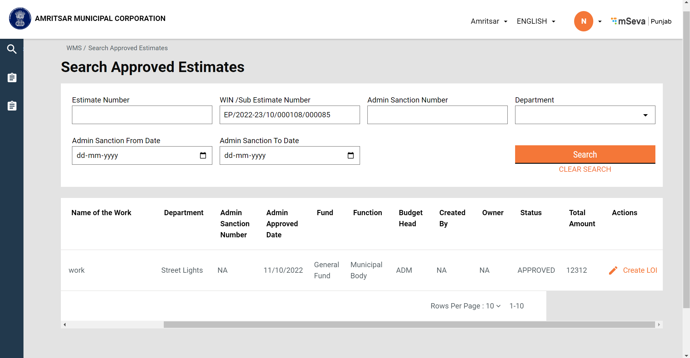
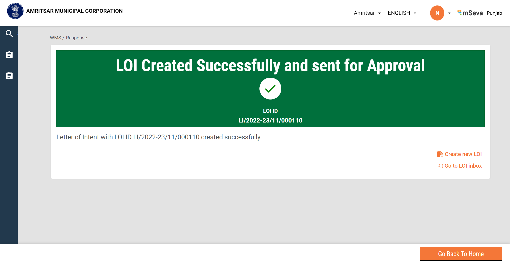

# Create LOI

Create LOI flow starts from the search approved sub-estimates screen since we can create an LOI based on an approved sub-estimate only.

<figure><figcaption><p>Search Approved Estimates Screen</p></figcaption></figure>

Upon Clicking the Create LOI action user is redirected to the Create LOI form

<figure><figcaption><p>Create LOI form</p></figcaption></figure>

When user submits this form a processing modal is shown in which user can fill details of the employee to whom this LOI will be forwarded for approval. All the data selected in this modal will be sent in the workflow object in the create LOI request body

<figure><figcaption><p>Workflow Modal</p></figcaption></figure>

If the Create LOI API call is successful, an acknowledgement screen is shown.

<figure><figcaption><p>Create LOI acknowledgement screen</p></figcaption></figure>

#### API Call role action mapping

| API                      | Action Id | Roles        |
| ------------------------ | --------- | ------------ |
| /loi-service/v1/\_create | 12        | LOI\_CREATOR |

#### Sample Curl for Create API

```json
curl --location --request POST 'http://works-dev.digit.org/loi-service/v1/_create' \
--header 'Accept: application/json, text/plain, */*' \
--header 'Accept-Language: en-US,en;q=0.9' \
--header 'Connection: keep-alive' \
--header 'Content-Type: application/json;charset=UTF-8' \
--header 'Origin: http://localhost:3000' \
--header 'Referer: http://localhost:3000/works-ui/employee/works/create-loi' \
--header 'Sec-Fetch-Dest: empty' \
--header 'Sec-Fetch-Mode: cors' \
--header 'Sec-Fetch-Site: same-origin' \
--header 'User-Agent: Mozilla/5.0 (Windows NT 10.0; Win64; x64) AppleWebKit/537.36 (KHTML, like Gecko) Chrome/105.0.0.0 Safari/537.36' \
--header 'sec-ch-ua: "Google Chrome";v="105", "Not)A;Brand";v="8", "Chromium";v="105"' \
--header 'sec-ch-ua-mobile: ?0' \
--header 'sec-ch-ua-platform: "Windows"' \
--data-raw '{
    "letterOfIndent": {
        "workIdentificationNumber": "123423",
        "fileNumber": "32423",
        "negotiatedPercentage": "3",
        "contractorId": "324",
        "securityDeposit": "324",
        "bankGuarantee": "432",
        "emdAmount": "123",
        "contractPeriod": "32",
        "defectLiabilityPeriod": "12",
        "fileDate": 1672511399000,
        "agreementDate": 1640975399000,
        "agencyName": "agency1",
        "officerInChargedesig": "d1",
        "officerIncharge": "officer2",
        "uploads": [],
        "comments": "jksdf",
        "appDept": "deptOfEngg",
        "appDesig": "junior engg",
        "app": "officer2",
        "tenantId":"pb.amritsar",
        "oicId": "3fa85f64-5717-4562-b3fc-2c963f66afa6",
        "status":"DRAFT",
        "action":"CREATE",
        "additionalDetails": {
            "formData":[
                {
            "CreatedBy": "Nipun",
            "amount": 12312
          }
            ]
        }
    },
    "workflow":{
        "action":"CREATE",
        "comment":"",
        "uuid":[sample_uuid]
    },
    "RequestInfo": {
        "tenantId":"pb.amritsar",
        "apiId": "Rainmaker",
        "authToken": "b9e90045-e88a-4123-826a-f9aecba278ff",
        "userInfo": {
            "id": 109,
            "uuid": "be99b2c2-5780-4b1c-8e41-e3f8a972ebda",
            "userName": "Nipsyyyy",
            "name": "Nipun ",
            "mobileNumber": "9667076655",
            "emailId": null,
            "locale": null,
            "type": "EMPLOYEE",
            "roles": [
                {
                    "name": "Employee",
                    "code": "EMPLOYEE",
                    "tenantId": "pb.amritsar"
                },
                {
                    "name": "LOI CREATOR",
                    "code": "LOI_CREATOR",
                    "tenantId": "pb.amritsar"
                },
            ],
            "active": true,
            "tenantId": "pb.amritsar",
            "permanentCity": null
        },
        "msgId": "1663059767517|en_IN",
        "plainAccessRequest": {},
        "ts":1,
        "action":"CREATE"
    }
}'
```

#### Additional Data

Some of the dropdown data is fetched from mdms and hrms search API

| PageComponent                    | Data Source | API                           |
| -------------------------------- | ----------- | ----------------------------- |
| Name of the agency               | mdms        |                               |
| Designation of officer in charge | hrms        | /egov-hrms/employees/\_search |
| Name of officer in charge        | hrms        | /egov-hrms/employees/\_search |

#### Localizations

Localization keys are added under the ‘_rainmaker-works_’ locale module. In future if any new labels are implemented in works module that should also be pushed in the locale DB under _rainmaker-works_ locale module. Below is the example of few locale labels.

```json
        {
            "code": "ES_COMMON_DESIGNATION_Chief Sanitary Inspector",
            "message": "Chief Sanitary Inspector",
            "module": "rainmaker-works",
            "locale": "en_IN"
        },
        {
            "code": "ES_COMMON_DESIGNATION_Citizen service representative",
            "message": "Citizen service representative",
            "module": "rainmaker-works",
            "locale": "en_IN"
        }
```
