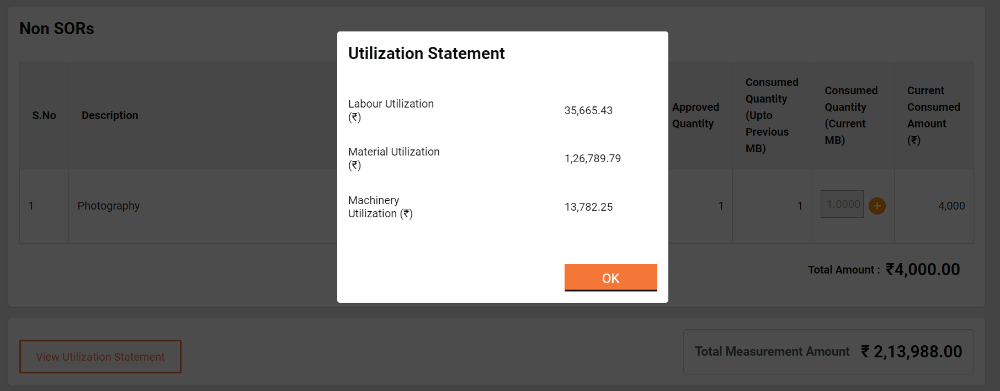

# Service Architecture

## Principles

The Works platform design approach is based on the principles of interoperability, open, standards-based, real-time, inclusivity, a single source of truth, security and privacy. The principles define the framework for a scalable and reliable platform that adapts to evolving needs. Read more about the platform [design principles here](https://core.digit.org/platform/principles).&#x20;

Works aim to expedite payments for public works projects undertaken by different departments. The platform registries and APIs ensure units have instant access to trusted information that improves coordination between the various departments. The seamless flow of information ensures payments are fast-tracked, projects are managed better, and departments can execute more work.

## Approach

The platform design provides the capability to integrate smart payments with [iFIX](https://pfm.digit.org/).  The integration enables departments to track project milestones and simplify vendor payments. The multi-layer architecture design ensures transparency, visibility and fast decisions all of which translate to an accelerated pace of development. The registries and APIs ensure information flows seamlessly across channels removing the challenges of siloed data structures and facilitating interoperability. &#x20;

The platform architecture illustration below provides a visual representation of the key components and layers that facilitate a seamless flow of information across multiple departments.&#x20;

<figure><figcaption></figcaption></figure>

The platform operates through distinct layers that include -&#x20;

* Master Data - project-specific information layer (bottom layer)
* Registries & Certificates&#x20;
* Common Service APIs
* Services
* Open APIs
* Apps - linking multiple stakeholder groups
* Individual Users (top layer)

Read more about our multi-layered platform [architecture design rationale here.](https://urban.digit.org/platform/architecture#multi-layer-architecture)

