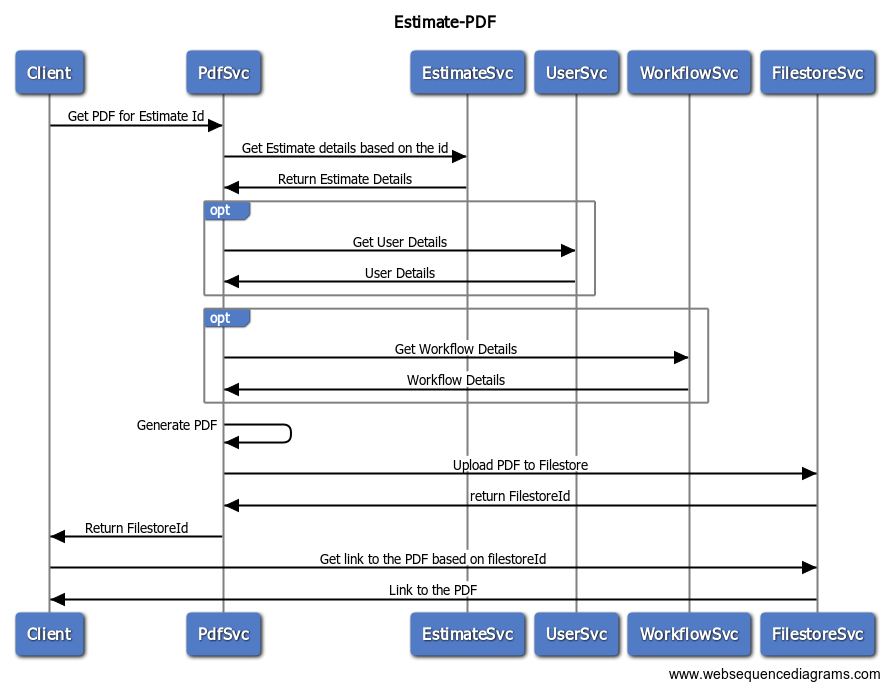

# Estimates

## Overview

Estimate Service will allow users to create estimates and forward them for approval to higher authorities across departments for technical, financial, and admin sanctions.

## API Specifications

### API Contract Link


API specification for Estimates


### APIs


[Estimate-Service-1.0.0-resolved.yaml](../../../../../.gitbook/assets/Estimate-Service-1.0.0-resolved.yaml)



[Estimate-Service-1.0.0-resolved.yaml](../../../../../.gitbook/assets/Estimate-Service-1.0.0-resolved.yaml)



[Estimate-Service-1.0.0-resolved.yaml](../../../../../.gitbook/assets/Estimate-Service-1.0.0-resolved.yaml)


## Data Model

### Web Sequence Diagrams

#### Create Estimate

#### Update Estimate

#### Search Estimate

#### Estimate Inbox

#### Estimate PDF

### Master Data Types

[\_\_](http://creativecommons.org/licenses/by/4.0/)_All content on this website by_ [_eGov Foundation_ ](https://egov.org.in/)_is licensed under a_ [_Creative Commons Attribution 4.0 International License_](http://creativecommons.org/licenses/by/4.0/)_._
