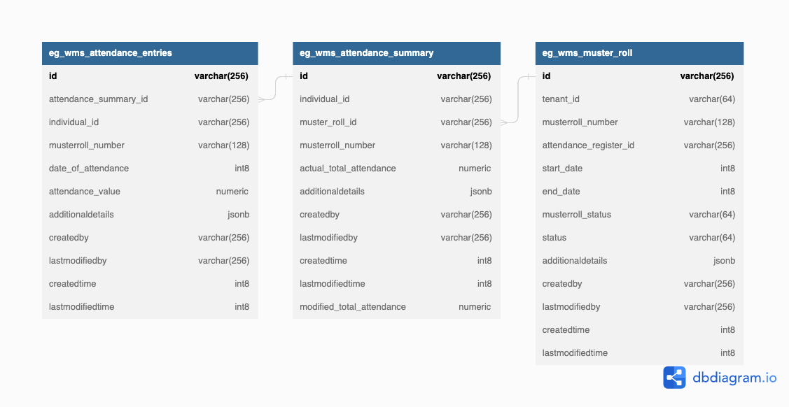

# Muster Roll

## Overview

The muster roll service aggregates attendance logs from the attendance service based on some rules and presents an attendance aggregate for a time period (week or month) per individual. This can then be used to compute payments or other semantics.&#x20;

## API Specifications

### API Contract Link



## Data Model

### DB Schema Diagram

<figure><figcaption></figcaption></figure>

### Web Sequence Diagrams



<figure><figcaption></figcaption></figure>




<figure><figcaption></figcaption></figure>




<figure><figcaption></figcaption></figure>




**MASTER DATA**&#x20;





**POSTMAN SCRIPT**&#x20;

Steps to run the postman collection for the Muster Roll services APIs:

———————————————————————————————————

1\. Import the postman collection for musterRoll -&#x20;

[https://github.com/egovernments/DIGIT-Works/blob/develop/backend/muster-roll-service/src/main/resources/Muster%20Roll%20Service.postman\_collection.json](https://github.com/egovernments/DIGIT-Works/blob/develop/backend/muster-roll-service/src/main/resources/Muster%20Roll%20Service.postman\_collection.json)

2\. Import the environment variables required for running the postman collection -  [https://github.com/egovernments/DIGIT-Works/blob/develop/backend/muster-roll-service/src/main/resources/Muster%20Environment.postman\_environment.json](https://github.com/egovernments/DIGIT-Works/blob/develop/backend/muster-roll-service/src/main/resources/Muster%20Environment.postman\_environment.json)which will create an environment ‘Muster Environment’.

3\. MusterRoll requires the below services from Attendance Service API to be run prior to creating muster. So run the below services before running the musterRoll postman collection.

&#x20;   a) create Attendance register - [https://works-dev.digit.org/attendance/v1/\_create](https://works-dev.digit.org/attendance/v1/\_create)

&#x20;   b) Attendee enroll - [https://works-dev.digit.org/attendance/attendee/v1/\_create](https://works-dev.digit.org/attendance/attendee/v1/\_create)

&#x20;   c) Attendance log create - [https://works-dev.digit.org/attendance/log/v1/\_create](https://works-dev.digit.org/attendance/log/v1/\_create)

4\. Update the current value of the variable ‘registerId’ in the ‘Muster Environment’ with the id returned by the response of the create attendance register ( in step 3 a)

5\. Run the ‘Muster Roll Service’ postman collection as ‘Run Collection’ . It will run the /\_estimate, /\_create, /\_update and /\_search APIs success and validation error scenarios.

6\. Muster will be created for the attendees enrolled in the attendance register (in step 3 b) using the attendance logs created (in step 3 c).

The current value of environment variables ‘musterRollId’ and ‘musterRollNumber’ will be set from the response of the /\_create muster roll which will be used by /\_update and /\_search APIs.

&#x20;****&#x20;
