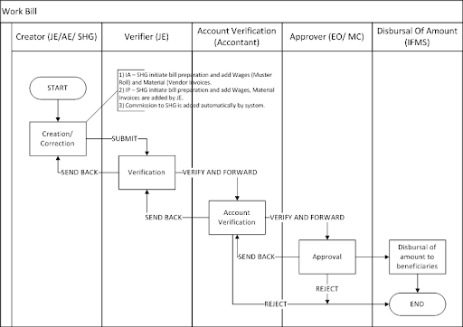
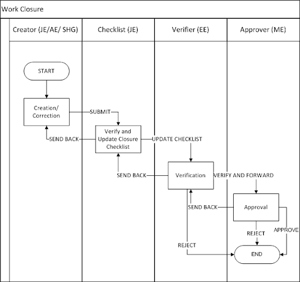

# Product Requirements Document

## 1. Introduction

Mukhyamantri Karma Tatpara Abhiyan Yojana ( MUKTA Yojana) is a government scheme and This scheme is helpful for the poor urban people, which leads to the rising employment rate of the state. This document is prepared to detail the specification MUKTASoft version V1.

MUKTASoft aims to improve the overall scheme efficiency of MUKTA by identifying & providing equal job opportunities to the urban poor, constructing environment-friendly projects, developing local communities and slums & plan better for upcoming years. &#x20;

### 1.1 Purpose

The purpose of this document is to give a detailed description of the requirements for the “Mukta Soft V1” module. It will illustrate the purpose and complete declaration for the development of the system. It will also explain system constraints, interface and interactions with other external applications. This document is primarily intended to define the scope of version V1 and propose to a customer for its approval and as a reference for developing the first version of the system for the development team.

### 1.2 Definitions, Acronyms & Abbreviations

<table><thead><tr><th width="233">Acronyms</th><th>Expanded Form</th></tr></thead><tbody><tr><td>JE</td><td>Junior Engineer</td></tr><tr><td>ME</td><td>Municipal Engineer</td></tr><tr><td>EO</td><td>Executive Officer</td></tr><tr><td>MC</td><td>Municipal Corporation</td></tr><tr><td>DDO</td><td>Drawing and Disbursing Officer</td></tr><tr><td>SOR</td><td>Schedule of Rates</td></tr><tr><td>WO</td><td>Work Order</td></tr><tr><td>PO</td><td>Purchase Order</td></tr><tr><td>WL</td><td>Finalised Worklist</td></tr><tr><td>SHG</td><td></td></tr></tbody></table>

### 1.3 Source of Information

1\. MUKTA FRS (click on the file link below to access)&#x20;



2\. Field visit to JATNI ULB \[15th - 18th November 2022]

### 1.4 Scope for V1

#### 1.4.1 ULB Features

1. Finalised Worklist \[Finalised Wishlist]
   * Finalised Worklist created manually is entered into the system hence create and modify features are provided.
2. Estimate
   * An estimate is prepared without SORs/ Non-SORs and a detailed estimate in an Excel file is uploaded.
   * Estimate No. is generated by the system on creation.
   * Technical Sanction No. and Administrative Approval No is entered manually during the workflow.
3. Revise Estimate - The requirement is not very clear as of now.
4. Work Order
   * Work to be awarded to an SHG/ JE based on the decision taken by the committee offline.
   * A work order is prepared in the system and sent to the awardee for acceptance. There is only a work order for an estimate.
   * The auto decline of work order if SHG action is not taken within the stipulated time frame.
   * Work commencement verification/ checklist is updated and the site is handed over to the awardee.
   * Download the work order PDF as per the specified format.
5. Revise Work Order - The requirement is not very clear as of now.
6. Work Bill
   * Bill is created by SHG/JE and then along with the muster roll sent to JE/AE for verification and then ME for approval through the accountant. There are basically 3 components of the bill.
     * Wages - Muster roll is prepared in the system.
     * Supplies - It is performed manually and then the manual invoices are added to the bill.
     * Commission to SHG - Auto calculated by the system itself.
   * JE/AE has to measure the work offline, validate the muster rolls and then correct/verify the bill accordingly.
   * Download the work bill PDF as per the specified format.
7. Bill Payment (Integration with IFMS)
   * Bill is approved by ME.
   * An approved bill is then sent to IFMS for payment.
   * Various statuses of payments are then updated back to MUKTA.
   * According to the status update, the system allows correction in the bill.&#x20;
   * The updated payment file is then pushed again to IFMS for payment if needed.
8. Closure
   * Project closure will be initiated by SHG (the entity that has first-hand completed the project)
   * This will be checked by JE and sent to ME for approval.&#x20;
   * ME on approval, the Project will be marked as completed and not be available for further creation of Bills, mark attendance or other activities.&#x20;
9. SHG Registration&#x20;
   * Aadhar-based eKYC for SPOC while creating SHG’s record.
   * NPCI API-based bank account detail validations.
10. Dashboard and MIS Reports
11. Masters Data (MDMS)

#### 1.4.2 SHG/ JE Features

1. Work Order - SHGs to accept/decline the work order, LOI is skipped as of now.
2. Wage seeker’s registration
   * Aadhar-based eKYC while creating wage seeker’s record.
   * NPCI API-based bank account detail validations.
3. Wage seeker's attendance and muster rolls
4. Works bill
   * Bill is created by SHG and then submitted to JE for approval. JE will also have the option and access to create the bill.
   * Integration with the IFMS system for seamless payment of wage seekers, suppliers, and SHGs.
5. Closure&#x20;
   * Request for completion/ closure of work, updating the closure checklist.

## 2. Process Flow Diagram V1

<figure><figcaption></figcaption></figure>

## 3. Functional Details

### 3.1 User’s Inbox

The user’s inbox is the DIGIT standard design which enables the workflow users to receive all the files in one place to pick them and take action. The design and functionality are going to be the same with the changes listed below.

1. The information displayed and terminology.
2. Localization.

#### Attributes

1. The search filters provided on the top will have the search parameters as given below.
   * Identification No. \[Estimate No., Work Order No., Bill No.]
   * WIN \[Work Identification Number]
   * Prepared By&#x20;
2. The search filters provided on the left-hand side will have the search parameters as given below.
   * Assigned to me
   * Assigned to all - Selected by default
   * Ward
   * Workflow state
3. The inbox should display the following details.
   * Identification No. (Estimate No./ Work Order No./ Bill No. etc.)
   * Document Type (Estimate/ Work Order/ Work Bill/ Measurement Book etc.)
   * Status
   * Prepared By
   * SLA Days Remaining

#### Mockups

<figure><figcaption></figcaption></figure>

### 3.2 Configurable Workflow

Workflows need to be configurable at the ULB level to configure ULB-specific process flow. In this document, the workflow mentioned for various features is applicable to only one ULB. The use cases are given below.

1. Creator → Approver.
2. Creator → Verifier → Approver.
3. Creator → Verifier → Field Verification → Approver.

There are a few common workflow states as given below.

1. Drafted - The user creates and saves as a draft.
2. Verified - The user verifies it.
3. Approved - The user approved it.

### 3.3 General Validations

#### 3.3.1 IFSC

The validation of IFSC must satisfy the following conditions.

1. It should be 11 characters long.
2. The first four characters should be upper case alphabets.
3. The fifth character should be 0.
4. The last six characters are usually numeric, but can also be alphabetic.

#### 3.3.2 PAN

The valid PAN Card number must satisfy the following conditions.

1. It should be ten characters long.
2. The first five characters should be any upper-case alphabet.
3. The next four characters should be any number from 0 to 9.
4. The last(tenth) character should be any upper-case alphabet.
5. It should not contain any white spaces.

#### 3.3.3 GSTIN

The valid GST (Goods and Services Tax) number must satisfy the following conditions.

1. It should be 15 characters long.
2. The first 2 characters should be a number.
3. The next 10 characters should be the PAN number of the taxpayer.
4. The 13th character (entity code) should be a number from 1-9 or an alphabet.
5. The 14th character should be Z.
6. The 15th character should be an alphabet or a number.

#### 3.3.4 AADHAR

The valid Aadhaar number must satisfy the following conditions.

1. It should have 12 digits.
2. It should not start with 0 and 1.
3. It should not contain any alphabet or special characters.
4. It should have white space after every 4 digits.

The Aadhar validation from OCAC. It is without OTP.

1. Aadhar can be validated by sending the Aadhar No. and Name of Aadhar Holder and in response Yes/No is received.
2. It is available online/ offline both.&#x20;
3.
   * In the case of online validation, Aadhar is validated with the creation of the record itself.
   * In case of offline validation, the record is created first and the Aadhaar is validated offline at once for all the records.

eKYC, For eKYC, demographic data is received in response by passing the valid OPT.

### 3.4 Finalised Worklist

Finalised worklist is a wish list of works which the ward representative suggests and then the ward committee collects from each ward and approves in its meeting, thereafter a feasibility study is performed by the Municipal Engineering department and administrative approval is taken from the chairperson of the ULB. In MUKTA V1 it is catered in the below-mentioned method.\

<table><thead><tr><th width="111.33333333333331">S.No.</th><th>Business/Functional Requirements</th><th>Interface</th></tr></thead><tbody><tr><td>1</td><td>Finalised wish lists of all the works are added into the Finalised Worklist and get approved by the ULB Committee.</td><td>Manual</td></tr><tr><td>2</td><td>An approved list of works along with a Finalised Worklist is entered into the system and proposal no. is generated.</td><td>Web</td></tr><tr><td>3</td><td>System generates the WIN (work identification no.) for each and every work in the work proposal to identify the work uniquely.</td><td>Web</td></tr><tr><td>4</td><td>Search, View and Modify Finalised Worklist option is provided.</td><td>Web</td></tr></tbody></table>

#### 3.4.1 Create Finalised Worklist

A manually finalised WL is entered into the system and hence the create WL  feature is provided. In V1 it will not have the workflow integrated with it.

**Attributes**

<table><thead><tr><th width="86">S.No. </th><th width="153">Field</th><th width="140">Data Type</th><th width="86">Required</th><th>Description</th></tr></thead><tbody><tr><td>1</td><td>Proposal Description</td><td>Alphanumeric (1024)</td><td>Y</td><td>
Gist of proposal.

Special Chars allowed { / . _$@# }
</td></tr><tr><td>2</td><td>Proposal Date</td><td>Date</td><td>Y</td><td>A date to be entered by the user, can not be a future date.</td></tr><tr><td>3</td><td>Letter Reference</td><td>Alphanumeric (128)</td><td> </td><td>
Usually the Offline File/ Letter Number related to the project

Special Chars allowed { / . _$@# }
</td></tr><tr><td> </td><td><mark style="background-color:orange;">Fund Allocation</mark></td><td> </td><td> </td><td> </td></tr><tr><td>4</td><td>Scheme</td><td>Drop-down</td><td>Y</td><td>Name of scheme, default set to MUKTA. MUKTA related works can be performed either from the MUKTA fund or from the UNNATI fund.</td></tr><tr><td>5</td><td>Fund Alloted (₹)</td><td>Numeric</td><td>Y</td><td>It is the amount in rupee available in the ULB’s account for the selected scheme. It is entered by till the IFMS integration is completed.</td></tr><tr><td> </td><td><mark style="background-color:orange;">Works Details</mark></td><td><mark style="background-color:orange;">List</mark></td><td> </td><td><mark style="background-color:orange;">The list will have multiple works within a proposal</mark></td></tr><tr><td>5</td><td>Work Description</td><td>Alphanumeric (256)</td><td>Y</td><td>
A brief details of works listed under wishlist.

Special Chars allowed { / . _$@# }
</td></tr><tr><td>6</td><td>Work Type</td><td>Drop-down</td><td>Y</td><td>The list of values mentioned under the masters data section.</td></tr><tr><td>7</td><td>Geo Location</td><td>Co-ordinates</td><td>N</td><td>Input latitude/ longitude, or the GIS-map to pin the location. </td></tr><tr><td>8</td><td>Location</td><td>Drop-down</td><td>Y</td><td>DIGIT standard location Picker component.</td></tr><tr><td>11</td><td>Is Feasible</td><td>Drop-down</td><td>Y</td><td>Values will be Yes/ No.</td></tr><tr><td>12</td><td>Proposed Amount</td><td>Numeric</td><td>Y</td><td>A rough estimated amount for the given work.</td></tr><tr><td>13</td><td>Status</td><td>Drop-down</td><td>Y</td><td>
Values are as given below.
<ul><li>Feasibility Study Completed</li><li>Finalised</li><li>Dropped</li><li>Estimate Approved</li><li>Work Order Accepted</li><li>In Progress</li><li>Closed</li><li>Abandoned</li></ul></td></tr><tr><td> </td><td><mark style="background-color:orange;">Attachments</mark></td><td> </td><td> </td><td> </td></tr><tr><td>14</td><td>Proposal File</td><td>File Attachment</td><td>N</td><td>Allow to attach up to 5 files each not greater than 5 MB. Files can be of type doc, xls, pdf</td></tr></tbody></table>

**Actions**

On Submit following actions are performed.

1. Finalised Worklist gets saved into DB.
2. Finalised Worklist No. is generated in a specified format.
3. Work Identification No. (WIN) is generated for each and every work in the list in a specified format.
4. Work detail is also saved along with the Finalised Worklist and the scheme selected at the finalised worklist is linked with all the works presented in the Finalised Worklist.
5. Finalised Worklist is available to download in PDF as per the given format.

**Mockups**

\<To be updated>

**Notification**

\<To be updated>

#### 3.4.2 Search Work/ Finalised Worklist

**Search Criteria**

A work in the Finalised Worklist is searched by the parameters mentioned in the table given below.

<table><thead><tr><th width="80">S.No.</th><th width="143">Field</th><th width="122">Data Type</th><th width="94">Required</th><th>Description</th></tr></thead><tbody><tr><td>1</td><td>Location</td><td>Drop-down</td><td>N</td><td>Auto-complete, matching search.</td></tr><tr><td>2</td><td>Proposal No.</td><td>Textbox</td><td>N</td><td>Works proposal no.</td></tr><tr><td>3</td><td>WIN</td><td>Textbox</td><td>N</td><td>Work identification no. generated for a work in Finalised Worklist</td></tr><tr><td>4</td><td>Work Type</td><td>Drop-down</td><td>N</td><td>Values of work type from MDMS configuration.</td></tr><tr><td>5</td><td>From Date</td><td>Date Picker</td><td>N</td><td>Proposal creation date, entered by user while creating Finalised Worklist.</td></tr><tr><td>6</td><td>To Date</td><td>Date Picker</td><td>N</td><td>Proposal creation date, entered by user while creating Finalised Worklist.</td></tr></tbody></table>

**Search Result**

On search, the result is shown as given below.

<table><thead><tr><th width="90">S.No</th><th width="136">Field</th><th width="147">Data Type</th><th>Comments</th></tr></thead><tbody><tr><td>1</td><td>Proposal No.</td><td>Display Only</td><td>A hyperlink to open the Finalised Worklist in view mode.</td></tr><tr><td>2</td><td>WIN</td><td>Display Only</td><td>Work identification no. generated for a work in Finalised Worklist</td></tr><tr><td>3</td><td>Proposal Date</td><td>Display Only</td><td>Proposal creation date, entered by user while creating Finalised Worklist.</td></tr><tr><td>4</td><td>Location</td><td>Display Only</td><td>Locality name along with ward name.</td></tr><tr><td>5</td><td>Action</td><td>Button</td><td>
Create Estimate - Estimate to be created or the estimate created is in rejected status.

View Estimate - Estimate is created and in workflow are approved status.
</td></tr></tbody></table>

**Mockups**

\<To be updated>

#### 3.4.3 View Finalised Worklist

**Attribute**

\<To be updated>

**Mockups**

\<To be updated>

**Notification**

Not applicable.

#### 3.4.4 Modify Finalised Worklist

From the search result, on click of Finalised Worklist no. Finalised Worklist details is displayed. An action button is provided with the label “Modify Proposal” to modify the proposal and with the following conditions the work proposal is modified.

**Attributes**

1. Proposal description can be modified.
2. Change in proposal date is allowed only to any date prior to existing proposal date.
3. Reference number can be changed.
4. Adding new works to the list is allowed.
5. Removing an existing work from the list is allowed only if an estimate is not created.
6. The status and feasibility of an existing work from the list can be changed only if there is no active/workflow estimate linked to it.

**Mockups**

\<To be updated>

### 3.5 Estimate

Estimate is a document which furnishes the quantities of different works involved, their rates and the expenditure anticipated towards a work.

Once the work proposal is approved with all the listed work in it, JE/AE has to prepare a detailed estimate of each and every work. In the system an abstract of the estimate is entered with an attached detailed estimate in PDF format to create an estimate and the same is then sent for technical and administrative approvals.

<table><thead><tr><th width="76.33333333333331">S.No.</th><th width="538">Business/Functional Requirements</th><th>Interface</th></tr></thead><tbody><tr><td>1</td><td>The system allows the creation of new Estimates against each work defined in Finalised Worklist without having an SOR/ Non-SOR listed.</td><td>Web</td></tr><tr><td>2</td><td>A detailed estimate having SOR and Non-SORs items  in excel is attached with this estimate.</td><td>Web</td></tr><tr><td>3</td><td>Search estimate allows searching for In workflow, Approved, and Rejected estimates. Draft estimates are not available for search.</td><td>Web</td></tr><tr><td>4</td><td>
Estimates have an approval workflow. Each user has to approve the estimate to go to the next stage 
<ul><li>Draft facility to be provided. It will allow JE/AE to prepare it in iterations.</li><li>Once the estimate is completed it is sent for verification and technical approval to the ME.</li><li>Send Back estimates will always go into the inbox of the previous user in the flow.</li><li>A technical approved estimate is sent for administrative approval to EO/ MC. </li><li>In app notifications will inform the user of the pending estimates that need approval </li></ul>
 
</td><td>Web</td></tr><tr><td>5</td><td>An estimate once approved cannot be modified.</td><td> </td></tr><tr><td>6</td><td>SOR and Non-SOR items to be provided in v2.</td><td> </td></tr></tbody></table>

#### 3.5.1 Process Flow

<figure><figcaption></figcaption></figure>

#### 3.5.2 Create Estimate

Search a work from the list of works in a Finalised Worklist and the ‘Create Estimate’ action is applied.

**Attributes**

<table><thead><tr><th width="85">S.No.</th><th width="144">Field</th><th width="123">Data Type</th><th width="98">Required</th><th>Description</th></tr></thead><tbody><tr><td>1</td><td>Estimate Type</td><td>Auto-selected</td><td>Y</td><td>Options are Original, Revised, Deviated.</td></tr><tr><td>2</td><td>Work Description</td><td>Display Only</td><td>Y</td><td>This value is populated from work list of work proposal</td></tr><tr><td>3</td><td>Work Type</td><td>Display Only</td><td>Y</td><td>This value is populated from work list of work proposal</td></tr><tr><td> </td><td>Fund Allocation</td><td> </td><td> </td><td> </td></tr><tr><td>4</td><td>Scheme Name</td><td>Drop-down</td><td>Y</td><td>Option to select a scheme out of available 2 schemes.</td></tr><tr><td>5</td><td>Fund Available</td><td>Display Only</td><td>Y</td><td>Fund Available= Fund in ULB’s Account - Total Blocked Amount + Paid Amount. </td></tr><tr><td> </td><td><mark style="background-color:orange;">Location Details</mark></td><td> </td><td> </td><td> </td></tr><tr><td>6</td><td>Location</td><td>Display Only</td><td>Y</td><td>Name of locality with ward.</td></tr><tr><td> </td><td>Estimation Details</td><td> </td><td> </td><td> </td></tr><tr><td>7</td><td>Estimated Amount</td><td>Numeric</td><td>Y</td><td>Estimated amount of work from the detail estimate prepared by JE.</td></tr><tr><td>8</td><td>Display Board Cost</td><td>Numeric</td><td>N</td><td>The cost of a display board on the site.</td></tr><tr><td>9</td><td>Supervision Charge</td><td>Display Only</td><td>Y</td><td>It is a commission to IA/AP, calculated by the commission rate defined on the estimated amount.</td></tr><tr><td>10</td><td>Unforeseen Item’s Contingency </td><td>Numeric</td><td>N</td><td>This is the amount for any unforeseen items.</td></tr><tr><td>11</td><td>GST Amount</td><td>Display Only</td><td>Y</td><td>Autocal calculated. The GST rate is configurable and the amount is calculated on the configured rate.</td></tr><tr><td>12</td><td>Total Works Value</td><td>Display Only</td><td>Y</td><td>Total works value = (5)+(6)+(7)+(8)+(9).</td></tr><tr><td> </td><td><mark style="background-color:orange;">Attachments</mark></td><td> </td><td> </td><td> </td></tr><tr><td>13</td><td>Detailed Estimate</td><td>File Attachment</td><td>Y</td><td>DIGIT standard file attachment component, file size 5MB. </td></tr><tr><td>14</td><td>Labor and Material Analysis </td><td>File Attachment</td><td>Y</td><td>DIGIT standard file attachment component, file size 5MB.</td></tr></tbody></table>

**Actions**

On save following activities are performed.

1. An estimate is saved as a draft and will be available to the creator for further modifications.
2. An estimate no. is generated in a specified format.
3. Estimate PDF is available to download.&#x20;

On submit following activities are performed.

1. Estimate is saved and forwarded to verifier/ approver and removed from the creator’s draft. It won't be available anymore for the creator to take an action.
2. An estimate no. is generated in a specified format if not generated already.
3. Estimate PDF is available to download from view estimate page.

**Mockups**

\<To be updated>

#### 3.5.3 Search Estimate

**Search Criteria**

<table><thead><tr><th width="92">S.No.</th><th width="115">Field</th><th width="129">Data Type</th><th width="101">Required</th><th>Description</th></tr></thead><tbody><tr><td>1</td><td>Location</td><td>Drop-down</td><td>N</td><td>Auto-complete, matching search.</td></tr><tr><td>2</td><td>WIN</td><td>Textbox</td><td>N</td><td>Work identification no. generated for a work in Finalised Worklist</td></tr><tr><td>3</td><td>Estimate No.</td><td>Drop-down</td><td>N</td><td>Values of work type from MDMS configuration.</td></tr><tr><td>4</td><td>Status</td><td>Drop-down</td><td>N</td><td>Workflow status of an estimate.</td></tr><tr><td>5</td><td>From Date</td><td>Date Range</td><td>N</td><td>Estimate creation date.</td></tr><tr><td>6</td><td>To Date</td><td>Date Range</td><td>N</td><td>Estimate creation date.</td></tr></tbody></table>


**Note:** At least one parameter is required to perform the search. The date range From Date/ To Date is considered one parameter.


**Search Result**

On search, the result is shown as given below.

<table><thead><tr><th width="98">S.No.</th><th width="152">Field</th><th width="154">Data Type</th><th>Description</th></tr></thead><tbody><tr><td>1</td><td>Estimate No</td><td>Display Only</td><td>A hyperlink to open the estimate  in view mode.</td></tr><tr><td>2</td><td>WIN</td><td>Display Only</td><td>Work identification no. generated for a work in Finalised Worklist</td></tr><tr><td>3</td><td>Prepared By</td><td>Display Only</td><td>Name of user who has prepared it.</td></tr><tr><td>4</td><td>Location</td><td>Display Only</td><td>Locality name along with ward name.</td></tr><tr><td>5</td><td>Estimated Amount</td><td>Display Only</td><td>Total estimated amount.</td></tr></tbody></table>

**Actions**

1. On search, a search is performed and the search result is displayed based on the parameters supplied.
2. On clear, values entered are cleared.

**Mockups**

\<To be updated>

#### 3.5.5 Revise Estimate

In the case of less/excess deviation a revised estimate is created which could lead to creating a revised WO in case the proposed total estimate value exceeds the approved total estimate value.

To create a revised estimate, the original estimate is searched from the action menu ‘Create Revise Estimate’.&#x20;

**Attributes**

<table><thead><tr><th width="98">S.No.</th><th>Field</th><th width="122">Data Type</th><th width="106">Required</th><th>Description</th></tr></thead><tbody><tr><td>1</td><td>Estimate Type</td><td>Auto-selected</td><td>Y</td><td>Options are Original, Revised, Deviated.</td></tr><tr><td>2</td><td>Original Estimate No.</td><td>Display Only</td><td>Y</td><td> </td></tr><tr><td>2</td><td>Work Description</td><td>Display Only</td><td>Y</td><td>This value is populated from work list of work proposal</td></tr><tr><td>3</td><td>Work Type</td><td>Display Only</td><td>Y</td><td>This value is populated from work list of work proposal</td></tr><tr><td> </td><td>Location Details</td><td> </td><td> </td><td> </td></tr><tr><td>4</td><td>Location</td><td>Display Only</td><td>Y</td><td>Name of locality with ward.</td></tr><tr><td> </td><td><mark style="background-color:orange;">Estimation Details</mark></td><td> </td><td> </td><td> </td></tr><tr><td>5</td><td>Estimated Amount</td><td>Numeric</td><td>Y</td><td>Estimated amount of work from the detail estimate prepared by JE.</td></tr><tr><td>6</td><td>Display Board Cost</td><td>Numeric</td><td>N</td><td>The cost of a display board on the site.</td></tr><tr><td>7</td><td>Supervision Charge</td><td>Display Only</td><td>Y</td><td>It is a commission to IA/AP, calculated by the commission rate defined on the estimated amount.</td></tr><tr><td>8</td><td>Unforeseen Item’s Contingency </td><td>Numeric</td><td>N</td><td>This is the amount for any unforeseen items.</td></tr><tr><td>9</td><td>GST Amount</td><td>Display Only</td><td>Y</td><td>Autocal calculated. The GST rate is configurable and the amount is calculated on the configured rate.</td></tr><tr><td>10</td><td>Total Works Value</td><td>Display Only</td><td>Y</td><td>Total works value = (5)+(6)+(7)+(8)+(9).</td></tr><tr><td> </td><td><mark style="background-color:orange;">Attachments</mark></td><td> </td><td> </td><td> </td></tr><tr><td>11</td><td>File Name</td><td>File Attachment</td><td>N</td><td>Allow to attach up to 5 files each not greater than 5 MB. Files can be of type doc, xls, pdf</td></tr></tbody></table>

**Actions**

\<To be updated>

**Mockups**

\<To be updated>

#### 3.5.6 Workflow Actions

**Edit Estimate**

Editing of estimates is only allowed till the time the estimate is under workflow and only the Estimation Details can be modified.

**Attributes**

1. Estimated Amount - It can be changed only by the user who has prepared the estimate.
2. Display Board Cost - It can be changed only by the user who has prepared the estimate.
3. IA/ IP Supervision Charge  - Read Only.
4. Unforeseen Item’s Contingency - It can be changed only by the user who has prepared the estimate.
5. GST Amount - Read Only.
6. Total Works Value - Read Only.
7. Technical Sanction No. - It can be changed only by the user who is allowed to approve the estimate technically.
8. Administrative Approval No. - It can be changed only by the user who is allowed to approve the estimate administratively.

**Mockups**

\<To be updated>

**Notification**

\<To be updated>

**Save as draft**

On save of an estimate, the estimate is saved into the system and is available in the draft of the logged-in user.

**Attributes**

Not applicable

**Mockups**

\<To be updated>

**Notification**

\<To be updated>

**Submit**

On submission, the estimate is created and moved to the next user’s inbox for further processing. If the estimate is already saved into a draft, it saves the changes and moves the estimate to the next user’s inbox for further processing.

**Attributes**

Not applicable

**Mockups**

\<To be updated>

**Notification**

\<To be updated>

**Verify and Forward**

A verifier of the estimate will receive the estimate in the inbox and then the verify and forward action is performed.

**Attributes**

1. Assignee Name - Drop-down - Non Mandatory -  It is to choose the assignee name, it will be the name of the technical sanction approver.
2. Add Comments - Text area - Non-Mandatory -  In case any comments to be added.
3. Attach Supporting Document - Non-Mandatory - Any document to be uploaded as a supporting document.
4. Verify and Forward - Action Button
5. Cancel - Action Button

**Mockups**

\<To be updated>

**Notification**

\<To be updated>

**Send Back**

It will allow a workflow user to send the estimate back to the previous user for any correction/clarification.

**Attributes**

1. Add Comments - Text area - Non-Mandatory -  In case any comments to be added.
2. Attach Supporting Document - Non-Mandatory - Any document to be uploaded as a supporting document.
3. Send Back - Action Button
4. Cancel - Action Button

**Mockups**

\<To be updated>

**Notification**

\<To be updated>

**Send Back To Originator**

It will allow a workflow user to send the estimate back to the creator of the estimate for any correction/clarification.

**Attributes**

5. Add Comments - Text area - Non-Mandatory -  In case any comments to be added.
6. Attach Supporting Document - Non-Mandatory - Any document to be uploaded as a supporting document.
7. Send Back To Originator - Action Button
8. Cancel - Action Button

**Mockups**

\<To be updated>

**Notification**

\<To be updated>

**Technical Sanction**

It will allow a workflow user to technically sanction the estimate and forward it for approval.

**Attributes**

1. Technical Sanction No. - Textbox - Mandatory - Technical sanctioner will enter the technical sanction no.
2. Assignee Name - Drop-down - Non Mandatory -  It is to choose the assignee name, it will be the name of the approver.
3. Add Comments - Text area - Non-Mandatory -  In case any comments to be added.
4. Attach Supporting Document - Non-Mandatory - Any document to be uploaded as a supporting document.
5. Technical Sanction - Action Button
6. Cancel - Action Button

**Mockups**

\<To be updated>

**Notification**

\<To be updated>

**Reject**

It will allow a workflow user to reject the estimate to cancel it.&#x20;

**Attributes**

1. Add Comments - Text area - Non-Mandatory -  In case any comments to be added.
2. Attach Supporting Document - Non-Mandatory - Any document to be uploaded as a supporting document.
3. Reject - Action Button
4. Cancel - Action Button

**Mockups**

\<To be updated>

**Notification**

\<To be updated>

#### **Approve**

It will allow a workflow user to approve the estimate.

**Attributes**

1. Administrative Approval  No. - Textbox - Mandatory - Estimate approver will enter the technical sanction no.
2. Add Comments - Text area - Non-Mandatory -  In case any comments to be added.
3. Attach Supporting Document - Non-Mandatory - Any document to be uploaded as a supporting document.
4. Approve - Action Button
5. Cancel - Action Button

**Mockups**

\<To be updated>

**Notification**

\<To be updated>

#### 3.5.7 Role Action Mapping

<table><thead><tr><th width="256.3333333333333">Role</th><th>Role-Action Mapping</th><th>User Persona</th></tr></thead><tbody><tr><td>ESTIMATE_CREATOR</td><td>
• Save as draft

• Submit/ Re-submit

• Search

• View

• Modify
</td><td>Junior Engineer/ Assistant Engineer</td></tr><tr><td>ESTIMATE_VERIFIER</td><td>
• Search

• View

• Verify and Forward

• Send Back
</td><td>Executive Engineer</td></tr><tr><td>TECHNICAL_SANCTIONER</td><td>
• Search

• View

• Technical Sanction

• Send Back

• Reject
</td><td>Municipal Engineer</td></tr><tr><td>ESTIMATE_ APPROVER</td><td>
• Search

• View

• Approve

• Send Back

• Reject
</td><td>Executive Officer/ Municipal Commissioner</td></tr></tbody></table>

### 3.6 Work Order

In the process of awarding the work to an SHG organisation, a work order is created and then verified and approved. The process mentioned in the below-given table is followed for the V1 solution.

<table><thead><tr><th width="79.33333333333331">S.No.</th><th width="531">Business/Functional Requirements</th><th>Interface</th></tr></thead><tbody><tr><td>1</td><td>The system allows the creation of new Work Order with details including Project Details, Financial Details, Agreement Details</td><td>Web</td></tr><tr><td>2</td><td>Search Work Order  allows to search for In workflow, Rejected, and approved work orders </td><td>Web</td></tr><tr><td>3</td><td>
Work Order has an approval workflow. Each user has to approve it to go to the next stage. 
<ul><li>Create Work Order is role based access and provided to JE/AE create it.</li><li>Work order attains the state of ‘Draft’ and save.</li><li>On submit, it is sent for verification and attains the status of Pending for Verification.</li><li>Send Back Work Orders will always go into the inbox of the previous user in the flow.</li><li>On rejection, work order is rejected and will no longer be available for further actions.</li><li>A verified work order is sent for approval, and once approved is available for SHG organisation to accept/ decline.</li><li>Once accepted by SHG, It will be available to JE/AE which is again role based, to perform the site visit and update the checklist and update work start date.</li><li>On decline by SHG, It will be available to the creator of WO, and the creator can take an action to re-assign the work order to some other organisation and send for approval again or reject the work order and create a new one.</li></ul></td><td>Web/ Mobile</td></tr><tr><td>4</td><td>
Work Order creation is validated against the estimated amount. 
<ul><li>In case the total estimated amount is more than 10 lakhs, work order is issued in the name JE (Office-in-charge)</li><li>In case the total estimated amount is 10 or less than 10 lakhs, a work order is issued in the name organisation.</li><li>The amount limit is configurable and configured in the system.</li></ul></td><td>Backend</td></tr><tr><td>5</td><td>
SMS to the SHG on the issuance of the work Order

Dear &#x3C;name>, &#x3C;Organisation name> has been chosen as the &#x3C;IA/IP> for the project &#x3C;project name>. Please login to MuktaSoft account to accept the Work Order &#x3C;WO_NUMBER>. To login please click on &#x3C;Organization Login URL>.
</td><td>SMS</td></tr><tr><td>6</td><td>Purchase of material if any, to be handled offline as of now.</td><td>Manual</td></tr></tbody></table>

#### 3.6.1 Process Flow

<figure><figcaption></figcaption></figure>

#### 3.6.2 Create Work Order

To create a work order, an estimate is searched using search estimate and then open to view the estimate details. From the action list select ‘Create Work Order’.

**Attributes**

<table><thead><tr><th width="94">S.No.</th><th width="140">Field</th><th width="129">Data Type</th><th width="105">Required</th><th>Description</th></tr></thead><tbody><tr><td>1</td><td>WIN</td><td>Display Only</td><td>NA</td><td>Work Identification No. from the list of works in WP.</td></tr><tr><td>2</td><td>Work Description</td><td>Display Only</td><td>NA</td><td>Work description from the work listed in WP.</td></tr><tr><td>3</td><td>Work Type</td><td>Display Only</td><td>NA</td><td>Work type from the work listed in WP. for the selected WIN.</td></tr><tr><td>4</td><td>File No.</td><td>Alphanumeric (64)</td><td>N</td><td>This is a number of the file that is used in offline modes.</td></tr><tr><td>5</td><td>File Date</td><td>Date</td><td>N</td><td>Date when the offline file is created. This cannot be a future date.</td></tr><tr><td> </td><td>Agreement Details</td><td> </td><td> </td><td> </td></tr><tr><td>6</td><td>Organisation Name</td><td>Drop-down</td><td>Y</td><td>The name of the organisation from the organisation master maintained at the ULB level. The name is searchable in the drop-down</td></tr><tr><td>7</td><td>Organisation Role</td><td>Auto-populated</td><td>Y</td><td>
The system decides the role of a Community Organisation based on the estimated amount. It is configurable in the system.
<ol><li>IP (Implementation Partner) - If the estimated cost of the works is more than Rs.10 Lakhs</li><li>IA (Implementation Agency) -  If the estimated cost of the works is less than Rs.10 Lakhs</li></ol></td></tr><tr><td>8</td><td>Officer-in-charge</td><td>Dropdown</td><td>Y</td><td>The drop-down values are population based on the role assigned. The name is searchable in the drop-down.</td></tr><tr><td>9</td><td>Completion Period (in days)</td><td>Integer</td><td>Y</td><td>This is the given period within which work to be completed. It cannot be negative or zero. This period is calculated from the date of start of the work.</td></tr><tr><td>10</td><td>WO Amount</td><td>Read Only</td><td>Y</td><td>Total estimated cost of the selected work.</td></tr><tr><td> </td><td>Attachments</td><td> </td><td> </td><td> </td></tr><tr><td>11</td><td>File Attachment</td><td>File Picker</td><td>N</td><td>Allow to attach upto 5 files, each not greater than 5 MB. Files can be of type doc, xls, pdf</td></tr></tbody></table>

**Actions**

On save following activities are performed.

1. The work order is saved as a draft and will be available to the creator for further modifications.
2. A  work order no. is generated in a specified format.
3. Work Order PDF is available to download in the specified format.

On submit following activities are performed.

1. Work Order is saved and forwarded to the verifier/ approver and removed from the creator’s draft. It won't be available anymore for the creator to take action.
2. A work order no. is generated in a specified format if not generated already.
3. Work Order PDF is available to download from the view Work Order page in the given format.

**Mockups**

\<To be updated>

#### 3.6.3 Create Revised WO

In the revised estimate is created and the total revised amount is more than the initially approved amount a revised WO is created.


**Note:** The details are not available of all the use cases regarding the revised WO.


**Attribute**

\<To be updated>

**Mockups**

\<To be Updated>

#### 3.6.4 Workflow Actions

**Save as draft**

On save, the WO is saved into the system and is available as a draft for the logged-in user to edit and submit it for further processing.

**Attributes**

Not applicable

**Mockups**

\<To be updated>

**Notification**

\<To be updated>

**Submit**

On submission, the WO is created and moved to the next user’s inbox for further processing. If the WO is already saved as a draft, It moves the WO to the next user’s inbox for further processing.

**Attributes**

Not applicable

**Mockups**

\<To be updated>

**Notification**

\<To be updated>

**Edit WO**

On Edit, the Work Order is edited to make the then save changes during the workflow.

**Attributes**

Not applicable

**Mockups**

\<To be updated>

**Notification**

\<To be updated>

**Verify and Forward**

A verifier will receive the WO in the inbox and perform the action verify and forward.

**Attributes**

1. Assignee Name - Drop-down - Non Mandatory -  It is to choose the assignee name, it will be the name of the approver.
2. Add Comments - Text area - Non-Mandatory -  In case any comments to be added.
3. Attach Supporting Document - Non-Mandatory - Any document to be uploaded as a supporting document.
4. Verify and Forward - Action Button
5. Cancel - Action Button

**Mockups**

\<To be updated>

**Notification**

\<To be updated>

**Send Back**

It will allow a workflow user to send the WO back to the previous user for any corrections/ clarifications.

**Attributes**

1. Add Comments - Text area - Non-Mandatory -  In case any comments to be added.
2. Attach Supporting Document - Non-Mandatory - Any document to be uploaded as a supporting document.
3. Send Back - Action Button
4. Cancel - Action Button

**Mockups**

\<To be updated>

**Notification**

\<To be updated>

**Send Back To Originator**

**Reject**

It will allow a workflow user to reject the WO to cancel it.&#x20;

**Attributes**

1. Add Comments - Text area - Non-Mandatory -  In case any comments to be added.
2. Attach Supporting Document - Non-Mandatory - Any document to be uploaded as a supporting document.
3. Reject - Action Button
4. Cancel - Action Button

**Mockups**

\<To be updated>

**Notification**

\<To be updated>

**Approve**

It will allow a workflow user to approve the WO.

**Attributes**

1. Add Comments - Text area - Non-Mandatory -  In case any comments to be added.
2. Attach Supporting Document - Non-Mandatory - Any document to be uploaded as a supporting document.
3. Approve - Action Button
4. Cancel - Action Button

**Mockups**

\<To be updated>

**Notification**

\<To be updated>

**Accept**

Once approved, Work Order is placed into SHGs portal for acceptance declination, accepted Work Order is then placed to the next user's inbox who is responsible to perform a ground visit and update the checklist and handover the site.&#x20;

**Attributes**

Not applicable.

**Mockups**

\<To be updated>

**Notification**

\<To be updated>

**Decline**

Once approved, Work Order is placed into SHGs portal for acceptance declination, declined WO is then placed back to the creator’s inbox who will either reject the WO or re-assign it to another SHG organisation.

**Attributes**

Not applicable.

**Mockups**

\<To be updated>

**Notification**

\<To be updated>

#### 3.6.5 Search Work Order

Search Work Order will enable the user to search for a WO and then view the details.

**Search Criteria**

<table><thead><tr><th width="100">S.No.</th><th width="112">Field</th><th width="116">Data Type</th><th width="95">Required</th><th>Description</th></tr></thead><tbody><tr><td>1</td><td>Location</td><td>Drop-down</td><td>N</td><td>Auto-complete, matching search.</td></tr><tr><td>2</td><td>WIN</td><td>Textbox</td><td>N</td><td>Work identification no. generated for a work in Finalised Worklist</td></tr><tr><td>3</td><td>Estimate No.</td><td>Drop-down</td><td>N</td><td>Estimate no. of the linked estimate.</td></tr><tr><td>4</td><td>WO No.</td><td> </td><td>N</td><td>WO number, unique identification no.</td></tr><tr><td>5</td><td>Status</td><td>Drop-down</td><td>N</td><td>Workflow status of an WO.</td></tr><tr><td>6</td><td>From Date</td><td>Date Picker</td><td>N</td><td>WO creation date.</td></tr><tr><td>7</td><td>To Date</td><td>Date Picker</td><td>N</td><td>WO creation date.</td></tr></tbody></table>

**Search Result**

On search, the result is shown as given below.

<table><thead><tr><th width="106">S.No.</th><th width="139">Field</th><th width="147">Data Type</th><th>Description</th></tr></thead><tbody><tr><td>1</td><td>WO No.</td><td>Display Only</td><td>A hyperlink to open the work order  in view mode.</td></tr><tr><td>2</td><td>WIN</td><td>Display Only</td><td>Work identification no. generated for a work in Finalised Worklist</td></tr><tr><td>3</td><td>Prepared By</td><td>Display Only</td><td>Name of user who has prepared the work order.</td></tr><tr><td>4</td><td>Organisation Name</td><td>Display Only</td><td>Name of the organisation to whom Work Order is awarded.</td></tr><tr><td>5</td><td>Location</td><td>Display Only</td><td>Locality name along with ward name.</td></tr><tr><td>6</td><td>WO Amount</td><td>Display Only</td><td>Total WO amount.</td></tr></tbody></table>

**Mockups**

\<To be updated>

#### 3.6.6 View Work Order

**Attributes**

On click of WO No./ Identification no.(Inbox) user is taken to view the WO page and the following details are displayed.

1. WO No.
2. WIN
3. Estimate No.
4. Work Description
5. Work Type
6. File No.
7. File Date
8. Location Details
   * Locality
   * Ward
9. Agreement Details
   * Name of Organisation
   * Role of Organisation
   * Name of Office-in-charge
   * Completion Period (In days)
   * Work Start Date
   * Work Order Amount
10. Attachments
    * File Attachments - allow to download and view the documents
11. Timelines
    * Preparation Date
    * Prepared By
    * Verification Date
    * Verified By
    * Approval Date
    * Approved By
    * Acceptance Date
    * Accepted By
    * Decline Date
    * Declined By
    * Checklist Updated Date
    * Checklist Updated By

**Mockups**

\<To be updated>

#### 3.6.7 Update Checklist

Accepted Work Orders by the SHG will, by default, come into the inbox of the checklist filler. The checklist is a predefined MDMS questionnaire that can be built using the Surveys Service. Checklists can be filled using both web and mobile interfaces.

Checklist comes with a few predefined questions for which answers are to be updated into Yes/ No. It is configurable and to be configured into the system ULB-wise.

**Attributes**

<table><thead><tr><th width="97.33333333333331">S.No.</th><th>Questions</th><th>Description</th></tr></thead><tbody><tr><td> </td><td>Commencement Checklist</td><td> </td></tr><tr><td>1</td><td>Is the orientation programme to community organisation completed?</td><td>Orientation programme for explaining the works components and work plan to the Community Organisation</td></tr><tr><td>2</td><td>Laying out the project?</td><td> </td></tr><tr><td>3</td><td>Is verification of the worksite facility completed?</td><td> </td></tr><tr><td>4</td><td>Is the site handed over?</td><td> </td></tr><tr><td> </td><td>Worksite Facility Checklist</td><td> </td></tr><tr><td>5</td><td>Is first aid available?</td><td> </td></tr><tr><td>6</td><td>Is the rest shade available?</td><td> </td></tr><tr><td>7</td><td>Is the rest shade available?</td><td> </td></tr><tr><td>8</td><td>Are water facilities available?</td><td> </td></tr><tr><td>9</td><td>Is the child case support available?</td><td> </td></tr><tr><td>10</td><td>Is the MUKTA display board available?</td><td> </td></tr><tr><td>11</td><td>Site Photos</td><td>4 photos, max up to 2 MB each.</td></tr></tbody></table>

**Mockups**

\<To be updated>

**Notification**

\<To be updated>

#### 3.6.8 Role Action Mapping

<table><thead><tr><th width="211.33333333333331">Role</th><th>Role-Action Mapping</th><th>User Persona</th></tr></thead><tbody><tr><td>WO_CREATOR</td><td>
• Create 

• Search 

• View 

• Modify 

• Re-submit 
</td><td>Junior Engineer/ Assistant Engineer</td></tr><tr><td>WO_CHECKER</td><td>
• Search

• View 

• Verify and Forward 

• Send Back 
</td><td>Executive Officer</td></tr><tr><td>WO_APPROVER</td><td>
• Search

• View 

• Approve

• Send Back 

• Reject
</td><td>Municipal Engineer</td></tr><tr><td>SHG_ADMIN</td><td>
Accept

Decline
</td><td>Organisation President/ Secretary</td></tr><tr><td>SITE_HANDOVER</td><td>
• Search

• View 

• Update Checklist 
</td><td>Junior Engineer/ Assistant Engineer</td></tr></tbody></table>

### 3.7 SHG Organization Portal

#### 3.7.1 SHG Login

Each SHG organisation whose record is already available with the ULB will have an account open in the SHG Portal and will be able to login into it using its SPOC’s (President/ Secretary) mobile number available in ULB’s record. Once logged in they will be able to perform below activities.

1. Accept/ Decline the Work Order issued in SHGs/JE’s name.
2. Register a wage seeker/ add wage seeker to SHG organisation.
3. Update/ Modify wage seekers and move from one SHG to another SHG.
4. Add wage seeker to a Work (To be started/ In Progress).
5. Update the attendance and create a muster roll.
6. Create a bill and send it for approval to JE/AE.
7. Initiate a request for closure/ completion of work.

#### 3.7.2 My Wage Seekers

A Wage Seeker Master is needed in Mukta to assign work, track attendance and process DBTs.\

<table><thead><tr><th width="123.33333333333331">S.No.</th><th width="476">Business/Functional Requirements</th><th>Interface</th></tr></thead><tbody><tr><td>1</td><td>The system allows the creation of new wage seekers with details.</td><td>Web/ Mobile</td></tr><tr><td>2</td><td>The system will allow them to search for existing wage seekers and modify details.</td><td>Web/ Mobile</td></tr><tr><td>3</td><td>Bulk upload of wage Seeker master at the time of system setup is possible.</td><td>Backend</td></tr><tr><td>4</td><td>Aadhar Number will be a unique identifier for each wage seeker and the system will ensure that duplicate records are not created. Every wage seeker is also given a reference wage seeker ID upon registration.</td><td>Web/ Mobile</td></tr><tr><td>5</td><td>
Wage seekers will get an SMS upon registering to MuktaSoft on their registered mobile number.

“Dear &#x3C;wage seeker’s name>, Congratulations! You have been successfully registered as a Wage Seeker on MuktaSoft with registration ID &#x3C;ID>. Please connect with your local SHG’s or MUKTA Coordinators for more details. 
</td><td>SMS</td></tr></tbody></table>

Wage Seeker Card

1. Wage Seeker ID
2. Aadhar
3. Name
4. Guardian Name
5. Enroll With
6. Working On
7. Total Days Worked
8. Total Wage Paid
9. Action - View Details


**Note:** The option to register a wage seeker is provided from the My Wage Seekers Page.


**Register Wage Seeker**

**Attributes**

<table><thead><tr><th width="85">S.No.</th><th width="120">Field Name</th><th width="114">Data Type</th><th width="114">Required</th><th>Description</th></tr></thead><tbody><tr><td>1</td><td>Aadhar </td><td>Numeric</td><td>Y</td><td>OTP based eKYC and validation.</td></tr><tr><td>2</td><td>Name</td><td>Alphabet</td><td>Y</td><td>Max character limit to 120</td></tr><tr><td>3</td><td>Mobile No.</td><td>Numeric</td><td>Y</td><td>Standard phone number Validation</td></tr><tr><td>4</td><td>Gender</td><td>Dropdown</td><td>Y</td><td>Male, Female, Transgender, Others</td></tr><tr><td>5</td><td>Date of Birth</td><td>Date </td><td>Y</td><td>
Only previous date selectable. 

Show warning for individuals less than 18 years.
</td></tr><tr><td>6</td><td>Father/ Husband Name</td><td>Alphabet</td><td>N</td><td>Max character limit to 120</td></tr><tr><td> </td><td>relationship</td><td> </td><td> </td><td> </td></tr><tr><td>7</td><td>Social Category</td><td>Dropdown</td><td>N</td><td>OBC, SC, ST - List to be given by the department</td></tr><tr><td>8</td><td>Photograph</td><td>Attachments</td><td>N</td><td>Size: 2 MB.</td></tr><tr><td> </td><td><mark style="background-color:orange;">Skills Details</mark></td><td> </td><td> </td><td> </td></tr><tr><td>9</td><td>Skill Categories</td><td>Multi-select</td><td>Y</td><td> </td></tr><tr><td>10</td><td>Skills</td><td>Multi-select</td><td>Y</td><td> </td></tr><tr><td> </td><td><mark style="background-color:orange;">Address/ Location</mark></td><td> </td><td> </td><td> </td></tr><tr><td>11</td><td>Pincode</td><td>Numeric</td><td>N</td><td>Pincode of the area organisation belongs to.</td></tr><tr><td>12</td><td>City</td><td>Dropdown</td><td>Y</td><td>Standard. List to be given by the department</td></tr><tr><td>13</td><td>Ward</td><td>Dropdown</td><td>Y</td><td>Standard. List to be given by the department</td></tr><tr><td>14</td><td>Locality</td><td>Dropdown</td><td>Y</td><td>Standard. List to be given by the department</td></tr><tr><td>15</td><td>Street Name</td><td>Text</td><td>N</td><td> </td></tr><tr><td>16</td><td>Door No.</td><td>Alphanumeric</td><td>N</td><td>HN/ Door no. from the organisation's address.</td></tr><tr><td> </td><td><mark style="background-color:orange;">Accounts Details</mark></td><td> </td><td> </td><td> </td></tr><tr><td>14</td><td>Account Holder’s Name</td><td>Alphabet (256)</td><td>Y</td><td>Bank account holder’s name.</td></tr><tr><td>15</td><td>Account No.</td><td>Numeric</td><td>Y</td><td>Bank account no.</td></tr><tr><td>16</td><td>Account No.</td><td>Numeric</td><td>Y</td><td>Re-enter the bank account no.</td></tr><tr><td>17</td><td>IFSC</td><td>Search Box</td><td>Y</td><td>Bank and branch details are searched on entry of IFSC code. IFSC validation to be added.</td></tr><tr><td>18</td><td>Branch Details</td><td>Display</td><td>Y</td><td>Branch details are shown as searched according to IFSC code.</td></tr><tr><td>19</td><td>Effective From</td><td>Date</td><td>Y</td><td>Account details are effective from date.</td></tr><tr><td>20</td><td>Effective To</td><td>Date</td><td>Y</td><td>Account details are effective to date.</td></tr><tr><td>21</td><td>Status</td><td>Drop-down</td><td>Y</td><td>Validation status of bank account, Valid/ Invalid.</td></tr></tbody></table>

**Mockups**

\<To be updated>

**Notification**

Dear \<wage seeker’s name>, Congratulations! You have been successfully registered as a Wage Seeker on MuktaSoft, your registration ID is  \<ID>. Please connect with your local SHG’s or MUKTA Coordinators for more details.

**View Details**

**Modify**

#### 3.7.3 My Works

My work will list all the works being done or to be done and the new work order which has been received to accept/decline. It will be divided into 2 sections In Progress and Completed works.

**Work Order Acceptance**

To accept or decline a WO the user will open My Works and see all the newly assigned WO in the In Progress works.

**Attributes**

Work Order Card

1. Work Order No.
2. Work Description
3. Organisation Role
4. Officer In-charge
5. Issue Date
6. Due Date
7. Work Start Date
8. WO Amount
9. Accept - Action button, this button will allow the user to accept the WO.
10. Decline - Action button, this button will allow the user to decline the WO.


**Note:** The accepted Work Order remains visible to SHG in its login while declined Work Order is removed from its login.


**Mockups**

\<To be updated>

**Notification**

\<To be updated>

**Wage Seeker’s Engagement**

An accepted work order is open to adding the wage seeker. Users click on ‘Add Wage Seeker’ to start adding wage seekers.

**Attributes**

Work Order Card

1. Work Order No.
2. Work Description
3. Organisation Role
4. Officer In Charge
5. Issue Date
6. Due Date
7. Work Start Date
8. WO Amount
9. Add Wage Seeker - Action button, this button is displayed only when no wage seekers are added to an ACTIVE WO.

Add Wage Seeker Page

1. Work Order No.
2. Work Description
3. Search Wage Seeker
   * Name
   * Guardian’s Name
   * Mobile No.
4. Submit - Action button to link all the search wage seekers with the work.

**Mockups**

\<To be updated>

**Notification**

Not applicable.

**Update Attendance**

Once a work order has the wage seekers added it is open to capture the attendance of wage seekers.

**Attributes**

Work Order Card

1. Work Order No.
2. Work Description
3. Organisation Role
4. Officer In Charge
5. Issue Date
6. Due Date
7. Work Start Date
8. WO Amount
9. Update Attendance - Action button, this button is displayed only when the wage seekers are added to work and work is not yet closed.

Update Attendance

1. Work Order No.
2. Work Description
3. Last Muster Roll Period
4. Current Muster Roll Period
5. Search Component
6. Date/Day \[Week Days]
   * Name/ Guardian’s Name - Display
   * Skill - Drop-down - To select the skill name.
   * Attendance
7. Submit - Action button to link all the search wage seekers with the work.

**Mockups**

\<To be updated>

**Notification**

\<To be updated>

**Work’s Closure**

For a work order which has come to an end, the option to initiate closure is enabled.

**Attributes**

1. Work Order No.
2. Work Description
3. Organisation Role
4. Officer In Charge
5. Due Date
6. Start Date
7. End Date
8. WO Amount
9. Request for Closure - Action button, this button is displayed only when the WO is fully paid and no amount is pending payment now.

**Mockups**

\<To be updated>

**Notification**

\<To be updated>

#### 3.7.4 Muster Rolls

Once the attendance of wage seekers is marked for a week period it is placed under Muster Rolls and available for correction until the bill associated with it is processed and approved. Once a bill associated with it is approved and put for payment it can not be modified.

**Attributes**

Muster Roll Card

1. Muster Roll ID
2. Work Order No.
3. Work Description
4. No. of wage seekers
5. Period
6. Status \[Open, Bill Prepared, Bill Approved, Bill Paid]
7. Show Details - Action button to see the muster roll details.

Muster Roll Details Page

1. Muster Roll ID
2. Work Order ID
3. Work Description
4. Period
5. Total Wage Seekers
6. No. of Days Worked
7. No. of Actual Days Worked
8. Status \[Open, Bill Prepared, Bill Approved, Bill Paid]
9. Wage Seekers Details
   * Name/ Guardian’s Name - Display
   * Skill - Drop-down - To select the skill name.
   * Attendance
10. Submit - Action button, save the changes in the attendance.

**Mockups**

\<To be updated>

**Notification**

Not applicable

#### 3.7.5 Create Bill

The SHG user will log in to the account and then open the Muster Rolls to see all the muster rolls which are pending for bill creation and can select one or multiple muster rolls to create a bill. The create bill page will have all the attributes as explained in the [Create Bill](https://docs.google.com/document/d/1lD5LJiJAaCQr\_DfXqe7\_VTKDs8n4oLKlQmr5VrqUUmU/edit#heading=h.21hqpznw8w6n) Section.

#### 3.7.6 My Bills

SHG will have the option to see all the bills in one place related to works that have been completed or are in progress. Bills are shown in 2 different tabs segregating them by status, Paid and In Progress.

**Attributes**

Work Bill Card

1. Bill No.
2. Work Order No.
3. Work Description
4. Wage Amount
5. Material Amount
6. Commission Amount
7. Total Deductions
8. Total Amount
9. Status \[Open, In Progress, Approved, Paid]
10. View Details - Action button to see the bill details.

On click of View Detail, View Bill Detail Page is shown with the below-given details.

Bill Details Page

1. WIN
2. Work Description
3. MB No.

Muster Rolls

1. Muster Roll ID
2. Period
3. No. of wage seekers
4. No. of actual man-days
5. Amount
6. Total Wage Amount

Material Invoices

1. Invoice No.
2. Vendor ID
3. Vendor's Name
4. Amount
5. Total Material Amount

Organisation Commission &#x20;

1. SHG Commission&#x20;

Deductions

1. Labour Cess
2. IT TDS
3. Security Deposit
4. Royalty on minerals
5. Empty cement bag
6. GST TDS

Amount Payable

Attachments

1. Vendor Invoices
2. MB

**Mockups**

\<To be updated>

**Notification**

Not applicable

#### 3.7.7 Search/View Closure Request

#### 3.7.8 Edit Closure Request

#### 3.7.9 Role Action Mapping

<table><thead><tr><th width="204.33333333333331">Role Name</th><th width="359">Actions</th><th>User Persona</th></tr></thead><tbody><tr><td>Organisation Admin</td><td>
• Create Wage Seekers

• My Works - View Work Orders

• Accept/ Decline Work Order

• Engage wage seekers

• Update Attendance

• Create Muster Roll

• Search/ View Muster Rolll

• Edit Muster Roll

• Create Bill

• My Bills - View Bills

• Edit Bill

• Create Closure Request

• Search/ View Closure Request

• Edit Closure
</td><td>SHG President</td></tr></tbody></table>

### 3.8 Billing Management

The system shall be able to automatically prepare bills and generate payment advice for each beneficiary.&#x20;

1. The beneficiaries are:
   * Wage seekers for their wage-earned days as recorded in the muster-roll are considered for billing.
   * Vendors/ Suppliers for their invoices duly approved are considered for billing.
   * The community organisation for their service charge @7.5% towards wage bill and material bill.&#x20;
2. &#x20;A bill can be prepared for a single muster roll as well as multiple muster rolls.
3. Wages are calculated based on the attendance and skill a wage seeker has worked.It is calculated automatically.
4. Vender’s/ Supplier’s amount is calculated manually and then added to the bill.
5. Commission to SHG is calculated automatically at the rate configured in the system automatically.
6. Other deductions are being added by JE when the bill is sent for approval. All the muster rolls by default are attached with the bills. Bill will have the following attachments.
   * Muster Rolls - From the system itself.
   * Vendor’s/ Supplier’s Invoice against the purchase. To be uploaded while creating a bill.
   * Measurement Book - It will be attached by the JE while verifying the bill and approving payment.
7. JE can send the bill back to SHG for correction in attendance, this correction is made separately marking actual working days. No change in original attendance is made.

<table><thead><tr><th width="113">S.No.</th><th>Functional Requirements</th></tr></thead><tbody><tr><td>1</td><td>
Bill is prepared in the system by SHG and then to JE for verification. JE also can initiate the bill for those work orders which are issued in JE’s name.
<ol><li>In case WO was issued in the name of SHG, all the beneficiaries are added to the bill by SHG.</li><li>In case WO was issued in the name of JE, Wages part of the bill is added by SHG while Vendor/ Supplier is added by JE.</li></ol></td></tr><tr><td>2</td><td>
When the Organisation (SHG) is working as IA.
<ol><li>Wage Seeker component - SHG will add it to the bill.</li><li>Materials Component - SHG will add it to the bill.</li><li>Commission Component - Auto calculated, 7.5 % of both material and wages component.</li><li>Total Value = Wages + Material + Commission.</li></ol></td></tr><tr><td>3</td><td>
When the Organisation (SHG) is working as IP.
<ol><li>Wage Seeker component - SHG will add it to the bill.</li><li>Materials Component - JE will add it to the bill.</li><li>Commission Component - Auto calculated, 7.5 % of wages component.</li><li>Total Value = Wages + Material + Commission.</li></ol></td></tr><tr><td>4</td><td>
The following documents are attached to the bill as these activities are manual in V1.
<ol><li>Vendor invoice for material supply.</li><li>Work measurements in Measurement Book.</li></ol></td></tr><tr><td>5</td><td>
All statutory deductions applicable for the vendor shall be computed automatically and be deducted from the vendor's bill amount. All such rates are configurable and predefined in the system.
<ol><li>Labour cess @1% of the material supply</li><li>IT-TDS @1% of the material supply</li><li>Security Deposit @3% or as applicable as per A/B/C/D class contractor</li><li>Royalty on minerals (@Rs.130/cum on stone product, @Rs.35/cum on sand/morum/crusher dust or as per rates applicable)</li><li>Empty cement bag @Rs.3.19/ bag</li><li>GS-TDS @2% of the material invoice if invoice amount is more than Rs.2.5lakhs.</li></ol></td></tr><tr><td>6</td><td>Bill is prepared and then sent to JE for approval. JE can send it back for correction and forward it for approval.</td></tr><tr><td>7</td><td>Once approved, payment advice is sent to IFMS automatically. Payment transfers to beneficiaries are done in IFMS and status is updated back to MUKTA.</td></tr></tbody></table>

#### 3.8.1 Process Maps

<figure><figcaption></figcaption></figure>

#### 3.8.2 Create Bill

For SHG, to create a bill, all the muster rolls which have the status OPEN for a work are listed and the user can select one or multiple muster rolls to create a bill.&#x20;

For JE/AE, to create a bill, the user will search the work order and open it to view. The option to create a bill is provided in the action button and on create bill all the open muster rolls are included in the bill. In case there is no muster roll open to create a bill validation message is displayed.

**Attributes**\

<table><thead><tr><th width="91">S.No.</th><th width="133">Field</th><th width="132">Data Type</th><th width="93">Required</th><th>Description</th></tr></thead><tbody><tr><td>1</td><td>Work Order No.</td><td>Display Only</td><td> </td><td> </td></tr><tr><td>2</td><td>WIN/ Project ID</td><td>Display Only</td><td>NA</td><td>Work identification number of the work listed in the WP.</td></tr><tr><td>3</td><td>Location</td><td>Display Only</td><td> </td><td> </td></tr><tr><td> </td><td>Work/ Project Type</td><td>Display Only</td><td> </td><td> </td></tr><tr><td>4</td><td>Work Description</td><td>Display Only</td><td>NA</td><td>Work description of the work listed in the WP.</td></tr><tr><td>5</td><td>Bill Type</td><td>Drop Down</td><td>Y</td><td>Running/ Final Bill</td></tr><tr><td>4</td><td>MB No.</td><td>Alphanumeric (64)</td><td>Y</td><td>Measurement book number from the manual MB.</td></tr><tr><td> </td><td>MB Date</td><td> </td><td> </td><td> </td></tr><tr><td> </td><td>Muster Rolls</td><td>Grid</td><td> </td><td> </td></tr><tr><td>5</td><td>Muster Roll ID</td><td>Link</td><td>NA</td><td>Muster roll ID of the selected muster roll.</td></tr><tr><td>6</td><td>Muster Roll Period</td><td>Read Only</td><td>NA</td><td>Period for which muster roll created.</td></tr><tr><td>7</td><td>No. of wage seekers</td><td>Read Only</td><td>NA</td><td>No. of wage seekers worked during this period on given work.</td></tr><tr><td>8</td><td>No. of earn days</td><td>Read Only</td><td>NA</td><td>No. of actual total mandays measured for the work completed in this period.</td></tr><tr><td>9</td><td>Wage Amount</td><td>Read Only</td><td>NA</td><td>Wage amount for the muster roll</td></tr><tr><td>10</td><td>Total Wage Amount</td><td>Read Only</td><td>NA</td><td>Total wage amount for all the muster rolls added to bills.</td></tr><tr><td>11</td><td>Material Invoices</td><td>Grid</td><td> </td><td>As per the muster rolls selected.</td></tr><tr><td>12</td><td>Invoice No.</td><td>Alphanumeric (64)</td><td>NA</td><td>Vendor’s/ Supplier’s invoice no. for the material supplied to work.</td></tr><tr><td>13</td><td>Invoice Date</td><td> </td><td> </td><td> </td></tr><tr><td>13</td><td>Vendor ID</td><td>Search-box</td><td>NA</td><td>Vendor ID of the vendor registered with ULB. Search facility to search a vendor.</td></tr><tr><td>14</td><td>Vendor's Name</td><td>Read Only</td><td>NA</td><td>Name of the vendor as per the database available with ULB.</td></tr><tr><td>15</td><td>Invoice Amount</td><td>Numeric</td><td>NA</td><td>Invoice amount for the supplied material.</td></tr><tr><td>16</td><td>Billed Amount</td><td> </td><td> </td><td> </td></tr><tr><td>16</td><td>Total Material Amount</td><td>Read Only</td><td>NA</td><td>Total of all the invoices added to this bill.</td></tr><tr><td>18</td><td>Deductions</td><td>Grid</td><td> </td><td>As per  the configuration, deductions will be listed.</td></tr><tr><td>19</td><td>Labour Cess</td><td>Autocalculated</td><td>NA</td><td>Deduction as per the configuration, amount is auto calculated.</td></tr><tr><td>20</td><td>IT TDS</td><td> </td><td>NA</td><td>Deduction as per the configuration, amount is auto calculated.</td></tr><tr><td>21</td><td>Security Deposit</td><td> </td><td>NA</td><td>Deduction as per the configuration, amount is auto calculated.</td></tr><tr><td>22</td><td>Royalty on minerals</td><td> </td><td>NA</td><td>Deduction as per the configuration, amount is auto calculated.</td></tr><tr><td>23</td><td>Empty Cement Bag</td><td> </td><td>NA</td><td>Deduction as per the configuration, amount is auto calculated.</td></tr><tr><td>24</td><td>GST TDS</td><td> </td><td>NA</td><td>Deduction as per the configuration, amount is auto calculated.</td></tr><tr><td>25</td><td>Amount Payable</td><td>Read Only</td><td>NA</td><td>Total amount payable to three beneficiaries Wage, Supply and Commission.</td></tr><tr><td> </td><td>CBO Details</td><td> </td><td> </td><td> </td></tr><tr><td> </td><td>CBO ID</td><td> </td><td> </td><td> </td></tr><tr><td> </td><td>CBO Name</td><td> </td><td> </td><td> </td></tr><tr><td> </td><td>CBO Role</td><td> </td><td> </td><td> </td></tr><tr><td>17</td><td>Supervision Charge</td><td>Auto-calculated</td><td>NA</td><td>Service Charge/ Commission  for SHG.</td></tr><tr><td> </td><td> </td><td> </td><td> </td><td> </td></tr><tr><td>26</td><td>Attachments</td><td> </td><td> </td><td> </td></tr><tr><td>27</td><td>Vendor Invoices</td><td>File Picker</td><td>Y</td><td>All the invoices from vendors.</td></tr><tr><td>28</td><td>MB</td><td>File Picker</td><td>Y</td><td>Measurement book</td></tr><tr><td>29</td><td>Labour Utilisation</td><td>File Picker</td><td>Y</td><td> </td></tr><tr><td>30</td><td>Material Utilisation</td><td>File Picker</td><td>Y</td><td> </td></tr></tbody></table>

**Actions**

On save following activities are performed.

1. The Work Bill is saved as a draft and will be available to the creator for further modifications.
2. A  Work Bill no. is generated in a specified format.
3. Work Bill  PDF is available to download in the specified format.

On submit, the following activities are performed.

1. Work BIll is saved and forwarded to the verifier/ approver and removed from the creator’s draft. It won't be available anymore for the creator to take action.
2. A Work Bill no. is generated in a specified format if not generated already.
3. Work Bill PDF is available to download from the view Work Bill page in the given format.

**Workflow Actions**

**Submit**

On submit, the work bill is created and moved to the next user’s inbox for further processing.

**Attributes**

Create a bill page.

**Mockups**

\<To be updated>

**Notification**

\<To be updated>

**Edit Bill**

On Edit, the work bill is opened into editable mode and allows the user to make the changes and save it.

**Attributes**

Create a bill page.

**Mockups**

\<To be updated>

**Notification**

\<To be updated>

**Verify and Forward**

A verifier will receive the work bill in the inbox and perform the action to verify and forward.

**Attributes**

1. Assignee Name - Drop-down - Non Mandatory -  It is to choose the assignee name, it will be the name of the approver.
2. Add Comments - Text area - Non-Mandatory -  In case any comments to be added.
3. Attach Supporting Document - Non-Mandatory - Any document to be uploaded as a supporting document.
4. Verify and Forward - Action Button
5. Cancel - Action Button

**Mockups**

\<To be updated>

**Notification**

\<To be updated>

**Accounts Verify and Forward**

An account verifier will receive the work bill in the inbox and perform the action to verify and forward.

**Attributes**

1. Assignee Name - Drop-down - Non Mandatory -  It is to choose the assignee name, it will be the name of the approver.
2. Add Comments - Text area - Non-Mandatory -  In case any comments to be added.
3. Attach Supporting Document - Non-Mandatory - Any document to be uploaded as a supporting document.
4. Verify and Forward - Action Button
5. Cancel - Action Button

**Mockups**

\<To be updated>

**Notification**

\<To be updated>

**Send Back**

It will allow a workflow user to send the work bill back to the previous user for any corrections/ clarifications.

**Attributes**

1. Add Comments - Text area - Non-Mandatory -  In case any comments to be added.
2. Attach Supporting Document - Non-Mandatory - Any document to be uploaded as a supporting document.
3. Send Back - Action Button
4. Cancel - Action Button

**Mockups**

\<To be updated>

**Notification**

\<To be updated>

**Reject**

It will allow a workflow user to reject the work bill to cancel it.&#x20;

**Attributes**

1. Add Comments - Text area - Non-Mandatory -  In case any comments to be added.
2. Attach Supporting Document - Non-Mandatory - Any document to be uploaded as a supporting document.
3. Reject - Action Button
4. Cancel - Action Button

**Mockups**

\<To be updated>

**Notification**

\<To be updated>

**Approve**

It will allow a workflow user to approve the work bill.

**Attributes**

1. Add Comments - Text area - Non-Mandatory -  In case any comments to be added.
2. Attach Supporting Document - Non-Mandatory - Any document to be uploaded as a supporting document.
3. Approve - Action Button
4. Cancel - Action Button

**Mockups**

\<To be updated>

**Notification**

\<To be updated>

#### 3.8.3 Search Bill

Search Work Bill will enable the user to search for a WO and then view the details.

**Search Criteria**

<table><thead><tr><th width="85">S.No.</th><th width="111">Field</th><th width="111">Data Type</th><th width="102">Required</th><th>Description</th></tr></thead><tbody><tr><td>1</td><td>Location</td><td>Drop-down</td><td>N</td><td>Auto-complete, matching search.</td></tr><tr><td>2</td><td>WIN</td><td>Textbox</td><td>N</td><td>Work identification no. generated for a work in Finalised Worklist</td></tr><tr><td>3</td><td>WO No.</td><td> </td><td>N</td><td>WO number, unique identification no.</td></tr><tr><td>4</td><td>Bill No.</td><td>Drop-down</td><td>N</td><td>Bill no. of the bill to be searched.</td></tr><tr><td>5</td><td>Status</td><td>Drop-down</td><td>N</td><td>Workflow status of a work bill.</td></tr><tr><td>6</td><td>From Date</td><td>Date Picker</td><td>N</td><td>Work bill creation date.</td></tr><tr><td>7</td><td>To Date</td><td>Date Picker</td><td>N</td><td>Work bill creation date.</td></tr></tbody></table>

**Search Result**

On search, the result is shown as given below.

<table><thead><tr><th width="102">S.No.</th><th width="145">Field</th><th width="142">Data Type</th><th>Description</th></tr></thead><tbody><tr><td>1</td><td>Bill No.</td><td>Display Only</td><td>A hyperlink to open the work bill  in view mode.</td></tr><tr><td>2</td><td>WO No.</td><td>Display Only</td><td>WO no. for which bill is searched.</td></tr><tr><td>3</td><td>Prepared By</td><td>Display Only</td><td>Name of user who has prepared the work bill.</td></tr><tr><td>4</td><td>Organisation Name</td><td>Display Only</td><td>Name of the organisation to whom Work Order is awarded.</td></tr><tr><td>5</td><td>Location</td><td>Display Only</td><td>Locality name along with ward name.</td></tr><tr><td>6</td><td>Bill Amount</td><td>Display Only</td><td>Total bill amount.</td></tr></tbody></table>

**Mockups**

#### 3.8.4 View Bill

**Attribute**

1. WIN
2. Work Description
3. MB No.

Muster Rolls

1. Muster Roll ID
2. Period
3. No. of wage seekers
4. No. of actual man-days
5. Amount
6. Total Wage Amount

Material Invoices

1. Invoice No.
2. Vendor ID
3. Vendor's Name
4. Amount
5. Total Material Amount

Organisation Commission &#x20;

1. SHG Commission&#x20;

Deductions

1. Labour Cess
2. TDS
3. Security Deposit
4. Royalty on minerals
5. Empty cement bag
6. GST

Amount Payable

Attachments

1. Vendor Invoices
2. MB

**Mockups**

\<To be updated>

#### 3.6.5 Role Action Mapping

| Role              | Role-Action Mapping V1                                                                   | User Persona                                  |
| ----------------- | ---------------------------------------------------------------------------------------- | --------------------------------------------- |
| Bill Creator      | 
• Create

• Search

• View

• Modify
                               | 
SHG President / 

Junior Engineer
 |
| Bill Verifier     | 
• Search

• View

• Modify

• Verify and Forward

• Send Back
 | Municipal Engineer                            |
| Accounts Verifier | 
• Search

• View

• Verify and Forward

• Send Back

• Reject
 | Accountant                                    |
| Bill Approver     | 
• Search

• View

• Approve

• Send Back

• Reject
            | Executive Officer/ Municipal Commissioner     |

### 3.9 Work Review and Closure

The work should be declared as completed, only when all work items in that Work are found to be completed. A work item is considered to be completed if the quantity recorded in MB equals the estimated quantity.&#x20;

Hence, declaring a work completed seems to be an automated process but in reality, it does not happen this way as sometimes, ground reality demands an additional quantity of the work item even if the estimated quantity is already completed as per MB, sometimes the work-items are found completed on the ground even if the estimated quantity is not achieved in MB, and sometimes the Works demands additional work items to be included in the estimate. These scenarios are called deviations and a proposal to revise the estimate is prepared.

The request for the closure of the project can be initiated by SHG/ ULB (JE). Ideally, it is initiated by SHG and then the request is reviewed by ULB. The final bill has to be submitted if any payment is pending before approval of completion. The functional requirement is as given below.

1. Project closure will be initiated by SHG by clicking on in-progress Work Orders. This will take SHGs to fill out a closure checklist form.
2. Initiated project closure will land in the inbox of the checker for project closure. He/she will check related details to closure and submit them to the approver for closing approval.&#x20;
3. Approver upon marking the project as closed will finally close/complete the project. &#x20;
4. The closure will also need to be initiated by ULB by searching for projects in progress and closing them
5. Once closed projects will move to completed works in SHGs My Works. No new bills, muster rolls, or attendance tracking will be allowed.

#### 3.9.1 Process Maps

<figure><figcaption></figcaption></figure>

#### 3.9.2 Create Closure Request

**Attributes**

\

<table><thead><tr><th width="94">S.No.</th><th width="139">Field</th><th width="143">Data Type</th><th width="102">Required</th><th>Description</th></tr></thead><tbody><tr><td> </td><td>Work Details</td><td> </td><td> </td><td> </td></tr><tr><td>1</td><td>WIN</td><td>Read Only</td><td>NA</td><td>Work identification no.</td></tr><tr><td>2</td><td>Work Description</td><td>Read Only</td><td>NA</td><td>Work description from the Finalised Worklist</td></tr><tr><td>3</td><td>Ward</td><td>Read Only</td><td>NA</td><td>Ward name and no. of the worksite</td></tr><tr><td>4</td><td>Location</td><td>Read Only</td><td>NA</td><td>Locality name of the worksite</td></tr><tr><td>4</td><td>Estimate Amount</td><td>Read Only</td><td>NA</td><td>The estimated amount of the work.</td></tr><tr><td> </td><td>Work Order Details</td><td> </td><td> </td><td> </td></tr><tr><td>9</td><td>WO No.</td><td>Read Only</td><td>NA</td><td>Work order no.</td></tr><tr><td>10</td><td>WO Date</td><td>Read Only</td><td>NA</td><td>Work order issue date.</td></tr><tr><td>11</td><td>Organisation</td><td>Read Only</td><td>NA</td><td>Name of the organisation word order is awarded.</td></tr><tr><td>12</td><td>Officer Incharge</td><td>Read Only</td><td>NA</td><td>Name of the officer in charge (JE/AE)</td></tr><tr><td>13</td><td>Completion Period</td><td>Read Only</td><td>NA</td><td>Completion period defined for the organisation to complete the work.</td></tr><tr><td>14</td><td>WO Amount</td><td>Read Only</td><td>NA</td><td>Work order amount</td></tr><tr><td> </td><td>Field Checklist</td><td> </td><td> </td><td> </td></tr><tr><td>15</td><td>Checklist Items</td><td>Read Only</td><td>NA</td><td>All the checklist items to be shown here with the answers.</td></tr><tr><td>16</td><td>Work Start Date</td><td>Read Only</td><td>NA</td><td>Work start date.</td></tr><tr><td> </td><td>Work Bills</td><td>List</td><td> </td><td>List of all the bills</td></tr><tr><td>17</td><td>Bill No.</td><td>Read Only</td><td>NA</td><td>Bill no. for the bill running/ final paid/ in progress.</td></tr><tr><td>18</td><td>Bill Date</td><td>Read Only</td><td>NA</td><td>Bill creation date</td></tr><tr><td>19</td><td>Bill Amount</td><td>Read Only</td><td>NA</td><td>Total bill amount</td></tr><tr><td>20</td><td>Status</td><td>Read Only</td><td>NA</td><td>Current status of bill in progress/ paid.</td></tr><tr><td> </td><td>Closure Checklist</td><td>List</td><td> </td><td> </td></tr><tr><td>21</td><td>Checklist</td><td>Questions</td><td>Y</td><td>List of all the checklist items</td></tr><tr><td> </td><td>Attachments</td><td> </td><td> </td><td> </td></tr><tr><td>22</td><td>Documents</td><td>DIGIT Document Upload</td><td>Y</td><td>Configurable at the ULB level to configure the documents for ULBs</td></tr></tbody></table>

**Actions**

On submit, the following activities are performed.

1. Work Closure Request is saved and forwarded to the verifier/ approver.
2. A Work Closure Request  No. is generated in a specified format if not generated already.
3. Work Closure Request PDF is available to download from the view Work Closure Request page in the given format.

**Mockups**

\<To be updated>

**Notification**

\<To be updated>

**Workflow Actions**

**Submit**

On submit, the closure request is created and moved to the next user’s inbox for further processing.

**Attributes**

Not applicable

**Mockups**

\<To be updated>

**Notification**

\<To be updated>

**Edit Work Closure**

On Edit, the Work Order is edited to make the then save changes during the workflow.

**Attributes**

Not applicable

**Mockups**

\<To be updated>

**Notification**

\<To be updated>

**Verify and Forward**

A verifier will receive the WO in the inbox and perform the action verify and forward.

**Attributes**

1. Assignee Name - Drop-down - Non Mandatory -  It is to choose the assignee name, it will be the name of the approver.
2. Add Comments - Text area - Non-Mandatory -  In case any comments to be added.
3. Attach Supporting Document - Non-Mandatory - Any document to be uploaded as a supporting document.
4. Verify and Forward - Action Button
5. Cancel - Action Button

**Mockups**

\<To be updated>

**Notification**

\<To be updated>

**Send Back**

It will allow a workflow user to send the WO back to the previous user for any corrections/ clarifications.

**Attributes**

1. Add Comments - Text area - Non-Mandatory -  In case any comments to be added.
2. Attach Supporting Document - Non-Mandatory - Any document to be uploaded as a supporting document.
3. Send Back - Action Button
4. Cancel - Action Button

**Mockups**

\<To be updated>

**Notification**

\<To be updated>

**Reject**

It will allow a workflow user to reject the WO to cancel it.&#x20;

**Attributes**

1. Add Comments - Text area - Non-Mandatory -  In case any comments to be added.
2. Attach Supporting Document - Non-Mandatory - Any document to be uploaded as a supporting document.
3. Reject - Action Button
4. Cancel - Action Button

**Mockups**

\<To be updated>

**Notification**

\<To be updated>

**Approve**

It will allow a workflow user to approve the WO.

**Attributes**

1. Add Comments - Text area - Non-Mandatory -  In case any comments to be added.
2. Attach Supporting Document - Non-Mandatory - Any document to be uploaded as a supporting document.
3. Approve - Action Button
4. Cancel - Action Button

**Mockups**

\<To be updated>

**Notification**

\<To be updated>

#### 3.9.2 Role Action Mapping

| Role                           | Role-Actions                                                                                    | User Persona                                  |
| ------------------------------ | ----------------------------------------------------------------------------------------------- | --------------------------------------------- |
| Closure Request Creator        | 
• Create

• Search

• View

• Modify
                                      | 
SHG President / 

Junior Engineer
 |
| Closure Request Field Verifier | 
• Search

• View

• Modify

• Update Field Verification

• Send Back
 | Junior Engineer/ Executive Engineer           |
| Closure Request Verifier       | 
• Search

• View

• Verify and Forward

• Send Back

• Reject
        | Executive Engineer                            |
| Closure Request Approver       | 
• Search

• View

• Approve

• Send Back

• Reject
                   | Municipal Engineer                            |

### 3.10 PDF Downloads

#### 3.10.1 Finalised Worklist

\<To be updated>

#### 3.10.2 Estimate PDF

\<To be updated>

#### 3.10.3 Work Order PDF&#x20;

**SHG as IA**

\<To be updated>

**SHG as IP**

\<To be updated>

#### 3.10.4 Wage Seeker’s Register

\<To be updated>

#### 3.10.5 Muster Roll

\<To be updated>

#### 3.10.6 Work Bill

\<To be updated>

## 4. Master Data Management

Master data management or Master, consists of attribute-level information(data) that is configured at the time of implementation of the system or captured from users in data entry forms. Most of the master data configured can be seen in dropdowns on various screens.  The master's data needs to be configured as listed below.

1. Organization (SHG)
2. Vendor/ Supplier
3. Wage Seeker
4. Skills
5. Sub Skills
6. Work Type
7. Estimate Type (Original, Revision)
8. Deductions
9. Boundaries
   * Ward
   * Localities

Few other configurations.

1. Work value configuration for IA/IP.
2. Commission rate configuration for IA/IP.

### 4.1 Wage Seeker Master

Please refer to the SHG portal section for details.

### 4.2 Organisation Master

Organisations are business functions that work with the ULB to execute Projects. These can be typical contractors, SHG or material vendors. All of them are registered under the same Organisation Master.&#x20;

<table><thead><tr><th width="104.33333333333331">S.NO.</th><th width="518">Business/Functional Requirements</th><th>Interface</th></tr></thead><tbody><tr><td>1</td><td>The system allows the creation of new Organisations with details, including Organisation Details, SPOC, and Bank Account details.</td><td>Web</td></tr><tr><td>2</td><td>The system allows users to search for existing Organisations and modify the details.</td><td>Web</td></tr><tr><td>3</td><td>
Every Organisation of the SHG-type will have only 1 member login. Her/his details will be captured at the time of registering the Organisation and registration notification is sent to the SPOC.

Dear &#x3C;name>, You have been registered as the &#x3C;Designation> to &#x3C;Organisation Name> on MuktaSoft. Organisation ID &#x3C;ID>. Login to the account to perform MUKTA related activities . Login URL &#x3C;URL>. Contact Mukta Coordinators for more details. 
</td><td>SMS &#x26; Mobile</td></tr><tr><td>4</td><td>Bulk upload of Organisation’s Master at the time of system setup is possible</td><td>Backend</td></tr></tbody></table>

Community-Based Organisations Types

1. Mission Shakti Women Self-Help Groups (Mission Shakti Groups)
2. Slum Dwellers Associations (SDAs)
3. Area Level Federations (ALFs)&#x20;
4. City Level Federations (CLFs)

Eligibility criteria for MSG

1. MSG must be registered with the Housing and Urban Development Department/ Mission Shakti and following Panchasutra.
2. MSG must have an active bank account.
3. MSG must have a PAN in the name of their group.

#### 4.2.1 Create Organization

**Attributes**

<table><thead><tr><th width="91">S.No.</th><th width="131">Field</th><th width="129">Data Type</th><th width="102">Required</th><th>Description</th></tr></thead><tbody><tr><td>1</td><td>CBO Type</td><td>Dropdown</td><td>Y</td><td>
Applicable to Community Organisation. Options are

MSG, SDA, ALF, CLF, and Others.
</td></tr><tr><td>2</td><td>Registration No.</td><td>Alphanumeric (128)</td><td>Y</td><td> </td></tr><tr><td>3</td><td>CBO Name</td><td>Alphanumeric (256)</td><td>Y</td><td>Name of the CBO as per  governments record. </td></tr><tr><td>4</td><td>Formation Date</td><td>Date</td><td>Y</td><td>Cannot be a future date</td></tr><tr><td>4</td><td>Total Members</td><td>Numeric</td><td>Y</td><td>Count of members the organisation has.</td></tr><tr><td>15</td><td>PAN</td><td>Alphanumeric</td><td>Y</td><td>PAN number of the organisation</td></tr><tr><td>16</td><td>GSTIN</td><td>Alphanumeric</td><td>N</td><td>GSTIN of the organisation.</td></tr><tr><td> </td><td>Location Details</td><td> </td><td> </td><td> </td></tr><tr><td>5</td><td>Pincode</td><td>Numeric</td><td>N</td><td>Pincode of the area organisation belongs to.</td></tr><tr><td>6</td><td>City</td><td>Display</td><td>Y</td><td>Standard. List to be given by the department</td></tr><tr><td>7</td><td>Ward</td><td>Dropdown</td><td>Y</td><td>Standard. List to be given by the department</td></tr><tr><td>8</td><td>Locality</td><td>Dropdown</td><td>Y</td><td>Standard. List to be given by the department</td></tr><tr><td>9</td><td>Street Name</td><td>Alphanumeric</td><td>N</td><td>Street name from the organisation’s address.</td></tr><tr><td>10</td><td>Door No.</td><td>Alphanumeric</td><td>N</td><td>HN/ Door no. from the organisation's address.</td></tr><tr><td> </td><td>Account Details</td><td> </td><td> </td><td> </td></tr><tr><td>11</td><td>Account Holder’s Name</td><td>Alphabet (128)</td><td>Y</td><td>Account holder’s name.</td></tr><tr><td>12</td><td>Account Number</td><td>Numeric</td><td> </td><td>Account no. of organisation.</td></tr><tr><td>13</td><td>Account Number</td><td>Numeric</td><td>Y</td><td>Re-enter the account no.</td></tr><tr><td>14</td><td>IFSC </td><td>Search box</td><td>Y</td><td>Search box to search the IFSC by bank and branch.</td></tr><tr><td>15</td><td>Search IFSC</td><td>Search- window</td><td>N</td><td>A link opens in the search window to search the IFSC by Bank Name and Branch Name. </td></tr><tr><td>16</td><td>Branch Details</td><td>Read Only</td><td>Y</td><td>The name and address of the bank and branch of the searched  IFSC.</td></tr><tr><td>17</td><td>Effective From</td><td>Date</td><td>Y</td><td>Account details are effective from date.</td></tr><tr><td>18</td><td>Effective To</td><td>Date</td><td>Y</td><td>Account details are effective to date.</td></tr><tr><td>19</td><td>Status</td><td>Drop-down</td><td>Y</td><td>Validation status of bank account, Valid/ Invalid.</td></tr><tr><td> </td><td>President/ Secretary Detail </td><td> </td><td> </td><td> </td></tr><tr><td>17</td><td>Name </td><td>Alphabet</td><td>Y</td><td>Name of President/ Secretary of the organisation.</td></tr><tr><td>18</td><td>Gender</td><td>Dropdown</td><td>Y</td><td>Options are Male, Female, Transgender.</td></tr><tr><td>19</td><td>Mobile Number</td><td>Numeric</td><td>Y</td><td>Mobile no. of the President/ Secretary of the organisation.</td></tr><tr><td>20</td><td>Office Phone Number</td><td>Numeric</td><td>N</td><td>Office phone no. of the Organisation</td></tr><tr><td>21</td><td>Designation</td><td>Dropdown</td><td>Y</td><td>Options are President, Secretary, Office Bearer.</td></tr><tr><td>22</td><td>Photograph</td><td>Attachments</td><td>N</td><td>Phone of President/ Secretary of the organisation.</td></tr></tbody></table>

**Mockups**

\<To be updated>

**Role Action Mapping**\

| Role        | Actions                                                                                                         | User Persona    |
| ----------- | --------------------------------------------------------------------------------------------------------------- | --------------- |
| MUKTA Admin | 
• Create Organisation

• Search Organisation

• View Organisation

• Modify  Organisation
 | Junior Engineer |

### 4.3 Suppliers/ Vendors Master

#### 4.3.1 Create Vendor

**Attributes**\

<table><thead><tr><th width="97">S.No.</th><th width="142">Field</th><th width="133">Data Type</th><th width="94">Required</th><th>Description</th></tr></thead><tbody><tr><td>S.No.</td><td>Field</td><td>Data Type</td><td>Required</td><td>Description</td></tr><tr><td>1</td><td>Entity Type</td><td>Drop-down</td><td>Y</td><td>Individual List of ‘Type of Entity’:Business, Individual, Sole Proprietor.</td></tr><tr><td>2</td><td>Name</td><td>Alphanumeric (256)</td><td>Y</td><td>Enter the full name of the vendor as appears in government- approved documents.</td></tr><tr><td>3</td><td>Vendor’s Class</td><td>Drop-down</td><td>N</td><td>List of Class: A, B,C, D, as per social audit agency.</td></tr><tr><td>4</td><td>Status</td><td>Drop-down</td><td>Y</td><td>Active, Inactive, Debarred.</td></tr><tr><td> </td><td>Location Details</td><td> </td><td> </td><td> </td></tr><tr><td>5</td><td>Pin Code</td><td>Numeric</td><td>N</td><td>Pincode of area vendors location.</td></tr><tr><td>6</td><td>ULB</td><td>Auto-populate</td><td>Y</td><td>Name of ULB auto-populated and read only.</td></tr><tr><td>7</td><td>Locality</td><td>Drop-down</td><td>Y</td><td>Name of locality from the drop-down.</td></tr><tr><td>8</td><td>Street Name</td><td>Alphanumeric (128)</td><td>N</td><td>Street name in the vendor’s address.</td></tr><tr><td>9</td><td>Door No.</td><td>Alphanumeric (8)</td><td>Y</td><td>Door no./ House No. in the vendor’s address.</td></tr><tr><td>10</td><td>Address Proof</td><td>Drop-down</td><td>Y</td><td>List of documents which are used as address proof.</td></tr><tr><td>11</td><td>Upload Document</td><td>File Picker</td><td>Y</td><td>Document selected above is uploaded.</td></tr><tr><td> </td><td>Supporting Documents</td><td> </td><td> </td><td> </td></tr><tr><td>12</td><td>PAN</td><td>Alphanumeric (X)</td><td>Y</td><td>Vendor's PAN is captured.</td></tr><tr><td>13</td><td>Upload PAN</td><td>File Picker</td><td>Y</td><td>A copy of the vendor's PAN is uploaded.</td></tr><tr><td>14</td><td>GSTN</td><td>Alphanumeric (X)</td><td>Y</td><td>Vendor's GSTIN is captured.</td></tr><tr><td>15</td><td>Upload GSTN Certificate</td><td>File Picker</td><td>Y</td><td>A copy of the vendor's GSTIN Certificate is uploaded.</td></tr><tr><td>16</td><td>Udyam Aadhar</td><td>Alphanumeric (256)</td><td>Y</td><td>Vendor's Udyam Aadhar is captured.</td></tr><tr><td>17</td><td>Upload Udyam Aadhar Certificate</td><td>File Picker</td><td> </td><td>A copy of the vendor’s Udyam Registration Certificate is uploaded.</td></tr><tr><td> </td><td>Contact Person Details</td><td> </td><td> </td><td> </td></tr><tr><td>18</td><td>Contact Person Name</td><td>Alphanumeric (64)</td><td>Y</td><td>Name of the contact person from the vendor firm.</td></tr><tr><td>19</td><td>Contact Person Phone</td><td>Alphanumeric (10)</td><td>Y</td><td>Contact person phone no.</td></tr><tr><td>20</td><td>Phone Validation Status</td><td>Status Icon</td><td>Y</td><td>Phone no. validation status.</td></tr><tr><td>21</td><td>Contact Person Email</td><td>Alphanumeric (256)</td><td>Y</td><td>Contact person email address.</td></tr><tr><td>22</td><td>Email Validation Status</td><td>Status Icon</td><td>Y</td><td>Email mail address validation status.</td></tr><tr><td>23</td><td>Upload Identity Proof</td><td>File Picker</td><td>Y</td><td>Upload identity proof of contact person.</td></tr><tr><td> </td><td>Bank Account Details</td><td> </td><td> </td><td> </td></tr><tr><td>24</td><td>
Account

Holder’s Name
</td><td>Alphanumeric (64)</td><td>Y</td><td>Vendor’s firm account holder’s name.</td></tr><tr><td>25</td><td>Account Number</td><td>Numeric</td><td>Y</td><td>Vendor’s firm account holder’s account no.</td></tr><tr><td>26</td><td>Account Number</td><td>Numeric</td><td>Y</td><td>Vendor’s firm account holder’s account no.</td></tr><tr><td>27</td><td>IFSC</td><td>Search-box</td><td>Y</td><td>IFSC to search the branch details.</td></tr><tr><td>28</td><td>Search IFSC</td><td>Search-window</td><td>N</td><td>A link opens in the search window to search the IFSC by Bank Name and Branch Name. </td></tr><tr><td>29</td><td>Branch Details</td><td>Read Only</td><td>Y</td><td>Display of bank and branch details according to IFSC provided. </td></tr><tr><td>30</td><td>Effective From</td><td>Date</td><td>Y</td><td>Account details are effective from date.</td></tr><tr><td>31</td><td>Effective To</td><td>Date</td><td>Y</td><td>Account details are effective to date.</td></tr><tr><td>32</td><td>Validation Status</td><td>Drop-down</td><td>Y</td><td>Validation status of bank account, Valid/ Invalid.</td></tr></tbody></table>

**Mockups**

\<To be updated>

**Notification**

\<To be updated>

**Role Action Mapping**

\<To be updated>

### 4.4 Skill and Sub-skill Master

PAReSHRAM provides a list of skills. State department has to provide the list.

### 4.5 Work Type

1. Drainage and sewerage work
2. Sanitation work
3. Water conservation and rainwater harvesting structures
4. Development and renovation of water bodies
5. Development and maintenance of public parks and playgrounds
6. Wall paintings
7. Beautification of parks, canals, rivers, gardens, roads and plantation of trees construction
8. Maintenance of micro-community centres and open space development including Mission Shakti Grihas & Parichaya centres

### 4.6 Estimate Type

1. Original
2. Revised
3. Deviated

### 4.7 Worksite Facility&#x20;

1. Rest Shade
2. Drinking Water
3. Child care support
4. MUKTA display board
5. Set of Photograph&#x20;

### 4.8 Commencement Activity

1. Orientation programme for explaining the components of the work and
2. project plan for the Community Organisation
3. Laying out the project
4. Verification of worksite facility
5. Any other activity carried out

### 4.9 Boundaries

It is assumed that the same SUJOG-configured data for boundaries is to be used here. There is no need to collect it again from the state.

#### 4.9.1 ULBs/ Tenants

The same SUJOG definition of tenants' data template, data and configuration is to be used.

#### 4.7.1 Wards

The same SUJOG definition of wards data template, data and configuration is to be used.

#### 4.7.2 Localities

The same SUJOG definition of wards data template, data and configuration is to be used.

### 4.10 Scheme

All MUKTA-related works are considered under the MUKTA scheme only. This scheme is to be defined/ configured into the system.

**Attributes**\

<table><thead><tr><th width="99">S.No.</th><th>Field</th><th>Data Type</th><th>Required</th><th>Description</th></tr></thead><tbody><tr><td>1</td><td>Name</td><td>Alphanumeric (256)</td><td>Y</td><td> </td></tr><tr><td>2</td><td>Fund Head</td><td>Alphanumeric (256)</td><td>Y</td><td> </td></tr><tr><td> </td><td>Fund Code</td><td>Alphanumeric (256)</td><td> </td><td> </td></tr><tr><td> </td><td>Function Code</td><td>Alphanumeric (256)</td><td> </td><td> </td></tr><tr><td> </td><td>Budget Head</td><td>Alphanumeric (256)</td><td> </td><td> </td></tr></tbody></table>

### 4.11 Standard Deductions

### 4.12 Overheads

### 4.13 Organisation Classifications

## 5. Integrations&#x20;

### 5.1 IFMS

Approach to be defined.

### 5.2 Aadhar e-KYC

Approach to be defined.

### 5.3 NPCI Account Validations

Approach to be defined.

### 5.4 DSC/eSign

Approach to be defined.

### 5.5 SMS Gateway

\<To be updated>

### 5.6 Email Gateway

\<To be updated>

## 6. Dashboards and Reports

### 6.1 Dashboard

#### Attributes

<table><thead><tr><th width="115">S.No.</th><th>Description</th></tr></thead><tbody><tr><td>1.</td><td>The Mukta dashboard will be a state level dashboard. Users who have access to this dashboard can see the data and filter through different dimensions</td></tr><tr><td>2. </td><td>
Available attributes, filters and dimensions are as follows.

 
<ul><li>Created</li><li>In-progress</li><li>Completed</li><li>

<ul><li>Estimates</li><li>Contracts</li><li>

<ul><li>WO</li><li>PO</li></ul></li><li>Muster rolls</li><li>Muster roll approvals</li><li>Bills</li></ul></li><li>Masters</li><li>

<ul><li>Wage seekers</li><li>Community Organisations</li><li>Locations</li><li>

<ul><li>Ward</li><li>ULB </li><li>District</li></ul></li><li>Gender</li><li>

<ul><li>Male </li><li>Female</li><li>Transgender</li></ul></li></ul></li><li>Project leaderboard</li></ul></td></tr></tbody></table>

#### Mockups

\<To be updated>

### 6.2 MIS Reports

\<To be updated>

## 7. Localisation

