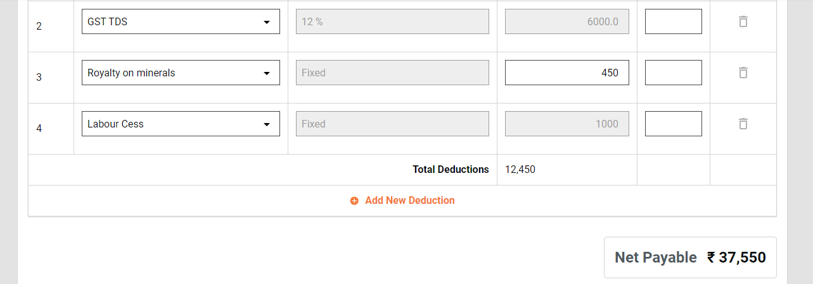
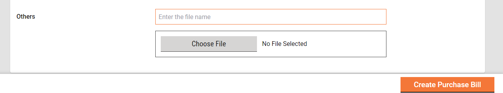

# Billing

### Billing 

The billing menu enables employee users to access employee inbox.

#### Inbox 

Home Page > Bills

From the Home Page on click of the Bills, the Inbox Page is displayed.

.png>)

1. On the left side on the top feature menus are displayed.
2. On the left side on the bottom Filters Panel is displayed with the filters.
   1. Assigned to Me - The only bills assigned to the logged-in user are displayed on the right side window.
   2. Assigned to All - It is default selected and hence the bills assigned to anyone are displayed on the right side window.
   3. Ward- It filters the application based on the ward selected and then displays the result on the right side window.
   4. Workflow States - It appears only when the application type filter is selected and filters the application based on the application status selected and then displays the result on the right side window.
3. On the right side of the top, search parameters are displayed, which allow you to search the bill by Bill Number, Project ID, and Bill Type.
4. On the right side on the bottom, a window is provided to list the bills based on default setting and applied filters and search parameters.

#### Search 

Home Page > Bills > Inbox > Search Bill

The search Bill enables ULB employees to search for a specific Bill using different search parameters.

**Search Criteria**

1. Ward
2. Bill Type
3. Project Name
4. Bill Number
5. Status
6. Created From Date
7. Created To Date

.png>)

**Search Result**

1. Bill Number
2. Project Name
3. Location
4. CBO Name
5. Bill Type
6. Status
7. Bill Amount

.png>)

#### View 

Home Page > Bills > Inbox > Search Bill > Search Results

The bill for which the details to be displayed is searched using Search Bill and then opened by clicking on bill number.

.png>)

1. Click on the Bill Number to view the Bill details.
2. Complete bill details are displayed along with attached documents and the option to download the bill in PDF.

#### Create 

Home Page > Bills > Inbox > Create Bill

To create a bill for a project, the work order for the project is searched using the search work order and opened to view the details. Then from the view work order page, the action **Create Purchase Bill** is clicked. Other bills, wages and supervision are created automatically.

1. A work order is searched using the Search Work Order and the search result is displayed.
2. Click on the Work Order Number to view the work order details.
3. Click on the **Create Purchase Bill** from the action.

.png>)

1. **Create Purchase Bill** page is opened.

.png>)

.png>)

.png>)

.png>)

1. Fill all the relevant details properly and then forward the application.

.png>)

1. On successful completion, the success page is displayed along with the bill number.

#### Workflow

**Creator**

The Bill Creator (BC) is responsible for creating and forwarding the Purchase Bill along with relevant documents uploaded.&#x20;

Note: Please note that the other 2 bills viz. Wage and Supervision Bills are created automatically by the system.&#x20;

BC can

* Create and forward purchase bill
* Edit purchase bill

**Create and Forward**

Bill creator (BC) has the rights to create a bill for a project and then forward it to the verifier. On creation, the BC gets the forward dialog box from which the user optionally selects the verifier’s name as assignee name, add the comments if any, and then forward the bill.&#x20;

On forward, the bill is forwarded to the verifier and the success page is displayed with the success message and bill number.

**Edit**&#x20;

The bill creator (BC) has the rights to edit the bill in the case the bill is sent back for any correction.&#x20;

1. The bill pending for correction is available in the Inbox. Else, search for the bill using the search bill.
2. Click on the bill number to open the bill and view the details.
3. Select the Edit from the Take Action. Bill is opened into editable mode.

**Verifier**

The Bill Verifier (BV) is responsible for verifying the bill and supporting documents uploaded.&#x20;

BV can

* Verify and forward Bill
* Send Bill back to BC

**Verify and forward**

The BV verifies and forwards the Bill if the documents and information provided in the Bill is found satisfactory and complete. To verify and forward the Bill

1. The bill pending for verification is available in the Inbox. Else, search for the bill using the search bill.
2. Click on the bill number to open the bill and view the details.
3. Select the Verify and Forward from the Take Action. A pop-up window is opened.
4. Select the approver’s name as Assignee Name.
5. Provide any additional information for the assignee in the comments section.
6. Click on the Choose Files button to upload any supporting documents.
7. Click on the Verify and Forward button. The bill is forwarded to the approver.

**Send back**

BV can send the Bill back to the BC for any corrections or if any vital document has not been uploaded. To send the Bill back to the BC.

1. The bill pending for verification is available in the Inbox. Else, search for the bill using the search bill.
2. Click on the bill number to open the bill and view the details.
3. Select the Send Back from the Take Action. A pop-up window is opened.
4. State the reasons for sending the bill to BC in the comments section.
5. Click on the Choose Files button to upload any supporting documents.
6. Click on the Send Back button. The bill is placed into BC’s inbox and the bill enabled for editing.

**Approver**

The Approver verifies the bill and if the documents and information provided in the bill is found satisfactory, complete, and as per the guideline, the bill is approved.

Approver can

* Approve the bill
* Send the bill back to BV
* Send the bill back to BC

**Approve**

1. The bill Pending for Approval is available in the Inbox. Else, search for the bill using the search bill.
2. Click on the bill number to open the bill and view the details.
3. Select the Approve from the Take Action. A pop-up window is opened.
4. Provide any additional information in the Comments section.
5. Click on the Approve Files button to upload any supporting documents.
6. Click on the Approve button. The bill is approved.&#x20;

**Send Back**

To send the bill back to the BV

1. The bill pending for approval is available in the Inbox. Else, search for the bill using the search bill.
2. Click on the bill number to open the bill and view the details.
3. Select the Send Back from the Take Action. A pop-up window is opened.
4. State the reasons for sending the bill back to the BV in the comments section.
5. Click on the Choose Files button to upload any supporting documents.
6. Click on the Send Back button. The bill is placed into BV’s inbox.&#x20;

**Send back to originator**

To send the bill back to the BC

1. The bill pending for approval is available in the Inbox. Else, search for the bill using the search bill.
2. Click on the bill number to open the bill and view the details.
3. Select the Send Back from the Take Action. A pop-up window is opened.
4. State the reasons for sending the bill back to the BC in the comments section.
5. Click on the Choose Files button to upload any supporting documents.
6. Click on the Send Back button. The bill is placed into BC’s inbox and the bill enabled for editing.
