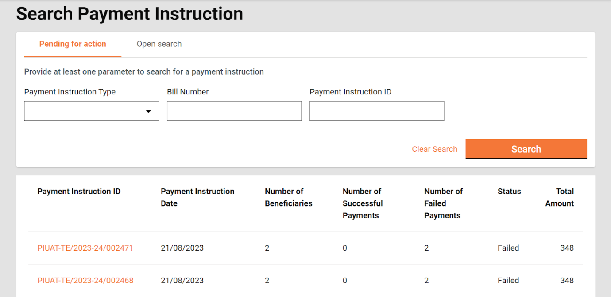
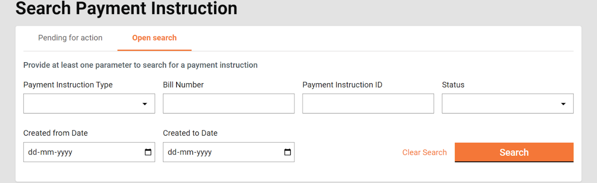
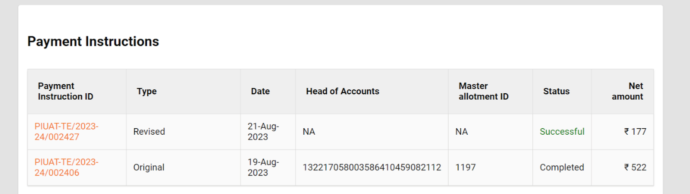
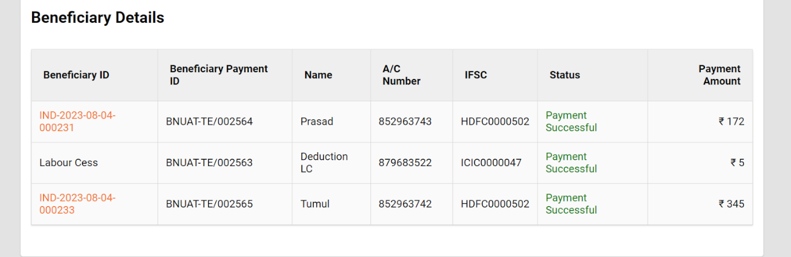

# Payments

## Payments

All the payments are processed by the JIT-FS system which is a state treasury system integrated with MUKTASoft. These payments are processed from MUKTA funds and designated HOAs.&#x20;

On approval of bills a payment instruction is created automatically and sent to the JIT-FS system.

### Payment Instruction

Home > Payment Instruction

Payment instruction feature lists all the payment instructions by default which are pending for an action. It also enables the user to search a payment instruction and view its details.

To search a payment instruction click on Open Search.

1. Enter at least one parameter to perform the search.
2. On search search result is displayed.
3. Click on the payment instruction ID to view the details.

### Create Revised Payment Instruction

In case payment to a beneficiary fails due to some reason, the status of the beneficiary’s payment is displayed as failed with the error message displayed at tool-tip. All such payment instructions are displayed under “pending for action” by default and the user has to generate the revised payment instruction.

### Retry Failed Payment Instruction

In case a payment instruction is declined by JIT due to some error the status of payment instruction is updated as failed. All such payment instructions are displayed under “pending for action” by default and the user has to take the action to retry after making necessary corrections.

