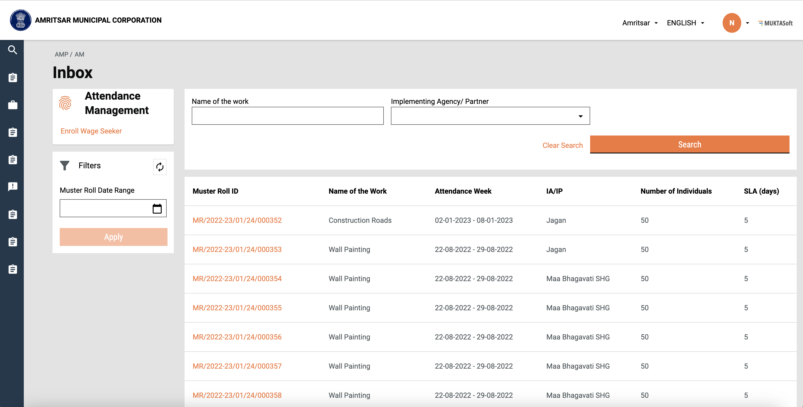
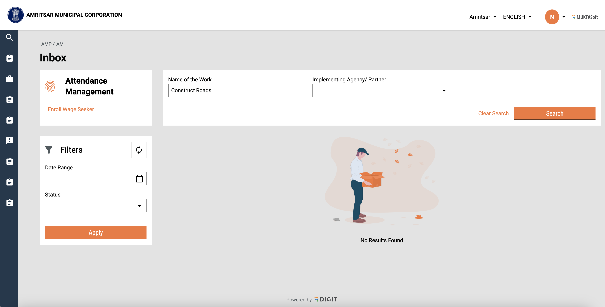

# Inbox

**Overview:**&#x20;

* Lists all the musters submitted by SHG
* To search/filter the muster list based on various criteria
* To navigate to Muster details/View Attendance page

## Workflow Details

The employee home screen will have a link to navigate to the Attendance Inbox screen

<figure><figcaption><p>Home Screen</p></figcaption></figure>

The inbox screen consists of a list of muster rolls created/submitted by SHG in tabular format. This table supports pagination and the number of records displayed per page can be editable

<figure><figcaption><p>Attendance Inbox Screen</p></figcaption></figure>

A minimum of 1 search criterion is required based on which the list will be populated with search results. Search parameters are as below:

* Name of the work
* Implementing Agency/Partner

This list can be filtered based on below parameters:

* Date range
* Muster roll status

A ‘No results found’ message is displayed if no records are found for the given search/filter criteria.

<figure><figcaption><p>Inbox with 'No Results Found'</p></figcaption></figure>

Both search and filter criteria can be cleared using the ‘Clear Search’ and ‘refresh’ buttons respectively. Muster Roll ID is a clickable link that navigates the user to the View Attendance screen (Muster Details).

## Technical Implementation Details

Inbox screen technical implementation can be found in the file below.                                                            &#x20;



**Hooks used**

To fetch inbox details, ‘**useCustomAPIHook**’ is used which takes all the API details like URL, query params and body from config (defined in MDMS).                     &#x20;



To fetch inbox config, ‘**useCustomMDMS**’ hook is used which takes the module name, master details and config.                                                                                      &#x20;



**APIs used**

Endpoint:

```markup
/inbox/v2/_search
```

Sample curl for Inbox API:

```json
curl --location --request POST 'https://works-dev.digit.org/inbox/v2/_search' \
--header 'Content-Type: application/json' \
--data-raw '{
    "RequestInfo": {
        "ts": 0,
        "action": "string",
        "key": "string",
        "msgId": "string",
        "authToken": "ea4069c7-c2a8-4def-a216-ce67352f980d",
        "userInfo": {
            "id": 107,
            "uuid": "c8d0093a-4d2b-495f-8bdf-fd9d3594e43f",
            "userName": "super",
            "name": "Super User",
            "mobileNumber": "1234567890",
            "emailId": null,
            "type": "EMPLOYEE",
            "roles": [
                {
                    "name": "SUPER USER",
                    "code": "SUPERUSER",
                    "tenantId": "pb"
                }
            ],
            "tenantId": "pb.amritsar"
        }
    },
    "inbox": {
        "tenantId": "pb.amritsar",
        "processSearchCriteria": {
            "tenantId": "pb.amritsar",
            "businessService": [
                "muster-roll-approval"
            ],
            "moduleName": "muster-roll-service"
        },
        "moduleSearchCriteria": {
            "tenantId":"pb.amritsar",
            "attendanceRegisterName":"Construct Roads",
            "musterRollStatus":"SUBMITTED",
            "startDate":1670178600000,
            "endDate":1670697000000
        },
        "limit": 10,
        "offset": 0
    }
}'
```

## **MDMS Used**

Inbox screen config is fetched from MDMS using 'useCustomMDMS' hook.

```json
const { isLoading, data } = Digit.Hooks.useCustomMDMS(
        tenant,
        "commonUiConfig",
        [
            {
                "name": "musterInboxConfig"
            }
        ]
    )
```

## Localisation

Localisation keys are added under the ‘_rainmaker-attendencemgmt_’ locale module. In future, if any new labels are implemented in the attendance module they should be pushed to the locale DB under _rainmaker-attendencemgmt_ locale module. Below is an example of a few locale labels for Hindi and English.

```json
{
    "code": "ATM_ACTUAL_WORKING_DAYS",
    "message": "वास्तविक कार्य दिवस",
    "module": "rainmaker-attendencemgmt",
    "locale": "hi_IN"
}
{
    "code": "ATM_ACTUAL_WORKING_DAYS",
    "message": "Actual Working Days",
    "module": "rainmaker-attendencemgmt",
    "locale": "en_IN"
}

```

## Customisation

The content on this screen is rendered based on configuration passed via MDMS. Its implementation can be found in the below file. &#x20;


[inbox-search-screen.md](../../../../customisation/ui-screens-customisation/inbox-search-screen.md)


## API Role Action Mapping

<table><thead><tr><th width="183">API</th><th width="201">Role Code</th><th width="99" data-type="number">Action Id</th><th width="179">Actions</th></tr></thead><tbody><tr><td>/inbox/v2/_search</td><td>JUNIOR_ENGINEER</td><td>65</td><td><ul><li>View inbox for Muster Rolls</li></ul></td></tr><tr><td>/inbox/v2/_search</td><td>MUNICIPAL_ENGINEER</td><td>65</td><td><ul><li>View inbox for Muster Rolls</li></ul></td></tr></tbody></table>

