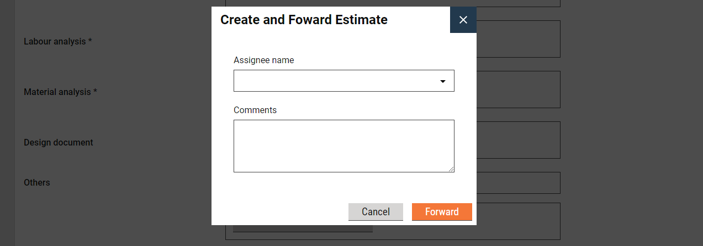
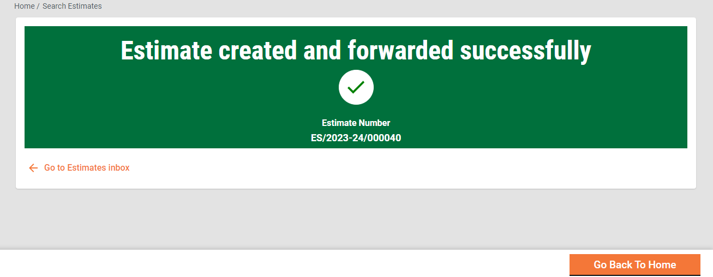
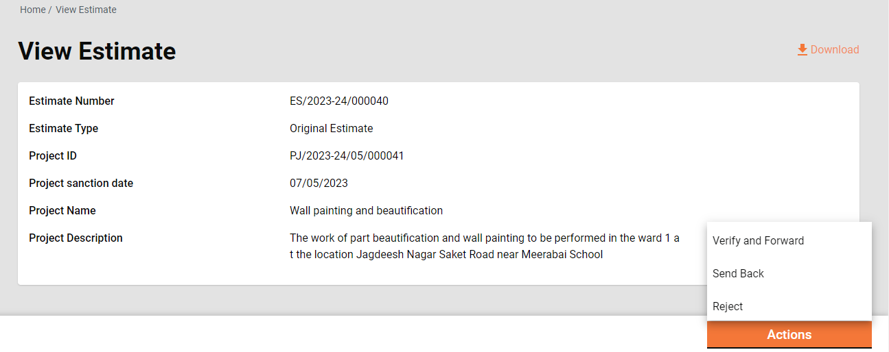
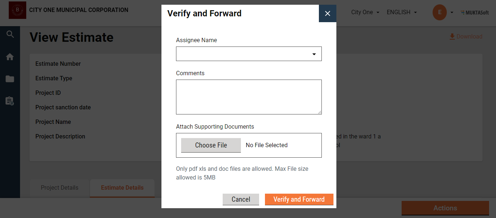
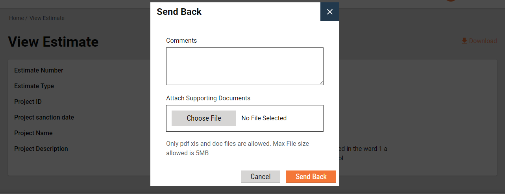

# Detailed Estimate

A detailed estimate in construction refers to a comprehensive breakdown of the anticipated costs associated with a construction project. This estimate is a meticulous calculation that itemizes various components, materials, labour, and other expenses required for the successful completion of the project.&#x20;

The detailed estimate is typically created during the planning and design phase of a project and serves as a fundamental tool for budgeting, tendering, and project management.

## Inbox 

**Home Page > Estimates**

To access the estimate inbox, follow these steps:

<mark style="color:red;">**Step 1:**</mark> Navigate to the home page.

<mark style="color:red;">**Step 2:**</mark> Look for and click on the "Estimates" option. This action navigates you to the estimate inbox, where you can manage and view the estimates.

.png>)

.png>)

<mark style="color:red;">**Step 3:**</mark> Select and apply the filters and search parameters as applicable.&#x20;

* The feature menus are displayed on the top left side.
* The bottom panel displays the filters on the left.
  1. Assigned to Me - The only estimates assigned to the logged-in user are displayed on the right side window.
  2. Assigned to All - It is default selected and hence the estimates assigned to anyone are displayed on the right side window.
  3. Ward- It filters the application based on the ward selected and then displays the result on the right side window.
  4. Workflow States - It appears only when the application type filter is selected. It filters the application based on the application status selected and then displays the result on the right side window.
* The Search parameters are displayed on the top right. Search the estimate by Estimate Number, Project ID, and Project Type.

<mark style="color:red;">**Step 4:**</mark> The window on the bottom right lists the estimates based on the default settings and applied filters and search parameters.

## Search Estimate 

**Home Page > Estimates> Search Estimate**

The 'Search Estimate' functionality empowers ULB employees to locate specific estimates with precision by utilizing multiple filters, streamlining the process of retrieving relevant and targeted information.

**Search Criteria**

1. Ward
2. Project Type
3. Project Name
4. Estimate Number
5. Status
6. From Date
7. To Date

.png>)

<mark style="color:red;">**Step 1:**</mark> It is mandatory to enter at least one search parameter or more to search for an estimate.

* The system fetches the estimates created between the specified period by entering the date range in created from and created to. The From Date and To Date fields are treated as one parameter.

<mark style="color:red;">**Step 2:**</mark> Click on the **Search** button to view the search results.

<mark style="color:red;">**Step 3:**</mark> Click on the **Clear Search** button to renew the search using different parameters.

The Search Result displays the following:

1. Estimate Number
2. Project Name
3. Location
4. Prepared by
5. Status
6. Estimated Amount (₹)

.png>)

## View Estimate 

**Home Page > Estimates> Inbox > Search Estimate > Search Results**

To view the details of a specific estimate

<mark style="color:red;">**Step 1:**</mark> Click on the applicable Estimate Number in the search results. This action displays information and specifics associated with the selected estimate.

<figure><figcaption></figcaption></figure>

<figure><figcaption></figcaption></figure>

<figure><figcaption></figcaption></figure>

<figure><figcaption></figcaption></figure>

.png>)

<figure><figcaption></figcaption></figure>

<figure><figcaption></figcaption></figure>

<figure><figcaption></figcaption></figure>

## Create Estimate 

**Home Page > Estimates > Inbox > Create Estimate**

To create an estimate for a project

<mark style="color:red;">**Step 1:**</mark> Click on the search project feature to locate the desired project.&#x20;

<mark style="color:red;">**Step 2:**</mark> Click on the applicable Project ID from the search results list to view the project details.

.png>)

* <mark style="color:red;">**Step 3:**</mark> Navigate to the **Actions** button located in the bottom right corner and click on the **Create Estimate** option.&#x20;

.png>)

<mark style="color:red;">**Step 4:**</mark> The basic project details are available at the top of the page. The Project Details tab provides a comprehensive view of the full project details.

<mark style="color:red;">**Step 5:**</mark> Click on the Estimate Details tab. Enter the SOR details. Estimate details are organized into grids for Schedule of Rates (SOR), Non-SOR items, and Other Charges.

<figure><figcaption></figcaption></figure>

<mark style="color:red;">**Step 7:**</mark> Use the Search option to find the relevant Schedule of Rates (SOR) and add the SOR items to the estimate.

<figure><figcaption></figcaption></figure>

<figure><figcaption></figcaption></figure>

<mark style="color:red;">**Step 8:**</mark> For Non-SOR items, enter the item **Description**, **Unit**, **Rate**, and **Estimated Quantity** details.

<mark style="color:red;">**Step 9:**</mark> Click on the **Add Non-SOR** button to append additional Non-SOR items to the estimate.

<figure><figcaption></figcaption></figure>

<mark style="color:red;">**Step 10:**</mark> Select **Goods and Services Tax (GST)** and **Supervision Charges** from the **Overhead** dropdown in the **Other Charges** section to add these details to the estimate.

<figure><figcaption></figcaption></figure>

<mark style="color:red;">**Step 11:**</mark> The total of SOR, Non-SOR and Other Charges is displayed as the Total Estimate Amount.

<mark style="color:red;">**Step 12:**</mark> Click on the **View Analysis Statements** option to view the breakdown of labour, material, and machinery costs for the estimated amount.&#x20;


Only saved estimate analysis statements can be viewed.


<mark style="color:red;">**Step 13:**</mark> Upload the documents in the **Relevant Documents** section required to verify and approve the estimate.

<figure><figcaption></figcaption></figure>

<mark style="color:red;">**Step 14:**</mark> Follow the steps below to save and create the estimate -

1. **Save as Draft:**
   * Click on the **Save as Draft** button to save the entered details without finalizing the estimate. This allows for further editing and review before submission.
2. **Submit:**
   * Once all details are filled in and the estimate is ready for submission, click on the **Submit** button.
   * Ensure that all fields marked with an asterisk (\*) are completed, as these are mandatory fields.

## Role Workflows 

The role-based workflows detail the actions available for individual roles. Click on the applicable role to navigate the workflows.

* [Estimate Creator](detailed-estimate.md#estimate-creator)
* [Estimate Verifier](detailed-estimate.md#estimate-verifier)
* [Technical Sanctioner](detailed-estimate.md#technical-sanctioner)

### **Estimate Creator**

The Estimate Creator (EC) is responsible for creating and forwarding the estimation along with relevant documents uploaded.

EC can

* [Save as Draft](detailed-estimate.md#save-as-draft)
* [Submit](detailed-estimate.md#submit)
* [Edit Estimate](detailed-estimate.md#edit)

#### Save as Draft

#### **Submit**

The Estimate Creator (EC) can create and submit an estimate for a project. The estimate is forwarded to the verifier.&#x20;

<mark style="color:red;">**Step 1:**</mark> Click on the **Submit** button once the estimate details are entered.&#x20;

<mark style="color:red;">**Step 2:**</mark> The EC gets the forward dialogue box.  Select the verifier name as the **Assignee Name** and add **Comments** if any.&#x20;

<mark style="color:red;">**Step 3:**</mark> Click on the **Forward** button. The estimate is forwarded to the selected Assignee for verification. A success message is displayed with the **Estimate Number**.

#### **Edit**

The estimate creator (EC) has the right to edit the estimate in case the estimate is sent back for any correction.

<mark style="color:red;">**Step 1:**</mark> Click on **Estimate Number** of the estimate pending correction. This is available in the Inbox. Else, click on the **Search Estimate** option to search for the estimate.

<mark style="color:red;">**Step 2:**</mark> Click on the **Take Action** button and select **Edit**. The estimate is opened in editable mode.

<mark style="color:red;">**Step 3:**</mark> Edit the required details. Click on **Submit** once editing is complete. The submitted estimate is again sent to the verifier for verification.

### **Estimate Verifier**

The Estimate Verifier (EV) is responsible for verifying the estimation and supporting documents uploaded.

EV can

* [Verify and forward estimate](detailed-estimate.md#verify-and-forward)
* [Send estimate back to EC](detailed-estimate.md#send-back)

#### **Verify and forward**

The EV verifies and forwards the application if the documents and estimation provided in the estimate are found satisfactory and complete.

To verify and forward the estimate

<mark style="color:red;">**Step 1:**</mark> The estimate pending verification is available in the Inbox. Else, search for the estimate using the search estimate.

<mark style="color:red;">**Step 2:**</mark> Click on the Estimate Number to open the estimate and view the details.

<mark style="color:red;">**Step 3:**</mark> Select the Verify and Forward from the Take Action. This opens a pop-up window.

<mark style="color:red;">**Step 4:**</mark> Select the technical sanctioner’s name as **Assignee Name**.

<mark style="color:red;">**Step 5:**</mark> Enter any additional information for the assignee in the **Comments** box.

<mark style="color:red;">**Step 6:**</mark> Click on the **Choose Files** button to upload any supporting documents.

<mark style="color:red;">**Step 7:**</mark> Click on the **Verify and Forward** button. The application is forwarded to the technical sanctioner.

#### **Send back**

EV can send the estimate back to the EC for any corrections or if any vital document has not been uploaded.

To send the estimate back to the CE

<mark style="color:red;">**Step 1:**</mark> The estimate pending verification is available in the Inbox. Else, search for the estimate using the search estimate.

<mark style="color:red;">**Step 2:**</mark> Click on the **Estimate Number** to open the estimate and view the details.

<mark style="color:red;">**Step 3:**</mark> Select the **Send Back** from the **Take Action**. This opens a pop-up window.

<mark style="color:red;">**Step 4:**</mark> State the reasons for sending the estimate back to the CE in the **Comments** box.

<mark style="color:red;">**Step 5:**</mark> Click on the **Choose Files** button to upload any supporting documents.

<mark style="color:red;">**Step 6:**</mark> Click on the **Send Back** button. The estimate is placed into CE’s inbox and enabled for editing.

### **Technical Sanctioner**

The Technical Sanctioner (TS) is responsible for technically sanctioning the estimate.

TS can

* [Technical sanction estimate](detailed-estimate.md#technical-sanction)
* [Send the estimate back to EV](detailed-estimate.md#send-back-1)
* [Send the estimate back to EC](detailed-estimate.md#send-back-to-originator-1)
* [Reject the estimate](detailed-estimate.md#reject-1)

.png>)

#### **Technical Sanction**

The TS technically approves the estimate if the estimate is found technically correct.

To technically sanction the estimate

1. The estimate pending verification is available in the Inbox. Else, search for the estimate using the search estimate.
2. Click on the estimate number to open the estimate and view the details.
3. Select the Send Back from the Take Action. A pop-up window is opened.

.png>)

1. Select the estimate’s approver’s name as Assignee Name.
2. Provide any additional information for the assignee in the comments section.
3. Click on the Choose Files button to upload any supporting documents.
4. Click on the Technically Sanction button. The application is forwarded to the estimate approver.

#### **Send Back**

TS can send the estimate back to the EV for any clarification which is needed by TS to proceed further.

To send the estimate back to the EV

1. The estimate pending for technical sanction is available in the Inbox. Else, search for the estimate using the search estimate.
2. Click on the estimate number to open the estimate and view the details.
3. Select the Send Back from the Take Action. A pop-up window is opened.

.png>)

1. State the reasons for sending the estimate back to the EV in the comments section.
2. Click on the Choose Files button to upload any supporting documents.
3. Click on the Send Back button. The estimate is placed into EV’s inbox.

#### **Send back to originator**

TS can send the estimate back to the EC for any corrections or if any vital document has not been uploaded.

To send the estimate back to the CE

1. The estimate pending for technical sanction is available in the Inbox. Else, search for the estimate using the search estimate.
2. Click on the estimate number to open the estimate and view the details.
3. Select the Send Back from the Take Action. A pop-up window is opened.

.png>)

1. State the reasons for sending the estimate back to the CE in the comments section.
2. Click on the Choose Files button to upload any supporting documents.
3. Click on the Send Back button. The estimate is placed into CE’s inbox and the estimate is enabled for editing.

#### **Reject**

The TS can reject the estimate if the documents and information furnished by the EC do not meet the prescribed guidelines.

To reject the estimate

1. The estimate Pending for Technical Sanction is available in the Inbox. Else, search for the estimate using the search estimate.
2. Click on the estimate number to open the estimate and view the details.
3. Select the Reject from the Take Action. A pop-up window is opened.

.png>)

1. State the reasons for rejecting the estimate in the Comments section.
2. Click on the Choose Files button to upload any supporting documents.
3. Click on the Reject button. The estimate is rejected, and a notification is sent to the EC informing the same.

**Approver**

The Approver verifies the estimate and if the documents and estimation provided in the application are found satisfactory, complete and the estimation amount as per the guideline, the estimate is approved.

Approver can

* Approve the estimate
* Send the estimate back to TS
* Send the estimate back to EC
* Reject the estimate

.png>)

#### **Approve**

1. The estimate Pending Approval is available in the Inbox. Else, search for the estimate using the search estimate.
2. Click on the estimate number to open the estimate and view the details.
3. Select the Approve from the Take Action. A pop-up window is opened.

.png>)

1. Provide any additional information for the applicant in the Comments section.
2. Click on the Approve Files button to upload any supporting documents.
3. Click on the Approve button. The estimate is approved.

#### **Send Back**

To send the estimate back to the TS

1. The estimate pending approval is available in the Inbox. Else, search for the estimate using the search estimate.
2. Click on the estimate number to open the estimate and view the details.
3. Select the Send Back from the Take Action. A pop-up window is opened.

.png>)

1. State the reasons for sending the estimate back to the TS in the comments section.
2. Click on the Choose Files button to upload any supporting documents.
3. Click on the Send Back button. The estimate is placed into TS’s inbox.

#### **Send back to originator**

To send the estimate back to the CE

1. The estimate pending for technical sanction is available in the Inbox. Else, search for the estimate using the search estimate.
2. Click on the estimate number to open the estimate and view the details.
3. Select the Send Back from the Take Action. A pop-up window is opened.

.png>)

1. State the reasons for sending the estimate back to the CE in the comments section.
2. Click on the Choose Files button to upload any supporting documents.
3. Click on the Send Back button. The estimate is placed into CE’s inbox and the estimate is enabled for editing.

#### **Reject**

The Approver can reject the estimate if the documents and information furnished by the EC do not meet the prescribed guidelines.

To reject the application

1. The estimate Pending Approval is available in the Inbox. Else, search for the estimate using the search estimate.
2. Click on the estimate number to open the estimate and view the details.
3. Select the Edit from the Take Action. A pop-up window is opened.

.png>)

1. State the reasons for rejecting the estimate in the Comments section.
2. Click on the Choose Files button to upload any supporting documents.
3. Click on the Reject button. The estimate is rejected and a notification is sent to the EC informing the same.
