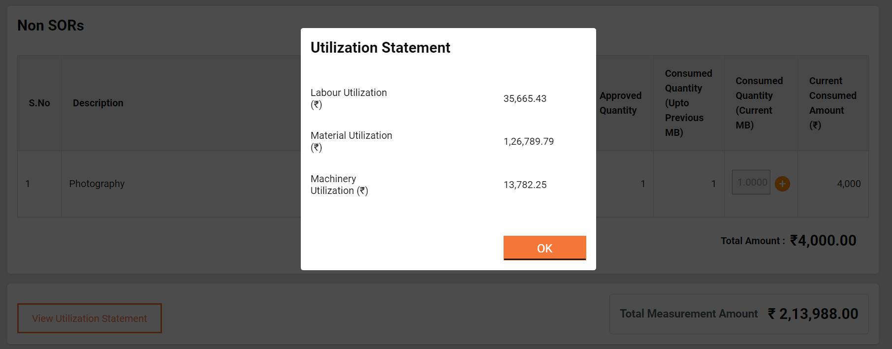

# Getting Started

This section of the user manual guides you through the user login process and the steps for using the MUKTASoft application for individual role.

On this page:

* [Logging in](getting-started.md#\_ak2iff6svn1)
* [Home page](getting-started.md#\_y9ihxiqjb66c)
* [Change language](getting-started.md#\_vhz5bczfaqjw)
* [Change password](getting-started.md#\_b8qo749mn030)
* [Reset password](getting-started.md#\_c78bky4bw4uc)
* [Logging out](getting-started.md#\_viqhetl2a1py)

### Logging In 

<table data-card-size="large" data-view="cards"><thead><tr><th></th><th></th><th></th></tr></thead><tbody><tr><td></td><td>Select language and click on <strong>Continue</strong>.</td><td></td></tr><tr><td></td><td>Enter <strong>User Name</strong>, <strong>Password</strong>, &#x26; <strong>City</strong>. Click on <strong>Continue</strong>.</td><td></td></tr></tbody></table>

### Home Page 

<table data-card-size="large" data-view="cards" data-full-width="false"><thead><tr><th></th><th></th><th></th></tr></thead><tbody><tr><td></td><td>Mukta home page</td><td></td></tr></tbody></table>

### Change Language 

<table data-card-size="large" data-view="cards"><thead><tr><th></th><th></th><th></th></tr></thead><tbody><tr><td></td><td>Click on <strong>English</strong> in the top right corner to view other language options. Select the preferred language from the list. </td><td></td></tr></tbody></table>

### Change Password 

<table data-card-size="large" data-view="cards"><thead><tr><th></th><th></th><th></th></tr></thead><tbody><tr><td></td><td>

Profile icon<strong>> Edit Profile > Change Password</strong>

Click on the <strong>Profile</strong> icon on the homepage.
<ul><li> Two options are displayed - <strong>Edit Profile</strong> and <strong>Logout</strong>.</li><li>Click on <strong>Edit Profile</strong>.</li><li>This opens the Edit Profile page with the employee picture on the left and the details on the right.</li></ul></td><td></td></tr><tr><td></td><td></td><td>
Click on the <strong>Change Password</strong> option at the bottom. 

Enter the current password and new password and confirm the new password. 

Click on the <strong>Save</strong> button to reset the password.
</td></tr></tbody></table>

### Reset password 

**Login Page > Forgot Password**

<table data-card-size="large" data-view="cards"><thead><tr><th></th><th></th><th></th></tr></thead><tbody><tr><td></td><td>Click on <strong>Forgot Password</strong> option on the login screen to reset the password.</td><td>

Enter the registered <strong>Mobile Number</strong> and <strong>City</strong>. Click on <strong>Continue</strong>.
</td></tr><tr><td></td><td>Enter <strong>OTP</strong> sent on the registered mobile number.</td><td>
Enter the new passwords and type in the new password again to confirm.

Click on the <strong>Change Password</strong> button to reset it.
</td></tr></tbody></table>

### Logging out 

**Home > Profile > Logout**

<table data-card-size="large" data-view="cards" data-full-width="false"><thead><tr><th></th><th></th><th></th></tr></thead><tbody><tr><td></td><td>Click on the profile icon on the top right side of the screen. There are two options - <strong>Edit Profile</strong> and <strong>Logout</strong>. </td><td>Click on the <strong>Logout</strong> option. The user is logged out.</td></tr></tbody></table>
