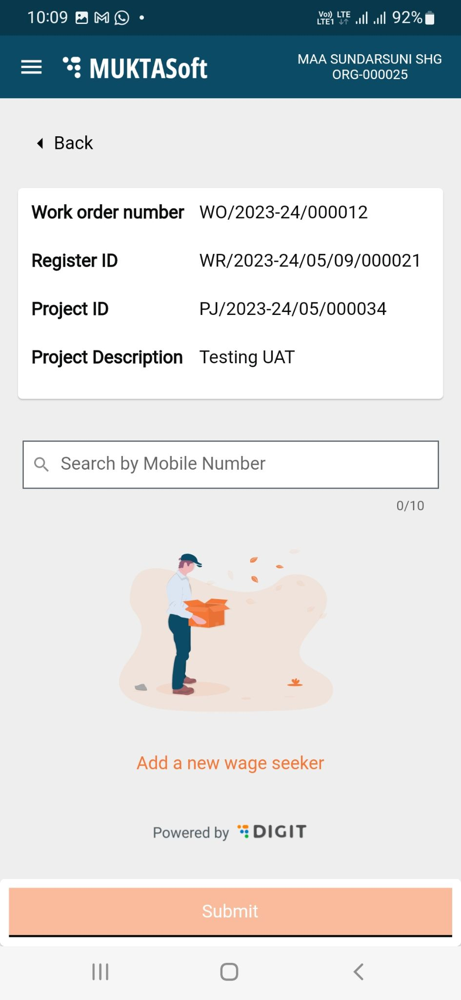
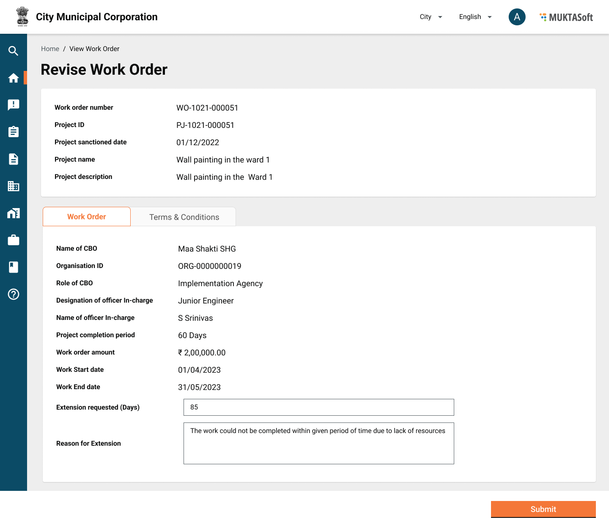

# Product Requirements Document v1.1

## Introduction 

The Mukhyamantri Karma Tatpara Abhiyan Yojana (MUKTA Yojana) is a government scheme aimed at helping the urban poor, consequently boosting the employment rate within the state. The purpose of this document is to provide comprehensive specifications for MUKTASoft version v1.1.

MUKTASoft aims to improve the overall scheme efficiency of MUKTA by identifying & providing equal job opportunities to the urban poor, constructing environment-friendly projects, developing local communities and slums & plan better for upcoming years.

## Purpose 

The purpose of this document is to give a detailed description of the requirements for the MUKTASoft v1.1. It will illustrate the purpose and complete declaration for the development of the system. It will also explain system constraints, interface and interactions with other external applications. This document is primarily intended to define the scope of version v1.1 and propose to the stakeholders for its approval and as a reference for developing the next version of the system for the development team.

### Definitions, Acronyms & Abbreviations 

<table data-header-hidden><thead><tr><th width="153"></th><th></th></tr></thead><tbody><tr><td>JE</td><td>Junior Engineer</td></tr><tr><td>ME</td><td>Municipal Engineer</td></tr><tr><td>EO</td><td>Executive Officer</td></tr><tr><td>MC</td><td>Municipal Corporation</td></tr><tr><td>DDO</td><td>Drawing and Disbursing Officer</td></tr><tr><td>SOR</td><td>Schedule of Rates</td></tr><tr><td>WO</td><td>Work Order</td></tr><tr><td>PO</td><td>Purchase Order</td></tr><tr><td>WL</td><td>Finalized Worklist</td></tr></tbody></table>

### Information Source 

1\. MUKTA FRS

2\. JIT Technical documents for integration and discussions with JIT teams

2\. Visits to Dhenkanal and Jatni ULBs \[**Prototype, Product Showcases and UAT**]

### In Scope 

1. [JIT Integration](product-requirements-document-v1.1.md#\_tahrkib399r5)
2. [Time Extension](product-requirements-document-v1.1.md#\_bgk0hf3cu6iq)
3. [MUKTA Dashboard](product-requirements-document-v1.1.md#\_543payx2n6s7)

### Out of Scope 

1. Aadhaar Integration to validate wage seeker’s Aadhaar numbers.
2. Project closure has been moved to MUKTASoft V2.0

## Functional Details 

### JIT Integration 

To achieve the goal of smart payments for MUKTA beneficiaries, MUKTASoft will be integrated with JIT-FS. It will enable the ULBs to transfer the money to the beneficiary account through DBT in a smooth and seamless manner by minimizing manual intervention.

#### Flow Diagram 

### Fund Allocation Register 

To execute the MUKTA-related works, the fund is provided by the state government through the state treasury. The fund is allocated to 4 different heads of account aiming the expenditure booked for different purposes and communities. The information on fund allocation for a ULB is then made available by the JIT system to an integrated system for tracking and validation purposes. MUKTASoft fetches these details and then maintains them for validation and reporting purposes.

#### **Search Criteria**

<table><thead><tr><th width="102.33333333333331">#</th><th width="224">Field</th><th>Description</th></tr></thead><tbody><tr><td>1</td><td>Financial Year</td><td>Financial year, by default current financial year is selected.</td></tr><tr><td>2</td><td>Head of Account</td><td>HOAs from the configuration.</td></tr><tr><td>3</td><td>Transaction Type</td><td>Allotment types are, 1) Initial Allotment 2) Additional Allotment 3) Withdrawal 4) Expense 5) Expense Reversed</td></tr></tbody></table>

#### **Search Result**

<table><thead><tr><th width="114.33333333333331">#</th><th width="210">Field</th><th>Description</th></tr></thead><tbody><tr><td>1</td><td>HOA</td><td>Head of accounts of MUKTA</td></tr><tr><td>2</td><td>Transaction Number</td><td>Transaction number of the transactions fetched from JIT or created in MUKTASoft.</td></tr><tr><td>3</td><td>Transaction Date</td><td>Date of transaction received from JIT-FS in a response of API call or the MUKTASoft PI creation date. Date to be taken care when calling the API again.</td></tr><tr><td>4</td><td>Transaction Type</td><td>
A transaction type would be anything from the options given below.
<ol><li>Initial Allotment</li><li>Additional Allotment</li><li>Withdrawal</li><li>Expense</li><li>Expense (Reversed)</li></ol>
First 3 are received from the JIT-FS system through API calls while the last one is from MUKTASoft when a PI is pushed. A reverse entry of the Expense is made in the case PI is canceled or failed to create.
</td></tr><tr><td>5</td><td>Transaction Amount</td><td>It is a transaction/bill amount.</td></tr><tr><td>6</td><td>Sanctioned Balance</td><td>
It is the balance remaining from the sanctioned amount and calculated as given below.

Sanctioned Balance = Total Sanctioned Amount - Sum of all the allotments.
</td></tr><tr><td>7</td><td>Fund Available</td><td>
It is the fund available for the expenditure and calculated as given below.

Fund Available = Sum of all the allotments - (Sum of all the expenditure + Sum of all the withdrawal)
</td></tr></tbody></table>

#### **Mockups**

.jpeg>)

### Create Payment Instruction 

The payment instruction is created and then pushed to the JIT system to enable the JIT to process the payment against a bill. For each bill, a payment instruction is generated internally on approval of the bill.

#### **Attributes**

<table><thead><tr><th width="90">#</th><th width="226">Parameter</th><th width="142">Is Mandatory?</th><th>Description</th></tr></thead><tbody><tr><td>1</td><td>Payment Instruction ID</td><td>Yes</td><td>Payment Instruction ID of the payment instruction created in MUKTASoft and then pushed to JIT.</td></tr><tr><td>2</td><td>Payment Instruction Date</td><td>Yes</td><td>Payment Instruction date of the payment instruction created in MUKTASoft and then pushed to JIT.</td></tr><tr><td>3</td><td>DDO Code</td><td>Yes</td><td>The code of DDO from the configuration.</td></tr><tr><td>4</td><td>Grantee Code</td><td>Yes</td><td>Grantee code from the configuration.</td></tr><tr><td>5</td><td>Scheme Code</td><td>Yes</td><td>MUKTA scheme code</td></tr><tr><td>6</td><td>HOA</td><td>Yes</td><td>Head of account from which payment to be made.</td></tr><tr><td>7</td><td>SSU ID</td><td>Yes</td><td>Special spending unit id from the configuration.</td></tr><tr><td>8</td><td>Master Allotment ID</td><td>Yes</td><td>Virtual allotment parent ID/sanction ID from which payment to be made.</td></tr><tr><td>9</td><td>Bill Net Amount</td><td>Yes</td><td>PI net amount of the payment instruction created in MUKTASoft and then pushed to JIT.</td></tr><tr><td>10</td><td>Bill Gross Amount</td><td>Yes</td><td>PI gross amount of the payment instruction created in MUKTASoft and then pushed to JIT.</td></tr><tr><td>11</td><td>Number of Beneficiaries</td><td>Yes</td><td>The count of beneficiaries in the payment instruction.</td></tr><tr><td>12</td><td>Purpose</td><td>Yes</td><td>Purpose is the reference text. E.g. Muster Roll ID etc. for which the payment instruction is created.</td></tr><tr><td></td><td><strong>Beneficiary Details</strong></td><td><strong>Array</strong></td><td><strong>In a single request multiple beneficiaries can be added.</strong></td></tr><tr><td>13</td><td>Beneficiary Payment ID</td><td>Yes</td><td>The beneficiary's Payment ID, unique for each beneficiary for its payment. Payment of the beneficiary is tracked by this throughout the payment processing. It is generated with the PI generation.</td></tr><tr><td>14</td><td>Beneficiary Name</td><td>Yes</td><td>Beneficiary name maintained in MUKTASoft.</td></tr><tr><td>15</td><td>Beneficiary Account Number</td><td>Yes</td><td>Beneficiary’s bank account number maintained in MUKTASoft.</td></tr><tr><td>16</td><td>IFSC</td><td>Yes</td><td>IFSC of bank branch from beneficiary’s accounts details.</td></tr><tr><td>17</td><td>Beneficiary Mobile Number</td><td>Yes</td><td>Beneficiary's mobile number maintained in MUKTASoft.</td></tr><tr><td>18</td><td>Beneficiary Address</td><td>Yes</td><td>Beneficiary’s address maintained in MUKTASoft.</td></tr><tr><td>19</td><td>Account Type</td><td>Yes</td><td>Account type of beneficiary’s account maintained in MUKTASoft</td></tr><tr><td>20</td><td>Payment Amount</td><td>Yes</td><td>Amount payable to beneficiary.</td></tr><tr><td>21</td><td>PAN</td><td>No</td><td>PAN of beneficiary</td></tr><tr><td>22</td><td>AADHAR</td><td>No</td><td>Aadhaar of beneficiary</td></tr><tr><td>23</td><td>Purpose</td><td>Yes</td><td>Purpose is the reference text. E.g. Muster Roll ID etc. for which the bill is created.</td></tr></tbody></table>

#### **Mockups**

Not applicable.

### Search Payment Instruction 

Search payment instruction serves the purpose of searching a payment instruction to view the details along with status and provide a by default list of all the payment instructions which are pending action from a ULB user.

#### **Search Criteria**

#### **Attributes**

<table><thead><tr><th width="122.33333333333331">#</th><th width="215">Parameters</th><th>Description</th></tr></thead><tbody><tr><td>1</td><td>Ward</td><td>Drop-down, with the ward name as values.</td></tr><tr><td>2</td><td>Payment Instruction Type</td><td>Payment instruction types. Viz. Original/ Revised.</td></tr><tr><td>3</td><td>Project Name</td><td>Name of project</td></tr><tr><td>4</td><td>Bill Number</td><td>Bill number</td></tr><tr><td>5</td><td>Status</td><td>Status of payment instructions. This parameter is not applicable for “Payment Instruction Pending for Correction”</td></tr><tr><td>6</td><td>Created from date</td><td>Payment instruction created date. This parameter is not applicable for “Payment Instruction Pending for Correction”</td></tr><tr><td>7</td><td>Created to date</td><td>Payment instruction created date. This parameter is not applicable for “Payment Instruction Pending for Correction”</td></tr></tbody></table>

#### **Mockups**

#### **Search Result**

#### **Attributes**

<table><thead><tr><th width="82.33333333333331">#</th><th width="237">Parameter</th><th>Description</th></tr></thead><tbody><tr><td>1</td><td>Payment Instruction ID</td><td>Original/ Revised Payment Instruction ID. It is a hyperlink which opens the payment instruction to view the complete details.</td></tr><tr><td>2</td><td>Payment Instruction Date</td><td>Original/ Revised Payment Instruction Date.</td></tr><tr><td>3</td><td>No. of beneficiaries</td><td>Total number of beneficiaries for which payment is getting processed.</td></tr><tr><td>4</td><td>No. of successful Payments</td><td>Total number of successful payments.</td></tr><tr><td>5</td><td>No. of failed Payments</td><td>Total number of failed payments</td></tr><tr><td>6</td><td>Total Amount</td><td>Total amount of payment instruction which is to be paid.</td></tr><tr><td>7</td><td>Status</td><td>Status of payment instruction</td></tr></tbody></table>

#### **Mockups**

.jpeg>)

### View Payment Instruction 

The view payment instruction feature is provided mainly for 2 purposes.

1. To view the details and track the status of payment instructions.
2. To take action against a payment instruction which is failed or rejected by the JIT system.

#### **Attributes**

<table><thead><tr><th width="93.33333333333331">#</th><th width="267">Parameter</th><th>Description</th></tr></thead><tbody><tr><td>1</td><td>Bill Number</td><td>Hyperlink to view the bill details.</td></tr><tr><td>2</td><td>Payment Instruction Type</td><td>Payment instruction type, Original or Revised.</td></tr><tr><td>3</td><td>Parent Payment Instruction ID</td><td>Parent payment instruction id, i.e. original PI ID. It is a hyperlink to view the Original Payment Instruction Details.</td></tr><tr><td>4</td><td>Payment Instruction ID</td><td>Payment Instruction ID.</td></tr><tr><td>5</td><td>Payment Instruction Date</td><td>Payment Instruction Date.</td></tr><tr><td>6</td><td>Head of Account</td><td>Head of account from which amount to be paid</td></tr><tr><td>7</td><td>Master Allotment ID</td><td>Master allotment ID from which amount to be paid</td></tr><tr><td>8</td><td>Status</td><td>Status of payment instruction. A tool-tip is displayed to display the error message for declined and rejected PIs.</td></tr><tr><td>9</td><td><strong>Payment Advice Details</strong></td><td></td></tr><tr><td>10</td><td>Payment Advice ID</td><td>Payment advice ID generated for the original/ revised PI.</td></tr><tr><td>11</td><td>Payment Advice Date</td><td>Payment advice generation date.</td></tr><tr><td>12</td><td>Token Number</td><td>Token no. generated for the payment instruction</td></tr><tr><td>13</td><td>Token Date</td><td>Token no. generated for the payment instruction</td></tr><tr><td>14</td><td>Online Bill Number</td><td>Online bill number for the online bill generated for the payment advice.</td></tr><tr><td></td><td><em>Error/ Info</em> Section</td><td>A information display band to display the error message/ info messages</td></tr><tr><td></td><td><strong>Beneficiary Details</strong></td><td><strong>Tabular form</strong></td></tr><tr><td>15</td><td>Beneficiary ID</td><td>It is an individual wage seeker/ organization ID for CBOs and vendors, and displayed as a hyperlink to view details.</td></tr><tr><td>16</td><td>Payment ID</td><td>Unique beneficiary ID for the payment through JIT. It remains the same though the process until the payment becomes successful.</td></tr><tr><td>17</td><td>Beneficiary Name</td><td>Name of the beneficiary.</td></tr><tr><td>18</td><td>Account Number</td><td>Account number of beneficiary, only the last 4 digits are displayed. Remaining initial digits of A/C are masked.</td></tr><tr><td>19</td><td>IFSC</td><td>IFSC code of the bank/ branch of beneficiary accounts.</td></tr><tr><td>20</td><td>Payment Status</td><td>The payment status, as per the definition. A tooltip is shown to display the error message for failed payments.</td></tr><tr><td>21</td><td>Payment Amount</td><td>The payment amount of the beneficiary.</td></tr><tr><td></td><td>Info</td><td>In case there are failed payments, information is displayed. “Please make sure all the necessary corrections are made before generating the revised payment instruction for JIT” .</td></tr></tbody></table>

#### **Mockups**

.png>)

### Update Payment Details 

Payment details of beneficiaries are updated with an API call which provides the details of beneficiaries for which amount is debited from the MUKTA account of provided ULB. The update in the status can be seen on the payment instruction details page.

#### Update Failure Details 

Payments which fail to credit into the beneficiary bank accounts are updated with an API call which provides the details of all the beneficiary payments which are returned. The update in the status can be seen on the payment instruction details page.

#### Create Revised Payment Instruction 

For all the failed payments a revised payment instruction is created. The option to create a revised payment instruction is provided on the payment instruction page for failed payments.

### Time Extension 

A work order is created for an approved estimate to award the work to CBO. CBO starts the work to complete it within a given period. In case CBO comes to know that they are not in a position to complete the work within the given period due to various reasons, they need to inform the same to an officer in charge of the project and apply for a time extension which is then subject to approval/cancelling of work order based on the analysis done by the ULB.

#### Process Flow 

#### Create Time Extension 

The request for a time extension can be directly raised by CBO using the mobile application or by the officer in charge of the project on behalf of CBO using a web application. Once the request is raised it goes for verification and approval.

#### **CBO**

CBO logins into application visits to My Works to get the option to raise the time extension request and then fill the form with the below details and submit it for verification and approval.

#### **Attributes**

1. Extension Period (in days) - It is mandatory to fill.
2. Reason for Extension - It is mandatory to fill.

**Mockups**

|  |  |
| -------------------------------------------------------------------------- | ----------------------------------------------------------------------------- |

**Employee**

The MUKTA Implementation Expert can create this request on behalf of CBO and then send it for verification and approval. Once the request is created it is visible in the CBO application under My Service Requests.

**Attributes**

1. Extension Period (in days) - It is mandatory to fill.
2. Reason for Extension - It is mandatory to fill.

**Mockups**

#### Time Extension Workflow 

The time extension work is of 3 levels beginning with the creator, forwarded for verification and ending with approval. The table below explains the levels of workflow and the transition between them.

**Attributes**

<table><thead><tr><th width="77">#</th><th>Action</th><th>Role</th><th>From State</th><th>To State</th><th>Status</th></tr></thead><tbody><tr><td>1</td><td>Submit</td><td>Work Order Creator</td><td></td><td>Pending for verification</td><td>Submitted</td></tr><tr><td>2</td><td>Verify and Forward</td><td>Work Order Verifier</td><td>Pending for verification</td><td>Pending for approval</td><td>Verified</td></tr><tr><td>3</td><td>Send Back</td><td>Work Order Verifier</td><td>Pending for verification</td><td>Pending for correction</td><td>Sent Back</td></tr><tr><td>4</td><td>Send Back</td><td>Work Order Approver</td><td>Pending for approval</td><td>Pending for verification</td><td>Sent Back</td></tr><tr><td>5</td><td>Send Back To CBO</td><td><strong>&#x3C;any roles having access of action></strong></td><td><strong>&#x3C;Current Status></strong></td><td>Pending for correction</td><td>Sent Back</td></tr><tr><td>6</td><td>Edit/ Re-submit</td><td>Work Order Creator</td><td>Pending for correction</td><td>Pending for verification</td><td>Re-submitted</td></tr><tr><td>7</td><td>Approve</td><td>Work Order Approver</td><td>Pending for approval</td><td>Approved</td><td>Approved</td></tr><tr><td>8</td><td>Reject</td><td><strong>&#x3C;any roles having access></strong></td><td><strong>&#x3C;Current Status></strong></td><td>Rejected</td><td>Rejected</td></tr></tbody></table>

**Mockups**

Standard UI which is for creation, verification, and approval to be used here.

#### Search Time Extension 

Search work order screens are used to search for revised work orders (time extension).

#### View Time extension 

The time extension request can be searched using the search work order screen and view the details.

### MUKTA Dashboard 

#### Issues 

#### **Projects Delayed**

1. Count of Projects where WO start date is in the selected date range and WO end date + X days are less than today's date. Let X be configurable.
2. For example: The selected time period is Jan 1 to Jan 15. WO start date is Jan 7th, the end date is Jan 31, and X is 7. From 8 Feb onwards if project closure is not done, this project is considered delayed.
3. On hover show “Contract created in the selected time period but not closed till date”.

#### **Pending Bills**

1. Count of Bills that are created (Automatically or manually) in the selected date range but current status (as of today) is not Paid/Payment done (Whichever is the final stage of the Bill).
2. Considers all types of bills.
3. Show the Amount as well of these bills as designed in the mockup.
4. On hover show “ Bills created in the selected time period but payment is not done as of today”.

#### **Work Orders Not Issued**

1. Number of Projects that are created in the selected time period and Work Orders are not yet created. (PS: Both are created dates only through text that says issued.)
2. On hover show the text “ Projects created but Work Orders not created”.

#### **Muster Rolls Not Created**

1. Count of weeks across all work orders that are in progress (Accepted by SHG) but Muster Roll is not created.
2. If the Contract start date is Jan 1st (Mon) and the user has not created muster rolls until Jan 31, the number of Muster Rolls not created is 4 for this project. If the user submits any 2 of them on Feb 1st, then the remaining 2 should be shown.
3. On hover show “Work weeks completed but muster rolls not submitted to ULBs”.

#### SLA Breached 

1. The number of estimates that are created in the selected time period but have breached their SLA is respective workflow statuses.
2. Ex. Estimate created on Jan 15 (timeline selected is Jan 12-18), SLA is 5 days for one particular state. From Jan 21 onwards till date, this will be counted as an SLA breach.
3. All these will be accumulated to form an SLA breach of Estimates.
4. If the estimate is moved to the next workflow state, this count will go down until the breach happens again.
5. In the same way, SLA breaches are calculated for other services too.

#### ULB-wise Leaderboard 

ULB-wise issues are displayed in tabular form.

#### Status Wise Break-up 

**Projects**

1. Created - All projects that are created in the selected time period.
2. In progress - Number of Projects that are created in the selected time period but Work Order (Contract) is not closed yet (which means the project is officially not closed).
3. Closed - Projects that are created in the selected time period and Work Order has closed in the past already.

#### **Estimate**

1. Created - All estimates that are created in the selected time period.
2. Yet to Approve - The number of Estimates that are created in the selected time period but the estimate is not finally approved (Did not reach the final status).
3. Approved - The number of Estimates that are created in the selected time period and approved in the past.

**Contracts**

1. Created - All Contracts that are created in the selected time period
2. Yet to Approve - The number of contracts that are created in the selected time period but the contract is not finally approved (Did not reach final status).
3. Yet to Accept - The number of contracts that are created in the selected time period but not accepted by CBO as of date.
4. In Progress - The number of contracts that are created in the selected time period and Accepted by CBO in the past but not closed yet, irrespective of the contract closure date.
5. Closed - The number of contracts that are created in the selected time period and closed in the past.

**Muster Rolls**

1. Submitted - All MRs that are created and Submitted (combined action) in the selected time period.
2. Yet to Approve - The number of MRs that are created in the selected time period but Approval is pending (Did not reach final status).
3. Approved - The number of Estimates that are created in the selected time period and approved in the past.

#### Money Transferred 

Amount paid by bill type aggregated by months.

#### Payment and Labour Attendance 

1. The number of approved person days considered in Muster rolls that are created for Wage seeker Bills amounting to above KPI.
2. On Hover Show: Month and actual person days.

#### By Project Type 

1. Projects that are created in the selected time period by project type.
2. Show the total project count within the PIE.
3. Switching to Amount should show the same split by Amount instead of Count.

#### By Bill Type 

1. Amount Billed (created) by Bill Type in the selected time frame. May not be approved or may be rejected also in that timeframe.
2. Show the total amount in the PIE.
3. Switching to numbers should give the number of bills the above KPI refers to while calculating the amount.

#### Payment By Gender 

1. Table showing payments that are made to wage seekers distinguished by gender for the selected time period.
2. Average days of employment.
3. Average payment distinguished by gender for the selected time period where the status of beneficiary reflects paid.

#### Mockups 

.png>)
