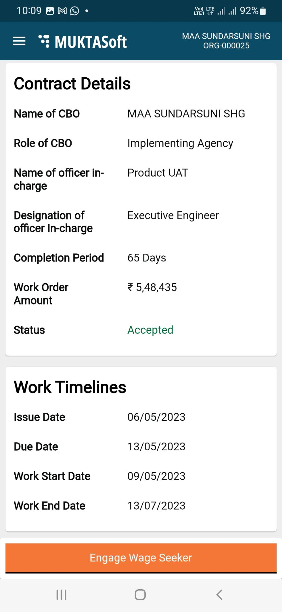

# Getting Started For CBO

### Overview 

This section of the user manual guides you through the CBO login process. CBO represents community-based organizations that are using the MUKTASoft application online to manage their MUKTA works-related activities effectively.

#### Logging in 

To log in to the system

1. Enter the url \[Application URL]/ Install MUKTASoft CBO application.

|  |  |
| ------------------------------------------------------------------------------ | ------------------------------------------------------------------------------ |

1. Click on the Login button.
2. Enter your Mobile Number.

|  |  |
| ------------------------------------------------------------------------------ | ------------------------------------------------------------------------------ |

1. Click on the Continue button.
2. Enter the OTP sent to the registered mobile number.
3. Click on the Continue button.

|  |  |
| -------------------------------------------------------------------------- | ------------------------------------------------------------------------------ |

You are logged in to the app and landed on the Home Page.

#### Home Page 

On the Home Page menus are displayed and users can navigate to perform an activity.

#### Change Language 

Users can change the language of the application from English to Odia or vice-versa for ease and convenience.

To change language

1. From the home page, tap on the menu icon () on the left side top corner.

|  |  |
| ------------------------------------------------------------------------------ | -------------------------------------------------------------------------- |

1. Select the preferred language from the list of available languages.
2. The system menu and prompts will now be displayed in the selected language.

#### View Org Profile 

To view org profile

1. From the home page, tap on the menu icon () on the left side top corner.

|  |  |
| --------------------------------------------------------------------------- | --------------------------------------------------------------------------- |

1. Tap on Org Profile to view the organization details.

|  |  |
| --------------------------------------------------------------------------- | --------------------------------------------------------------------------- |

#### Logging out 

To log out from the app

1. From the home page, tap on the menu icon () on the left side top corner.

|  |  |
| --------------------------------------------------------------------------- | --------------------------------------------------------------------------- |

1. Click on Logout.

You are logged out of the system.
