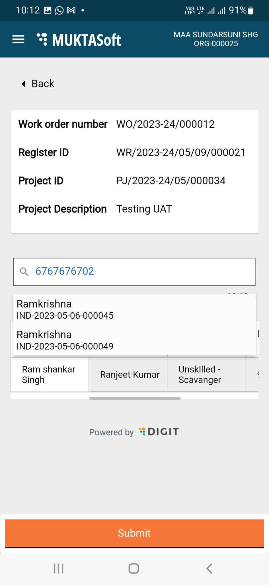

# Getting Started For CBO

## Overview 

This section of the user manual guides you through the CBO login process. CBO represents community-based organizations that are using the MUKTASoft application online to manage their MUKTA works-related activities effectively.

On this page:

* [Log in](getting-started-for-cbo.md#\_q7o9e4i82bi2)
* [Home page](getting-started-for-cbo.md#\_th0pisijzcww)
* [Change language](getting-started-for-cbo.md#\_id3wlre5gufw)
* [View organisation profile](getting-started-for-cbo.md#\_95zo2uhk62j3)
* [Log out](getting-started-for-cbo.md#\_4crhlnimv28n)

## Log in 

<table data-card-size="large" data-view="cards"><thead><tr><th></th><th></th><th></th></tr></thead><tbody><tr><td></td><td>
Enter the URL [Application URL] or Install the MUKTASoft CBO application.

Select the preferred language option. Click on <strong>Continue</strong>.
</td><td></td></tr><tr><td></td><td>
Click on <strong>Login</strong>. 

Enter the registered <strong>Mobile Number</strong>. 

Click on <strong>Continue</strong>.
</td><td></td></tr><tr><td></td><td>
Enter the <strong>OTP</strong> sent to the registered mobile number.

Click on the <strong>Continue</strong> button.
</td><td></td></tr><tr><td></td><td>You are logged in.</td><td></td></tr></tbody></table>

## Home Page 

<table data-card-size="large" data-view="cards"><thead><tr><th></th><th></th><th></th></tr></thead><tbody><tr><td></td><td>
The home page displays the action menu available for the logged-in user profile. 

Navigate through the options to initiate an activity.
</td><td></td></tr></tbody></table>

## Change Language 

Users can change the language of the application from English to Odiya or vice-versa for ease and convenience.

To change language

1. From the home page, tap on the menu icon (.png>)) on the left side top corner.

|  |  |
| ------------------------------------------------------------------------------ | -------------------------------------------------------------------------- |

1. Select the preferred language from the list of available languages.
2. The system menu and prompts will now be displayed in the selected language.

## View Organisation Profile 

To view org profile

1. From the home page, tap on the menu icon (.png>)) on the left side top corner.

|  |  |
| --------------------------------------------------------------------------- | --------------------------------------------------------------------------- |

1. Tap on Org Profile to view the organization details.

|  |  |
| --------------------------------------------------------------------------- | --------------------------------------------------------------------------- |

## Log out 

To log out from the app

1. From the home page, tap on the menu icon (.png>)) on the left side top corner.

|  |  |
| --------------------------------------------------------------------------- | --------------------------------------------------------------------------- |

1. Click on Logout.

You are logged out of the system.
