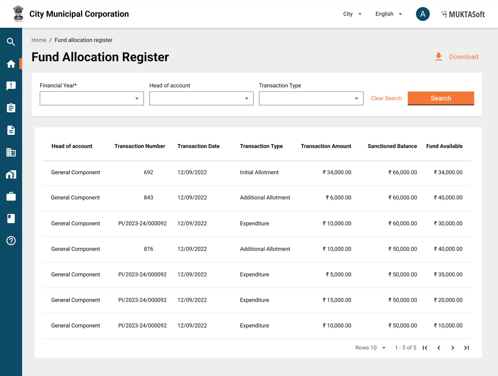

# Muster Roll 2

#### Muster Roll 

Muster roll service lists all the muster rolls generated all across the works/ projects assigned to the logged in CBO user. The CBO user can view the muster roll details along with its status and edit it in case the muster roll is sent back to CBO for correction by the ULB employee.

To view muster rolls:

1. Click on ‘Muster Rolls’ from the homepage.

|  |  |
| -------------------------------------------------------------------------- | -------------------------------------------------------------------------- |

1. Click to View Details to see the details of muster roll.

|  |  |
| ------------------------------------------------------------------------------ | ------------------------------------------------------------------------------ |

1. In case muster roll is sent back to CBO for correction. CBO gets the option to edit the muster roll and re-submit it.
