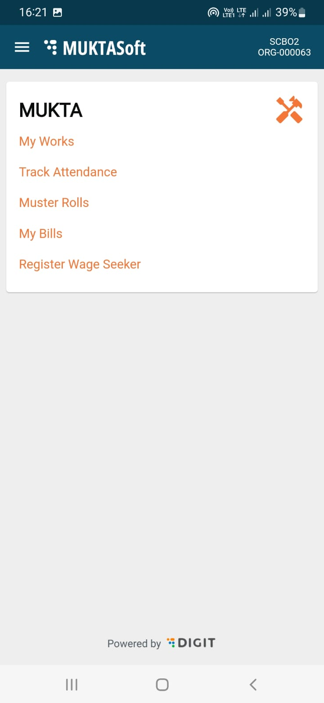

# My Bills

#### My Bills 

The bills related to works assigned to a CBO are listed under my bills.

To view different types of bills

1. Click on My Bills service. All types of bills are listed here with their status.

|  |   |
| ------------------------------------------------------------------------------ | - |

#### My Requests 

There are two types of requests which are raised by CBOs. One is the request to close the project, second is to request for more time to finish the work which is known as time extension. Once these requests are raised by CBOs are put for approval, and the same can be seen and tracked under My Requests.

To view all the requests raised -

1. Click on the My Requests service.

|  |   |
| ------------------------------------------------------------------------------ | - |

#### Register Wage Seeker 

Register wage seeker service allows the CBO user to enter the wage seeker details into MUKTASoft who are working for them.

To add a register a wage seeker

1. Tap on the Register Wage Seeker service link from the home page.

|  |  |
| ------------------------------------------------------------------------------ | -------------------------------------------------------------------------- |

1. Fill in the individual details. The fields marked with asterisk are mandatory to fill.

|  |  |
| ------------------------------------------------------------------------------ | -------------------------------------------------------------------------- |

1. Scroll down to the page and click on Next to fill the address details.

|  |  |
| -------------------------------------------------------------------------- | ------------------------------------------------------------------------------ |

1. Next fill all the details related to the bank account. Be careful while filling this and do check on the summary page before submitting it.

|  |  |
| ------------------------------------------------------------------------------ | ------------------------------------------------------------------------------ |

1. Click on the Submit button to save the wage seeker details.
2. On successful submission, success page is displayed along with the wage seeker’s ID.
