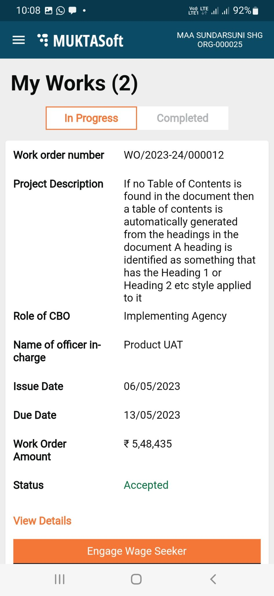
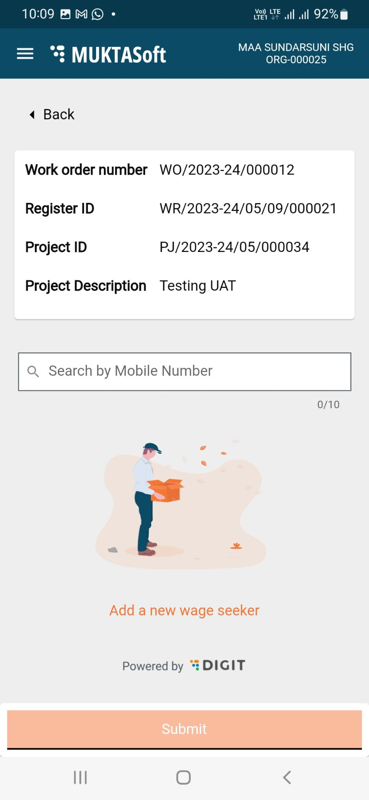
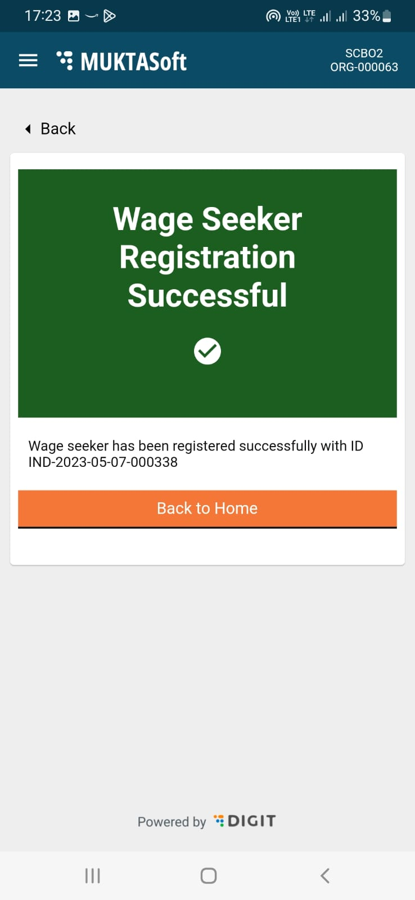

# My Works

#### My Works 

**View Details**

CBOs can view their work orders through the portal and the app installed on mobile.

To view work order details

1. Click on My Works service from the Home Page. The work orders assigned for the logged in user are shown as the result.

|  |  |
| ------------------------------------------------------------------------------ | ------------------------------------------------------------------------------ |

1. Scroll down to see more if the logged in user has more than one work assigned.
2. Click on the View Details to view the complete details of work order.

|      |  |
| ------------------------------------------------------------------------------ | ------------------------------------------------------------------------------ |
|  |  |

1. The Work Order Details page displays the details with Contract Details, Work Timelines, Terms and Conditions, and the option to download Work Order PDF.

**Engage Wage Seekers**

A CBO user can engage or disengage the wage seekers for all its running works.

To engage wage seeker

1. Click on My Works to list all the running works.
2. Click on the Engage Wage Seekers button available in the Work Order card.

|  |  |
| ------------------------------------------------------------------------------ | -------------------------------------------------------------------------- |

1. Search wage seekers to add one by one with the work.

|  |  |
| ------------------------------------------------------------------------------ | -------------------------------------------------------------------------- |

1. Once all the wage seekers are added click on submit to get the record saved.
