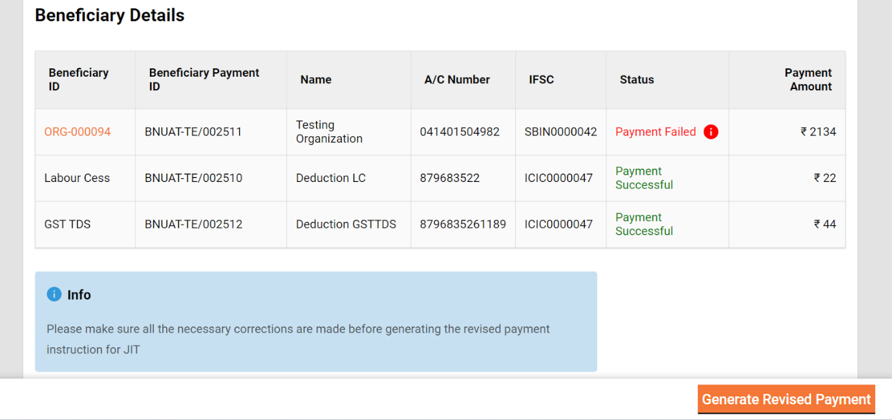
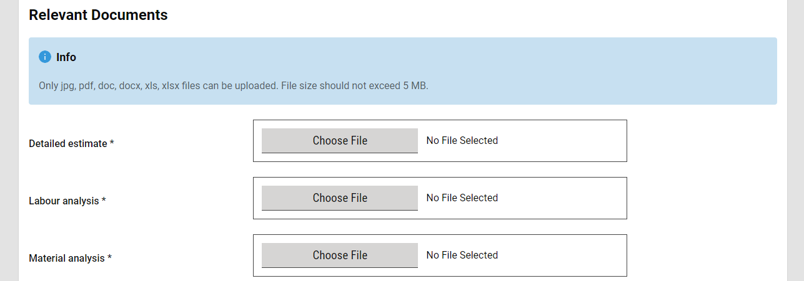
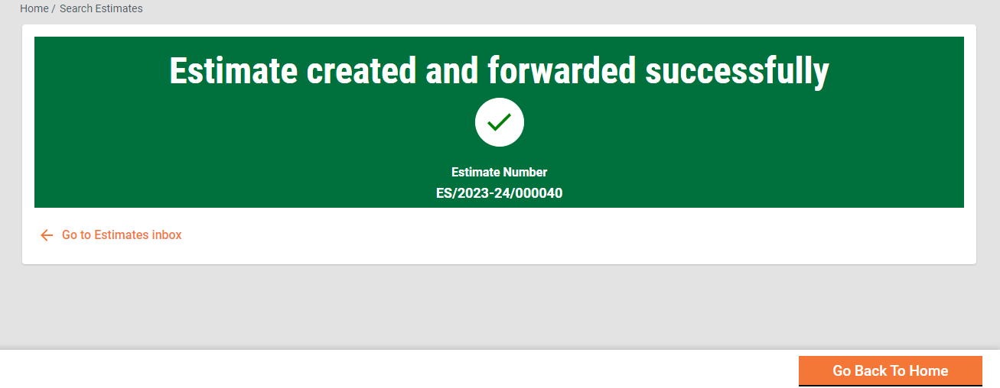
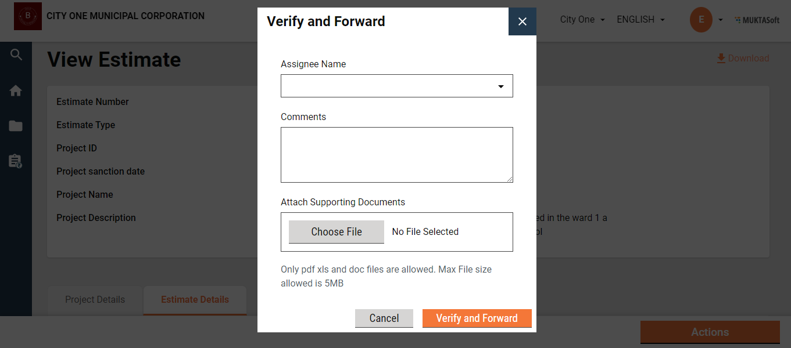
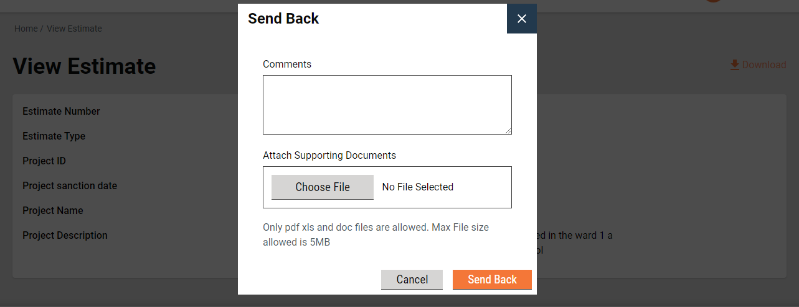

# Estimate

The Estimate option enables employee users to -

* Access employee inbox
*

## Inbox 

**Home Page > Estimates**

Click on the Estimate Inbox Page on the home page.

.png>)

.png>)

* On the left side on the top feature menus are displayed.
* On the left side, the bottom panel displays the filters.
  1. Assigned to Me - The only estimates assigned to the logged-in user are displayed on the right side window.
  2. Assigned to All - It is default selected and hence the estimates assigned to anyone are displayed on the right side window.
  3. Ward- It filters the application based on the ward selected and then displays the result on the right side window.
  4. Workflow States - It appears only when the application type filter is selected and filters the application based on the application status selected and then displays the result on the right side window.
* On the top right side, search parameters are displayed, which allow you to search the estimate by Estimate Number, Project ID, and Project Type.
* On the bottom right side, a window is provided to list the estimates based on the default settings and applied filters and search parameters.

### Search Estimate 

**Home Page > Estimates> Search Estimate**

The search estimate enables ULB employees to find specific estimates using multiple filters.

**Search Criteria**

1. Ward
2. Project Type
3. Project Name
4. Estimate Number
5. Status
6. From Date
7. To Date

.png>)

* At least one parameter is mandatory. Enter anyone for more to search for an estimate.
* The system fetches the estimates created between the specified period by entering the date range in created from and created to. From Date and To Date considered one parameter.
* Click on the Search button to view the search results.
* Click on the Reset button to renew the search using different parameters.

**Search Result**

1. Estimate Number
2. Project Name
3. Location
4. Prepared by
5. Status
6. Estimated Amount (₹)

#### View Estimate 

Home Page > Estimates> Inbox > Search Estimate > Search Results

The estimate is searched using the search estimate and then click on the estimated number from the search result to see the details.

.png>)

.png>)

.png>)

.png>)

#### Create Estimate 

Home Page > Estimates > Inbox > Create Estimate

To create an estimate for a project, the project is first searched using the search project feature and opened to view the details. Then from the view project details page, action create estimate is clicked.

1. A project is searched using the Search Project and the search result is displayed.
2. Click on the project ID. to view the project details.
3. Complete project detail is displayed along with attached documents and action menu.

1. Create Estimate is selected from the menu and Create Estimate Page is opened up.

.png>)

1. Basic project details are displayed on the top of the page.
2. Project Details tab displays the full project details.
3. Estimate details are captured into 2 grids, SOR/Non SOR Items and Overhead.
4. Item’s description, Unit, Rate, Estimated Quantity are entered in SOR/Non SOR Grid. Additional items can be added by clicking on Add Line Item.

.png>)

1. Overhead grid is provided to capture the GST and Supervision Charges.

.png>)

1. Total of SOR/ Non-SOR and Overheads grids are displayed as Total Estimate Amount.
2. Option to enter the Labour and Material cost is provided. Total these 2 can not be more than the total estimated amount.

1. Relevant document section allows users to upload the documents which are needed to verify and approve the estimate.

1. After filling all the details, click in create estimate. Please make a note fields marked with asterisk are mandatory to fill.

#### Workflow 

**Creator**

The Estimate Creator (EC) is responsible for creating and forwarding the estimation along with relevant documents uploaded.

EV can

* Forward estimate
* Edit estimate

**Create and Forward**

Estimate creator (EC) has the rights to create an estimate for a project and then forward it to the verifier. On creation, the EC gets the forward dialog box from which the user optionally selects the verifier’s name as assignee name, add the comments if any, and then forward the estimate.

On Forward, the estimate is forwarded to the verifier and the success page is displayed with the success message and estimate number.

**Edit**

The estimate creator (EC) has the rights to edit the estimate in the case the estimate is sent back for any correction.

1. The estimate pending for correction is available on the Inbox. Else, search for the estimate using the search estimate.
2. Click on the estimate number to open the estimate and view the details.
3. Select the Edit from the Take Action. Estimate is opened into editable mode.
4. After edit, the submit estimate is again sent to the verifier for verification.

**Verifier**

The Estimate Verifier (EV) is responsible for verifying the estimation and supporting documents uploaded.

EV can

* Verify and forward estimate
* Send estimate back to EC

**Verify and forward**

The EV verifies and forwards the application if the documents and estimation provided in the estimate is found satisfactory and complete.

To verify and forward the estimate

1. The estimate pending for verification is available on the Inbox. Else, search for the estimate using the search estimate.
2. Click on the estimate number to open the estimate and view the details.
3. Select the Verify and Forward from the Take Action. A pop-up window is opened.

1. Select the estimate’s technical sanctioner’s name as Assignee Name.
2. Provide any additional information for the assignee in the comments section.
3. Click on the Choose Files button to upload any supporting documents.
4. Click on the Verify and Forward button. The application is forwarded to the technical sanctioner.

**Send back**

EV can send the estimate back to the EC for any corrections or if any vital document has not been uploaded.

To send the estimate back to the CE

1. The estimate pending for verification is available in the Inbox. Else, search for the estimate using the search estimate.
2. Click on the estimate number to open the estimate and view the details.
3. Select the Send Back from the Take Action. Pop-up window is opened.

1. State the reasons for sending the estimate back to the CE in the comments section.
2. Click on the Choose Files button to upload any supporting documents.
3. Click on the Send Back button. The estimate is placed into CE’s inbox and enabled for editing.
