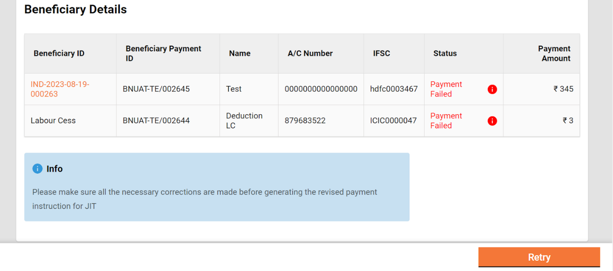
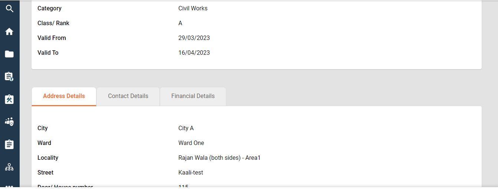
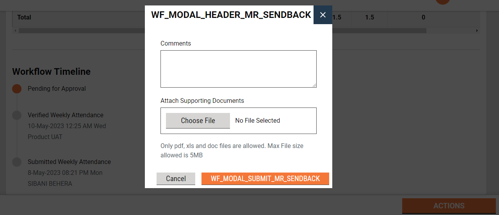

# Project

The work in the finalized work list is called a project. The project option enables employees to -

* [Search projects](project.md#\_h2jobkdffx0h)
* [View project details](project.md#\_9r2zeio0tf57)
* [Create projects](project.md#\_knxsefvb7ee7)
* [Modify projects](project.md#\_r4yyntfzp4qz)

### Search Project 

**Home Page > Projects > Search Project**

The search project option enables ULB employees to find specific projects using multiple filters.

**Search Filters**

1. Ward
2. Project Type
3. Project Name
4. Project ID
5. Created From
6. Created To

.png>)

* At least one parameter is mandatory. Enter any one or more to search for a Project.
* The system fetches the estimates created between the specified period by entering the date range in created from and created to. The Created From and Created To are considered one parameter.
* Click on the Search button to view the search results.
* Click on the Reset button to renew the search using different parameters.

**Search Result**

1. Project ID
2. Project Name
3. Location
4. Project Cost

.png>)

### View Project Details 

**Home Page > Projects > Search Project > View Project Details**

Search for the project to view details. Click on the **Project ID** to open and view the project page.

.png>)

.png>)

### Create Projects 

**Home Page > Projects > Search Project > Create Project**

* To create a project click on the **Create New Project** button. It takes the user to create a project form.

.png>)

.png>)

.png>)

* Fill in all the required details and attach the relevant documents.
* Click on the **Create Project**. On successful creation of the project, the success page is displayed along with **Project ID** and options to go back to the Search Project, go back to the home page, or create an estimate for the project.

### Modify Project 

**Home Page > Projects > Search Project > View Project > Modify Project**

The project details can be modified to correct the fields that were wrongly entered at the time of creating the project. Search for the specific project and open it to view the details. Navigate to the Actions button and click on Modify Project.

The project details are in the edit mode. Make the required changes.&#x20;


**Note:** All details can be modified except for the Project ID.&#x20;

The project for which the estimate is already created can not be modified.


