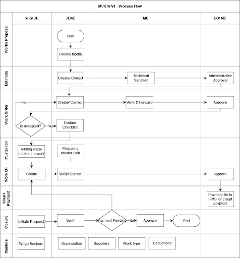
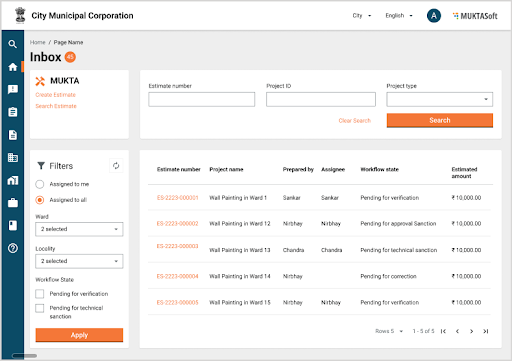
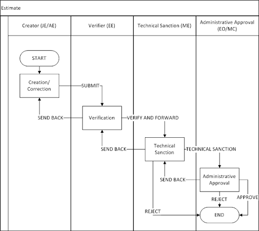

# Product Requirements Document

## 1. Introduction

Mukhyamantri Karma Tatpara Abhiyan Yojana ( MUKTA Yojana) is a government scheme and This scheme is helpful for the poor urban people, which leads to the rising employment rate of the state. This document is prepared to detail the specification MUKTASoft version V1.

MUKTASoft aims to improve the overall scheme efficiency of MUKTA by identifying & providing equal job opportunities to the urban poor, constructing environment-friendly projects, developing local communities and slums & plan better for upcoming years. &#x20;

### 1.1 Purpose

The purpose of this document is to give a detailed description of the requirements for the “Mukta Soft V1” module. It will illustrate the purpose and complete declaration for the development of the system. It will also explain system constraints, interface and interactions with other external applications. This document is primarily intended to define the scope of version V1 and propose to a customer for its approval and as a reference for developing the first version of the system for the development team.

### 1.2 Definitions, Acronyms & Abbreviations

| JE  | Junior Engineer                |
| --- | ------------------------------ |
| ME  | Municipal Engineer             |
| EO  | Executive Officer              |
| MC  | Municipal Corporation          |
| DDO | Drawing and Disbursing Officer |
| SOR | Schedule of Rates              |
| WO  | Work Order                     |
| PO  | Purchase Order                 |
| WL  | Finalised Worklist             |

### 1.3 Source of Information

1\. MUKTA FRS (click on the file link below to access)&#x20;



2\. Field Visit to JATNI ULB \[15th - 18th November 2022]

### 1.4 Scope for V1

#### 1.4.1 ULB Features

1. Finalised Worklist \[Finalised Wishlist]
   * Finalised Worklist created manually is entered into the system hence create and modify features are provided.
2. Estimate
   * An estimate is prepared without SORs/ Non-SORs and a detailed estimate in an excel file is uploaded.
   * Estimate No. is generated by the system on creation.
   * Technical Sanction No. and Administrative Approval No is entered manually during workflow.
3. Revise Estimate - The requirement is not very clear as of now.
4. Work Order
   * Work to be awarded to a SHG/ JE based on the decision taken on committee offline.
   * Work Order is prepared in the system and is sent to awardee for acceptance. There is only  work order for an estimate.
   * Auto decline of work order if SHG is not taking an action within stipulated time frame.
   * Work commencement verification/ checklist is updated and the site is handed over to awardee.
   * Download Work Order PDF as per specified format.
5. Revise Work Order - The requirement is not very clear as of now.
6. Work Bill
   * Bill is created by SHG/JE and then along with the muster roll sent to JE/AE for verification and then ME for approval through accountant. There are basically 3 components of the bill.
     * Wages - Muster roll is prepared in the system.
     * Supplies - It is performed manually and then the manual invoices are added to the bill.
     * Commission to SHG - Auto calculated by system itself.
   * JE/AE has to measure the work offline, validate the muster rolls and then correct/verify the bill accordingly.
   * Download Work Bill PDF as per specified format.
7. Bill Payment (Integration with IFMS)
   * Bill is approved by ME.
   * An approved bill is then sent to IFMS for payment.
   * Various status of payments are then updated back to MUKTA.
   * According to the status update, the system will allow correction in the bill.&#x20;
   * Updated payment file is then pushed again to IFMS for payment if needed.
8. Closure
   * Project closure will be initiated by SHG (Entity who has first hand completed the project)
   * This will be checked by JE and sent to ME for approval.&#x20;
   * ME on approving, Project will be marked as completed and not be available for further creation of Bills, mark attendance or other activities.&#x20;
9. SHG Registration&#x20;
   * Aadhar based eKYC for SPOC while creating SHG’s record.
   * NPCI API based bank account detail validations.
10. Dashboard and MIS Reports
11. Masters Data (MDMS)

#### 1.4.2 SHG/ JE Features

1. Work Order - SHGs to accept/decline the work order, LOI is skipped as of now.
2. Wage Seeker’s Registration
   * Aadhar-based eKYC while creating wage seeker’s record.
   * NPCI API-based bank account detail validations.
3. Wage Seeker’s Attendance and Muster Rolls
4. Works Bill
   * Bill is created by SHG and then submitted to JE for approval. JE will also have the option and access to create the bill.
   * Integration with IFMS system for seamless payment of wage seekers, suppliers, and SHGs.
5. Closure&#x20;
   * Request for completion/ closure of work, updating the closure checklist.

## 2. Process Flow Diagram V1

<figure><figcaption></figcaption></figure>

## 3. Functional Details

### 3.1 User’s Inbox

The user’s inbox is the DIGIT standard design which enables the workflow users to receive all the files in one place to pick them and take an action. The design and the functionality is going to be the same with changes listed below.

1. The information displayed and terminology.
2. Localization.

#### Attributes

1. The search filters provided on the top will have the search parameters as given below.
   * Identification No. \[Estimate No., Work Order No., Bill No.]
   * WIN \[Work Identification Number]
   * Prepared By&#x20;
2. The search filters provided on the left hand side will have the search parameters as given below.
   * Assigned to me
   * Assigned to all - Selected by default
   * Ward
   * Workflow state
3. The inbox should display the following details.
   * Identification No. (Estimate No./ Work Order No./ Bill No. etc.)
   * Document Type (Estimate/ Work Order/ Work Bill/ Measurement Book etc.)
   * Status
   * Prepared By
   * SLA Days Remaining

#### Mockups

<figure><figcaption></figcaption></figure>

### 3.2 Configurable Workflow

Workflows need to be configurable at the ULB level to configure ULB specific. In this document the workflow mentioned for various features is applicable to only one ULB. The use-cases would be  as given below.

1. Creator → Approver.
2. Creator → Verifier → Approver.
3. Creator → Verifier → Field Verification → Approver.

There are few common workflow states as given below.

1. Drafted - The user creates and saves as draft it.
2. Verified - The user verifies it.
3. Approved - The user approved it.

### 3.3 General Validations

#### 3.3.1 IFSC

The validation of IFSC must satisfy the following conditions.

1. It should be 11 characters long.
2. The first four characters should be upper case alphabets.
3. The fifth character should be 0.
4. The last six characters are usually numeric, but can also be alphabetic.

#### 3.3.2 PAN

The valid PAN Card number must satisfy the following conditions.

1. It should be ten characters long.
2. The first five characters should be any upper case alphabet.
3. The next four-characters should be any number from 0 to 9.
4. The last(tenth) character should be any upper case alphabet.
5. It should not contain any white spaces.

#### 3.3.3 GSTIN

The valid GST (Goods and Services Tax) number must satisfy the following conditions.

1. It should be 15 characters long.
2. The first 2 characters should be a number.
3. The next 10 characters should be the PAN number of the taxpayer.
4. The 13th character (entity code) should be a number from 1-9 or an alphabet.
5. The 14th character should be Z.
6. The 15th character should be an alphabet or a number.

#### 3.3.4 AADHAR

The valid Aadhaar number must satisfy the following conditions.

1. It should have 12 digits.
2. It should not start with 0 and 1.
3. It should not contain any alphabet and special characters.
4. It should have white space after every 4 digits.

The Aadhar validation from OCAC. It is without OTP.

1. Aadhar can be validated by sending the Aadhar No. and Name of Aadhar Holder and in response Yes/No is received.
2. It is available online/ offline both.&#x20;
3.
   1. In case of online validation, Aadhar is validated with the creation of record itself.
   2. In case of offline validation, Record is created first and then the aadhaar is validated offline at once for all the records.

eKYC, For eKYC, demographic data is received in response by passing the valid OPT.

### 3.4 Finalised Worklist

Finalised Worklist is a wish list of works which the ward representative suggests and then the ward committee collects from each ward and approves in its meeting, thereafter a feasibility study is performed by the Municipal Engineering department and the administrative approval is taken from the chairperson of the ULB. In MUKTA V1 it is catered in the below mentioned method.\

| S.No. | Business/Functional Requirements                                                                                               | Interface |
| ----- | ------------------------------------------------------------------------------------------------------------------------------ | --------- |
| 1     | Finalised wish lists of all the works are added into the Finalised Worklist and get approved by the ULB Committee.             | Manual    |
| 2     | An approved list of works along with a Finalised Worklist is entered into the system and proposal no. is generated.            | Web       |
| 3     | System generates the WIN (work identification no.) for each and every work in the work proposal to identify the work uniquely. | Web       |
| 4     | Search, View and Modify Finalised Worklist option is provided.                                                                 | Web       |

#### 3.4.1 Create Finalised Worklist

A manually finalised WL is entered into the system and hence the create WL  feature is provided. In V1 it will not have the workflow integrated with it.

**Attributes**

| S.No.       | Field                                                         | Data Type                                          | Required    | Description                                                                                                                                                                                                                 |
| ----------- | ------------------------------------------------------------- | -------------------------------------------------- | ----------- | --------------------------------------------------------------------------------------------------------------------------------------------------------------------------------------------------------------------------- |
| 1           | Proposal Description                                          | Alphanumeric (1024)                                | Y           | 
Gist of proposal.

Special Chars allowed { / . _$@# }
                                                                                                                                                           |
| 2           | Proposal Date                                                 | Date                                               | Y           | A date to be entered by the user, can not be a future date.                                                                                                                                                                 |
| 3           | Letter Reference                                              | Alphanumeric (128)                                 | 
 
 | 
Usually the Offline File/ Letter Number related to the project

Special Chars allowed { / . _$@# }
                                                                                                              |
| 
 
 | <mark style="background-color:orange;">Fund Allocation</mark> | 
 
                                        | 
 
 | 
 
                                                                                                                                                                                                                 |
| 4           | Scheme                                                        | Drop-down                                          | Y           | Name of scheme, default set to MUKTA. MUKTA related works can be performed either from the MUKTA fund or from the UNNATI fund.                                                                                              |
| 5           | Fund Alloted (₹)                                              | Numeric                                            | Y           | It is the amount in rupee available in the ULB’s account for the selected scheme. It is entered by till the IFMS integration is completed.                                                                                  |
| 
 
 | <mark style="background-color:orange;">Works Details</mark>   | <mark style="background-color:orange;">List</mark> | 
 
 | <mark style="background-color:orange;">The list will have multiple works within a proposal</mark>                                                                                                                           |
| 5           | Work Description                                              | Alphanumeric (256)                                 | Y           | 
A brief details of works listed under wishlist.

Special Chars allowed { / . _$@# }
                                                                                                                             |
| 6           | Work Type                                                     | Drop-down                                          | Y           | The list of values mentioned under the masters data section.                                                                                                                                                                |
| 7           | Geo Location                                                  | Co-ordinates                                       | N           | Input latitude/ longitude, or the GIS-map to pin the location.                                                                                                                                                              |
| 8           | Location                                                      | Drop-down                                          | Y           | DIGIT standard location Picker component.                                                                                                                                                                                   |
| 11          | Is Feasible                                                   | Drop-down                                          | Y           | Values will be Yes/ No.                                                                                                                                                                                                     |
| 12          | Proposed Amount                                               | Numeric                                            | Y           | A rough estimated amount for the given work.                                                                                                                                                                                |
| 13          | Status                                                        | Drop-down                                          | Y           | 
Values are as given below.
<ul><li>Feasibility Study Completed</li><li>Finalised</li><li>Dropped</li><li>Estimate Approved</li><li>Work Order Accepted</li><li>In Progress</li><li>Closed</li><li>Abandoned</li></ul> |
| 
 
 | <mark style="background-color:orange;">Attachments</mark>     | 
 
                                        | 
 
 | 
 
                                                                                                                                                                                                                 |
| 14          | Proposal File                                                 | File Attachment                                    | N           | Allow to attach up to 5 files each not greater than 5 MB. Files can be of type doc, xls, pdf                                                                                                                                |

**Actions**

On Submit following actions are performed.

1. Finalised Worklist gets saved into DB.
2. Finalised Worklist No. is generated in a specified format.
3. Work Identification No. (WIN) is generated for each and every work in the list in a specified format.
4. Work detail is also saved along with the Finalised Worklist and the scheme selected at the finalised worklist is linked with all the works presented in the Finalised Worklist.
5. Finalised Worklist is available to download in PDF as per the given format.

**Mockups**

\<To be updated>

**Notification**

\<To be updated>

#### 3.4.2 Search Work/ Finalised Worklist

**Search Criteria**

A work in the Finalised Worklist is searched by the parameters mentioned in the table given below.

| S.No. | Field        | Data Type   | Required | Description                                                                |
| ----- | ------------ | ----------- | -------- | -------------------------------------------------------------------------- |
| 1     | Location     | Drop-down   | N        | Auto-complete, matching search.                                            |
| 2     | Proposal No. | Textbox     | N        | Works proposal no.                                                         |
| 3     | WIN          | Textbox     | N        | Work identification no. generated for a work in Finalised Worklist         |
| 4     | Work Type    | Drop-down   | N        | Values of work type from MDMS configuration.                               |
| 5     | From Date    | Date Picker | N        | Proposal creation date, entered by user while creating Finalised Worklist. |
| 6     | To Date      | Date Picker | N        | Proposal creation date, entered by user while creating Finalised Worklist. |

**Search Result**

On search, the result is shown as given below.

| S.No | Field         | Data Type    | Comments                                                                                                                                                                      |
| ---- | ------------- | ------------ | ----------------------------------------------------------------------------------------------------------------------------------------------------------------------------- |
| 1    | Proposal No.  | Display Only | A hyperlink to open the Finalised Worklist in view mode.                                                                                                                      |
| 2    | WIN           | Display Only | Work identification no. generated for a work in Finalised Worklist                                                                                                            |
| 3    | Proposal Date | Display Only | Proposal creation date, entered by user while creating Finalised Worklist.                                                                                                    |
| 4    | Location      | Display Only | Locality name along with ward name.                                                                                                                                           |
| 5    | Action        | Button       | 
Create Estimate - Estimate to be created or the estimate created is in rejected status.

View Estimate - Estimate is created and in workflow are approved status.
 |

**Mockups**

\<To be updated>

#### 3.4.3 View Finalised Worklist

**Attribute**

\<To be updated>

**Mockups**

\<To be updated>

**Notification**

Not applicable.

#### 3.4.4 Modify Finalised Worklist

From the search result, on click of Finalised Worklist no. Finalised Worklist details is displayed. An action button is provided with the label “Modify Proposal” to modify the proposal and with the following conditions the work proposal is modified.

**Attributes**

1. Proposal description can be modified.
2. Change in proposal date is allowed only to any date prior to existing proposal date.
3. Reference number can be changed.
4. Adding new works to the list is allowed.
5. Removing an existing work from the list is allowed only if an estimate is not created.
6. The status and feasibility of an existing work from the list can be changed only if there is no active/workflow estimate linked to it.

**Mockups**

\<To be updated>

### 3.5 Estimate

Estimate is a document which furnishes the quantities of different works involved, their rates and the expenditure anticipated towards a work.

Once the work proposal is approved with all the listed work in it, JE/AE has to prepare a detailed estimate of each and every work. In the system an abstract of the estimate is entered with an attached detailed estimate in PDF format to create an estimate and the same is then sent for technical and administrative approvals.

| S.No. | Business/Functional Requirements                                                                                                                                                                                                                                                                                                                                                                                                                                                                                                                                                                             | Interface   |
| ----- | ------------------------------------------------------------------------------------------------------------------------------------------------------------------------------------------------------------------------------------------------------------------------------------------------------------------------------------------------------------------------------------------------------------------------------------------------------------------------------------------------------------------------------------------------------------------------------------------------------------ | ----------- |
| 1     | The system allows the creation of new Estimates against each work defined in Finalised Worklist without having an SOR/ Non-SOR listed.                                                                                                                                                                                                                                                                                                                                                                                                                                                                       | Web         |
| 2     | A detailed estimate having SOR and Non-SORs items  in excel is attached with this estimate.                                                                                                                                                                                                                                                                                                                                                                                                                                                                                                                  | Web         |
| 3     | Search estimate allows searching for In workflow, Approved, and Rejected estimates. Draft estimates are not available for search.                                                                                                                                                                                                                                                                                                                                                                                                                                                                            | Web         |
| 4     | 
Estimates have an approval workflow. Each user has to approve the estimate to go to the next stage 
<ul><li>Draft facility to be provided. It will allow JE/AE to prepare it in iterations.</li><li>Once the estimate is completed it is sent for verification and technical approval to the ME.</li><li>Send Back estimates will always go into the inbox of the previous user in the flow.</li><li>A technical approved estimate is sent for administrative approval to EO/ MC. </li><li>In app notifications will inform the user of the pending estimates that need approval </li></ul>
 
 | Web         |
| 5     | An estimate once approved cannot be modified.                                                                                                                                                                                                                                                                                                                                                                                                                                                                                                                                                                | 
 
 |
| 6     | SOR and Non-SOR items to be provided in v2.                                                                                                                                                                                                                                                                                                                                                                                                                                                                                                                                                                  | 
 
 |

#### 3.5.1 Process Flow

<figure><figcaption></figcaption></figure>

#### 3.5.2 Create Estimate

Search a work from the list of works in a Finalised Worklist and the ‘Create Estimate’ action is applied.

**Attributes**

| S.No.       | Field                                                          | Data Type       | Required    | Description                                                                                           |
| ----------- | -------------------------------------------------------------- | --------------- | ----------- | ----------------------------------------------------------------------------------------------------- |
| 1           | Estimate Type                                                  | Auto-selected   | Y           | Options are Original, Revised, Deviated.                                                              |
| 2           | Work Description                                               | Display Only    | Y           | This value is populated from work list of work proposal                                               |
| 3           | Work Type                                                      | Display Only    | Y           | This value is populated from work list of work proposal                                               |
| 
 
 | Fund Allocation                                                | 
 
     | 
 
 | 
 
                                                                                           |
| 4           | Scheme Name                                                    | Drop-down       | Y           | Option to select a scheme out of available 2 schemes.                                                 |
| 5           | Fund Available                                                 | Display Only    | Y           | Fund Available= Fund in ULB’s Account - Total Blocked Amount + Paid Amount.                           |
| 
 
 | <mark style="background-color:orange;">Location Details</mark> | 
 
     | 
 
 | 
 
                                                                                           |
| 6           | Location                                                       | Display Only    | Y           | Name of locality with ward.                                                                           |
| 
 
 | Estimation Details                                             | 
 
     | 
 
 | 
 
                                                                                           |
| 7           | Estimated Amount                                               | Numeric         | Y           | Estimated amount of work from the detail estimate prepared by JE.                                     |
| 8           | Display Board Cost                                             | Numeric         | N           | The cost of a display board on the site.                                                              |
| 9           | Supervision Charge                                             | Display Only    | Y           | It is a commission to IA/AP, calculated by the commission rate defined on the estimated amount.       |
| 10          | Unforeseen Item’s Contingency                                  | Numeric         | N           | This is the amount for any unforeseen items.                                                          |
| 11          | GST Amount                                                     | Display Only    | Y           | Autocal calculated. The GST rate is configurable and the amount is calculated on the configured rate. |
| 12          | Total Works Value                                              | Display Only    | Y           | Total works value = (5)+(6)+(7)+(8)+(9).                                                              |
| 
 
 | <mark style="background-color:orange;">Attachments</mark>      | 
 
     | 
 
 | 
 
                                                                                           |
| 13          | Detailed Estimate                                              | File Attachment | Y           | DIGIT standard file attachment component, file size 5MB.                                              |
| 14          | Labor and Material Analysis                                    | File Attachment | Y           | DIGIT standard file attachment component, file size 5MB.                                              |

**Actions**

On save following activities are performed.

1. An estimate is saved as a draft and will be available to the creator for further modifications.
2. An estimate no. is generated in a specified format.
3. Estimate PDF is available to download.&#x20;

On submit following activities are performed.

1. Estimate is saved and forwarded to verifier/ approver and removed from the creator’s draft. It won't be available anymore for the creator to take an action.
2. An estimate no. is generated in a specified format if not generated already.
3. Estimate PDF is available to download from view estimate page.

**Mockups**

\<To be updated>

#### 3.5.3 Search Estimate

**Search Criteria**

| S.No. | Field        | Data Type  | Required | Description                                                        |
| ----- | ------------ | ---------- | -------- | ------------------------------------------------------------------ |
| 1     | Location     | Drop-down  | N        | Auto-complete, matching search.                                    |
| 2     | WIN          | Textbox    | N        | Work identification no. generated for a work in Finalised Worklist |
| 3     | Estimate No. | Drop-down  | N        | Values of work type from MDMS configuration.                       |
| 4     | Status       | Drop-down  | N        | Workflow status of an estimate.                                    |
| 5     | From Date    | Date Range | N        | Estimate creation date.                                            |
| 6     | To Date      | Date Range | N        | Estimate creation date.                                            |


**Note:** At least one parameter is required to perform the search. The date range From Date/ To Date is considered one parameter.


**Search Result**

On search, the result is shown as given below.

| S.No. | Field            | Data Type    | Description                                                        |
| ----- | ---------------- | ------------ | ------------------------------------------------------------------ |
| 1     | Estimate No      | Display Only | A hyperlink to open the estimate  in view mode.                    |
| 2     | WIN              | Display Only | Work identification no. generated for a work in Finalised Worklist |
| 3     | Prepared By      | Display Only | Name of user who has prepared it.                                  |
| 4     | Location         | Display Only | Locality name along with ward name.                                |
| 5     | Estimated Amount | Display Only | Total estimated amount.                                            |

**Actions**

1. On search, a search is performed and the search result is displayed based on the parameters supplied.
2. On clear, values entered are cleared.

**Mockups**

\<To be updated>

#### 3.5.5 Revise Estimate

In the case of less/excess deviation a revised estimate is created which could lead to creating a revised WO in case the proposed total estimate value exceeds the approved total estimate value.

To create a revised estimate, the original estimate is searched from the action menu ‘Create Revise Estimate’.&#x20;

**Attributes**

| S.No.       | Field                                                            | Data Type       | Required    | Description                                                                                           |
| ----------- | ---------------------------------------------------------------- | --------------- | ----------- | ----------------------------------------------------------------------------------------------------- |
| 1           | Estimate Type                                                    | Auto-selected   | Y           | Options are Original, Revised, Deviated.                                                              |
| 2           | Original Estimate No.                                            | Display Only    | Y           | 
 
                                                                                           |
| 2           | Work Description                                                 | Display Only    | Y           | This value is populated from work list of work proposal                                               |
| 3           | Work Type                                                        | Display Only    | Y           | This value is populated from work list of work proposal                                               |
| 
 
 | Location Details                                                 | 
 
     | 
 
 | 
 
                                                                                           |
| 4           | Location                                                         | Display Only    | Y           | Name of locality with ward.                                                                           |
| 
 
 | <mark style="background-color:orange;">Estimation Details</mark> | 
 
     | 
 
 | 
 
                                                                                           |
| 5           | Estimated Amount                                                 | Numeric         | Y           | Estimated amount of work from the detail estimate prepared by JE.                                     |
| 6           | Display Board Cost                                               | Numeric         | N           | The cost of a display board on the site.                                                              |
| 7           | Supervision Charge                                               | Display Only    | Y           | It is a commission to IA/AP, calculated by the commission rate defined on the estimated amount.       |
| 8           | Unforeseen Item’s Contingency                                    | Numeric         | N           | This is the amount for any unforeseen items.                                                          |
| 9           | GST Amount                                                       | Display Only    | Y           | Autocal calculated. The GST rate is configurable and the amount is calculated on the configured rate. |
| 10          | Total Works Value                                                | Display Only    | Y           | Total works value = (5)+(6)+(7)+(8)+(9).                                                              |
| 
 
 | <mark style="background-color:orange;">Attachments</mark>        | 
 
     | 
 
 | 
 
                                                                                           |
| 11          | File Name                                                        | File Attachment | N           | Allow to attach up to 5 files each not greater than 5 MB. Files can be of type doc, xls, pdf          |

**Actions**

\<To be updated>

**Mockups**

\<To be updated>

#### 3.5.6 Workflow Actions

**Edit Estimate**

Editing of estimates is only allowed till the time the estimate is under workflow and only the Estimation Details can be modified.

**Attributes**

1. Estimated Amount - It can be changed only by the user who has prepared the estimate.
2. Display Board Cost - It can be changed only by the user who has prepared the estimate.
3. IA/ IP Supervision Charge  - Read Only.
4. Unforeseen Item’s Contingency - It can be changed only by the user who has prepared the estimate.
5. GST Amount - Read Only.
6. Total Works Value - Read Only.
7. Technical Sanction No. - It can be changed only by the user who is allowed to approve the estimate technically.
8. Administrative Approval No. - It can be changed only by the user who is allowed to approve the estimate administratively.

**Mockups**

\<To be updated>

**Notification**

\<To be updated>

**Save as draft**

On save of an estimate, the estimate is saved into the system and is available in the draft of the logged-in user.

**Attributes**

Not applicable

**Mockups**

\<To be updated>

**Notification**

\<To be updated>

**Submit**

On submission, the estimate is created and moved to the next user’s inbox for further processing. If the estimate is already saved into a draft, it saves the changes and moves the estimate to the next user’s inbox for further processing.

**Attributes**

Not applicable

**Mockups**

\<To be updated>

**Notification**

\<To be updated>

**Verify and Forward**

A verifier of the estimate will receive the estimate in the inbox and then the verify and forward action is performed.

**Attributes**

1. Assignee Name - Drop-down - Non Mandatory -  It is to choose the assignee name, it will be the name of the technical sanction approver.
2. Add Comments - Text area - Non-Mandatory -  In case any comments to be added.
3. Attach Supporting Document - Non-Mandatory - Any document to be uploaded as a supporting document.
4. Verify and Forward - Action Button
5. Cancel - Action Button

**Mockups**

\<To be updated>

**Notification**

\<To be updated>

**Send Back**

It will allow a workflow user to send the estimate back to the previous user for any correction/clarification.

**Attributes**

1. Add Comments - Text area - Non-Mandatory -  In case any comments to be added.
2. Attach Supporting Document - Non-Mandatory - Any document to be uploaded as a supporting document.
3. Send Back - Action Button
4. Cancel - Action Button

**Mockups**

\<To be updated>

**Notification**

\<To be updated>

**Send Back To Originator**

It will allow a workflow user to send the estimate back to the creator of the estimate for any correction/clarification.

**Attributes**

5. Add Comments - Text area - Non-Mandatory -  In case any comments to be added.
6. Attach Supporting Document - Non-Mandatory - Any document to be uploaded as a supporting document.
7. Send Back To Originator - Action Button
8. Cancel - Action Button

**Mockups**

\<To be updated>

**Notification**

\<To be updated>

**Technical Sanction**

It will allow a workflow user to technically sanction the estimate and forward it for approval.

**Attributes**

1. Technical Sanction No. - Textbox - Mandatory - Technical sanctioner will enter the technical sanction no.
2. Assignee Name - Drop-down - Non Mandatory -  It is to choose the assignee name, it will be the name of the approver.
3. Add Comments - Text area - Non-Mandatory -  In case any comments to be added.
4. Attach Supporting Document - Non-Mandatory - Any document to be uploaded as a supporting document.
5. Technical Sanction - Action Button
6. Cancel - Action Button

**Mockups**

\<To be updated>

**Notification**

\<To be updated>

**Reject**

It will allow a workflow user to reject the estimate to cancel it.&#x20;

**Attributes**

1. Add Comments - Text area - Non-Mandatory -  In case any comments to be added.
2. Attach Supporting Document - Non-Mandatory - Any document to be uploaded as a supporting document.
3. Reject - Action Button
4. Cancel - Action Button

**Mockups**

\<To be updated>

**Notification**

\<To be updated>

#### **Approve**

It will allow a workflow user to approve the estimate.

**Attributes**

1. Administrative Approval  No. - Textbox - Mandatory - Estimate approver will enter the technical sanction no.
2. Add Comments - Text area - Non-Mandatory -  In case any comments to be added.
3. Attach Supporting Document - Non-Mandatory - Any document to be uploaded as a supporting document.
4. Approve - Action Button
5. Cancel - Action Button

**Mockups**

\<To be updated>

**Notification**

\<To be updated>

#### 3.5.7 Role Action Mapping

| Role                  | Role-Action Mapping                                                                         | User Persona                              |
| --------------------- | ------------------------------------------------------------------------------------------- | ----------------------------------------- |
| ESTIMATE\_CREATOR     | 
• Save as draft

• Submit/ Re-submit

• Search

• View

• Modify
 | Junior Engineer/ Assistant Engineer       |
| ESTIMATE\_VERIFIER    | 
• Search

• View

• Verify and Forward

• Send Back
                   | Executive Engineer                        |
| TECHNICAL\_SANCTIONER | 
• Search

• View

• Technical Sanction

• Send Back

• Reject
    | Municipal Engineer                        |
| ESTIMATE\_ APPROVER   | 
• Search

• View

• Approve

• Send Back

• Reject
               | Executive Officer/ Municipal Commissioner |

### 3.6 Work Order

In the process of awarding the work to an SHG organisation, a work order is created and then verified and approved. The process mentioned in the below-given table is followed for the V1 solution.

| S.No. | Business/Functional Requirements                                                                                                                                                                                                                                                                                                                                                                                                                                                                                                                                                                                                                                                                                                                                                                                                                                                                                                                                                                                                                                                                     | Interface   |
| ----- | ---------------------------------------------------------------------------------------------------------------------------------------------------------------------------------------------------------------------------------------------------------------------------------------------------------------------------------------------------------------------------------------------------------------------------------------------------------------------------------------------------------------------------------------------------------------------------------------------------------------------------------------------------------------------------------------------------------------------------------------------------------------------------------------------------------------------------------------------------------------------------------------------------------------------------------------------------------------------------------------------------------------------------------------------------------------------------------------------------- | ----------- |
| 1     | The system allows the creation of new Work Order with details including Project Details, Financial Details, Agreement Details                                                                                                                                                                                                                                                                                                                                                                                                                                                                                                                                                                                                                                                                                                                                                                                                                                                                                                                                                                        | Web         |
| 2     | Search Work Order  allows to search for In workflow, Rejected, and approved work orders                                                                                                                                                                                                                                                                                                                                                                                                                                                                                                                                                                                                                                                                                                                                                                                                                                                                                                                                                                                                              | Web         |
| 3     | 
Work Order has an approval workflow. Each user has to approve it to go to the next stage. 
<ul><li>Create Work Order is role based access and provided to JE/AE create it.</li><li>Work order attains the state of ‘Draft’ and save.</li><li>On submit, it is sent for verification and attains the status of Pending for Verification.</li><li>Send Back Work Orders will always go into the inbox of the previous user in the flow.</li><li>On rejection, work order is rejected and will no longer be available for further actions.</li><li>A verified work order is sent for approval, and once approved is available for SHG organisation to accept/ decline.</li><li>Once accepted by SHG, It will be available to JE/AE which is again role based, to perform the site visit and update the checklist and update work start date.</li><li>On decline by SHG, It will be available to the creator of WO, and the creator can take an action to re-assign the work order to some other organisation and send for approval again or reject the work order and create a new one.</li></ul> | Web/ Mobile |
| 4     | 
Work Order creation is validated against the estimated amount. 
<ul><li>In case the total estimated amount is more than 10 lakhs, work order is issued in the name JE (Office-in-charge)</li><li>In case the total estimated amount is 10 or less than 10 lakhs, a work order is issued in the name organisation.</li><li>The amount limit is configurable and configured in the system.</li></ul>                                                                                                                                                                                                                                                                                                                                                                                                                                                                                                                                                                                                                                                                                             | Backend     |
| 5     | 
SMS to the SHG on the issuance of the work Order

Dear &#x3C;name>, &#x3C;Organisation name> has been chosen as the &#x3C;IA/IP> for the project &#x3C;project name>. Please login to MuktaSoft account to accept the Work Order &#x3C;WO_NUMBER>. To login please click on &#x3C;Organization Login URL>.
                                                                                                                                                                                                                                                                                                                                                                                                                                                                                                                                                                                                                                                                                                                                                                               | SMS         |
| 6     | Purchase of material if any, to be handled offline as of now.                                                                                                                                                                                                                                                                                                                                                                                                                                                                                                                                                                                                                                                                                                                                                                                                                                                                                                                                                                                                                                        | Manual      |

#### 3.6.1 Process Flow

<figure><figcaption></figcaption></figure>

#### 3.6.2 Create Work Order

To create a work order, an estimate is searched using search estimate and then open to view the estimate details. From the action list select ‘Create Work Order’.

**Attributes**

| S.No.       | Field                       | Data Type         | Required    | Description                                                                                                                                                                                                                                                                                                                                  |
| ----------- | --------------------------- | ----------------- | ----------- | -------------------------------------------------------------------------------------------------------------------------------------------------------------------------------------------------------------------------------------------------------------------------------------------------------------------------------------------- |
| 1           | WIN                         | Display Only      | NA          | Work Identification No. from the list of works in WP.                                                                                                                                                                                                                                                                                        |
| 2           | Work Description            | Display Only      | NA          | Work description from the work listed in WP.                                                                                                                                                                                                                                                                                                 |
| 3           | Work Type                   | Display Only      | NA          | Work type from the work listed in WP. for the selected WIN.                                                                                                                                                                                                                                                                                  |
| 4           | File No.                    | Alphanumeric (64) | N           | This is a number of the file that is used in offline modes.                                                                                                                                                                                                                                                                                  |
| 5           | File Date                   | Date              | N           | Date when the offline file is created. This cannot be a future date.                                                                                                                                                                                                                                                                         |
| 
 
 | Agreement Details           | 
 
       | 
 
 | 
 
                                                                                                                                                                                                                                                                                                                                  |
| 6           | Organisation Name           | Drop-down         | Y           | The name of the organisation from the organisation master maintained at the ULB level. The name is searchable in the drop-down                                                                                                                                                                                                               |
| 7           | Organisation Role           | Auto-populated    | Y           | 
The system decides the role of a Community Organisation based on the estimated amount. It is configurable in the system.
<ol><li>IP (Implementation Partner) - If the estimated cost of the works is more than Rs.10 Lakhs</li><li>IA (Implementation Agency) -  If the estimated cost of the works is less than Rs.10 Lakhs</li></ol> |
| 8           | Officer-in-charge           | Dropdown          | Y           | The drop-down values are population based on the role assigned. The name is searchable in the drop-down.                                                                                                                                                                                                                                     |
| 9           | Completion Period (in days) | Integer           | Y           | This is the given period within which work to be completed. It cannot be negative or zero. This period is calculated from the date of start of the work.                                                                                                                                                                                     |
| 10          | WO Amount                   | Read Only         | Y           | Total estimated cost of the selected work.                                                                                                                                                                                                                                                                                                   |
| 
 
 | Attachments                 | 
 
       | 
 
 | 
 
                                                                                                                                                                                                                                                                                                                                  |
| 11          | File Attachment             | File Picker       | N           | Allow to attach upto 5 files, each not greater than 5 MB. Files can be of type doc, xls, pdf                                                                                                                                                                                                                                                 |

**Actions**

On save following activities are performed.

1. The work order is saved as a draft and will be available to the creator for further modifications.
2. A  work order no. is generated in a specified format.
3. Work Order PDF is available to download in the specified format.

On submit following activities are performed.

1. Work Order is saved and forwarded to the verifier/ approver and removed from the creator’s draft. It won't be available anymore for the creator to take action.
2. A work order no. is generated in a specified format if not generated already.
3. Work Order PDF is available to download from the view Work Order page in the given format.

**Mockups**

\<To be updated>

#### 3.6.3 Create Revised WO

In the revised estimate is created and the total revised amount is more than the initially approved amount a revised WO is created.


**Note:** The details are not available of all the use cases regarding the revised WO.


**Attribute**

\<To be updated>

**Mockups**

\<To be Updated>

#### 3.6.4 Workflow Actions

**Save as draft**

On save, the WO is saved into the system and is available as a draft for the logged-in user to edit and submit it for further processing.

**Attributes**

Not applicable

**Mockups**

\<To be updated>

**Notification**

\<To be updated>

**Submit**

On submission, the WO is created and moved to the next user’s inbox for further processing. If the WO is already saved as a draft, It moves the WO to the next user’s inbox for further processing.

**Attributes**

Not applicable

**Mockups**

\<To be updated>

**Notification**

\<To be updated>

**Edit WO**

On Edit, the Work Order is edited to make the then save changes during the workflow.

**Attributes**

Not applicable

**Mockups**

\<To be updated>

**Notification**

\<To be updated>

**Verify and Forward**

A verifier will receive the WO in the inbox and perform the action verify and forward.

**Attributes**

1. Assignee Name - Drop-down - Non Mandatory -  It is to choose the assignee name, it will be the name of the approver.
2. Add Comments - Text area - Non-Mandatory -  In case any comments to be added.
3. Attach Supporting Document - Non-Mandatory - Any document to be uploaded as a supporting document.
4. Verify and Forward - Action Button
5. Cancel - Action Button

**Mockups**

\<To be updated>

**Notification**

\<To be updated>

**Send Back**

It will allow a workflow user to send the WO back to the previous user for any corrections/ clarifications.

**Attributes**

1. Add Comments - Text area - Non-Mandatory -  In case any comments to be added.
2. Attach Supporting Document - Non-Mandatory - Any document to be uploaded as a supporting document.
3. Send Back - Action Button
4. Cancel - Action Button

**Mockups**

\<To be updated>

**Notification**

\<To be updated>

**Send Back To Originator**

**Reject**

It will allow a workflow user to reject the WO to cancel it.&#x20;

**Attributes**

1. Add Comments - Text area - Non-Mandatory -  In case any comments to be added.
2. Attach Supporting Document - Non-Mandatory - Any document to be uploaded as a supporting document.
3. Reject - Action Button
4. Cancel - Action Button

**Mockups**

\<To be updated>

**Notification**

\<To be updated>

**Approve**

It will allow a workflow user to approve the WO.

**Attributes**

1. Add Comments - Text area - Non-Mandatory -  In case any comments to be added.
2. Attach Supporting Document - Non-Mandatory - Any document to be uploaded as a supporting document.
3. Approve - Action Button
4. Cancel - Action Button

**Mockups**

\<To be updated>

**Notification**

\<To be updated>

**Accept**

Once approved, Work Order is placed into SHGs portal for acceptance declination, accepted Work Order is then placed to the next user's inbox who is responsible to perform a ground visit and update the checklist and handover the site.&#x20;

**Attributes**

Not applicable.

**Mockups**

\<To be updated>

**Notification**

\<To be updated>

**Decline**

Once approved, Work Order is placed into SHGs portal for acceptance declination, declined WO is then placed back to the creator’s inbox who will either reject the WO or re-assign it to another SHG organisation.

**Attributes**

Not applicable.

**Mockups**

\<To be updated>

**Notification**

\<To be updated>

#### 3.6.5 Search Work Order

Search Work Order will enable the user to search for a WO and then view the details.

**Search Criteria**

| S.No. | Field        | Data Type   | Required | Description                                                        |
| ----- | ------------ | ----------- | -------- | ------------------------------------------------------------------ |
| 1     | Location     | Drop-down   | N        | Auto-complete, matching search.                                    |
| 2     | WIN          | Textbox     | N        | Work identification no. generated for a work in Finalised Worklist |
| 3     | Estimate No. | Drop-down   | N        | Estimate no. of the linked estimate.                               |
| 4     | WO No.       | 
 
 | N        | WO number, unique identification no.                               |
| 5     | Status       | Drop-down   | N        | Workflow status of an WO.                                          |
| 6     | From Date    | Date Picker | N        | WO creation date.                                                  |
| 7     | To Date      | Date Picker | N        | WO creation date.                                                  |

**Search Result**

On search, the result is shown as given below.

| S.No. | Field             | Data Type    | Description                                                        |
| ----- | ----------------- | ------------ | ------------------------------------------------------------------ |
| 1     | WO No.            | Display Only | A hyperlink to open the work order  in view mode.                  |
| 2     | WIN               | Display Only | Work identification no. generated for a work in Finalised Worklist |
| 3     | Prepared By       | Display Only | Name of user who has prepared the work order.                      |
| 4     | Organisation Name | Display Only | Name of the organisation to whom Work Order is awarded.            |
| 5     | Location          | Display Only | Locality name along with ward name.                                |
| 6     | WO Amount         | Display Only | Total WO amount.                                                   |

**Mockups**

\<To be updated>

#### 3.6.6 View Work Order

**Attributes**

On click of WO No./ Identification no.(Inbox) user is taken to view the WO page and the following details are displayed.

1. WO No.
2. WIN
3. Estimate No.
4. Work Description
5. Work Type
6. File No.
7. File Date
8. Location Details
   * Locality
   * Ward
9. Agreement Details
   * Name of Organisation
   * Role of Organisation
   * Name of Office-in-charge
   * Completion Period (In days)
   * Work Start Date
   * Work Order Amount
10. Attachments
    * File Attachments - allow to download and view the documents
11. Timelines
    * Preparation Date
    * Prepared By
    * Verification Date
    * Verified By
    * Approval Date
    * Approved By
    * Acceptance Date
    * Accepted By
    * Decline Date
    * Declined By
    * Checklist Updated Date
    * Checklist Updated By

**Mockups**

\<To be updated>

#### 3.6.7 Update Checklist

Accepted Work Orders by the SHG will, by default, come into the inbox of the checklist filler. The checklist is a predefined MDMS questionnaire that can be built using the Surveys Service. Checklists can be filled using both web and mobile interfaces.

Checklist comes with a few predefined questions for which answers are to be updated into Yes/ No. It is configurable and to be configured into the system ULB-wise.

**Attributes**

| S.No.       | Questions                                                         | Description                                                                                           |
| ----------- | ----------------------------------------------------------------- | ----------------------------------------------------------------------------------------------------- |
| 
 
 | Commencement Checklist                                            | 
 
                                                                                           |
| 1           | Is the orientation programme to community organisation completed? | Orientation programme for explaining the works components and work plan to the Community Organisation |
| 2           | Laying out the project?                                           | 
 
                                                                                           |
| 3           | Is verification of the worksite facility completed?               | 
 
                                                                                           |
| 4           | Is the site handed over?                                          | 
 
                                                                                           |
| 
 
 | Worksite Facility Checklist                                       | 
 
                                                                                           |
| 5           | Is first aid available?                                           | 
 
                                                                                           |
| 6           | Is the rest shade available?                                      | 
 
                                                                                           |
| 7           | Is the rest shade available?                                      | 
 
                                                                                           |
| 8           | Are water facilities available?                                   | 
 
                                                                                           |
| 9           | Is the child case support available?                              | 
 
                                                                                           |
| 10          | Is the MUKTA display board available?                             | 
 
                                                                                           |
| 11          | Site Photos                                                       | 4 photos, max up to 2 MB each.                                                                        |

**Mockups**

\<To be updated>

**Notification**

\<To be updated>

#### 3.6.8 Role Action Mapping

| Role           | Role-Action Mapping                                                               | User Persona                        |
| -------------- | --------------------------------------------------------------------------------- | ----------------------------------- |
| WO\_CREATOR    | 
• Create 

• Search 

• View 

• Modify 

• Re-submit 
 | Junior Engineer/ Assistant Engineer |
| WO\_CHECKER    | 
• Search

• View 

• Verify and Forward 

• Send Back 
      | Executive Officer                   |
| WO\_APPROVER   | 
• Search

• View 

• Approve

• Send Back 

• Reject
   | Municipal Engineer                  |
| SHG\_ADMIN     | 
Accept

Decline
                                                       | Organisation President/ Secretary   |
| SITE\_HANDOVER | 
• Search

• View 

• Update Checklist 
                           | Junior Engineer/ Assistant Engineer |
