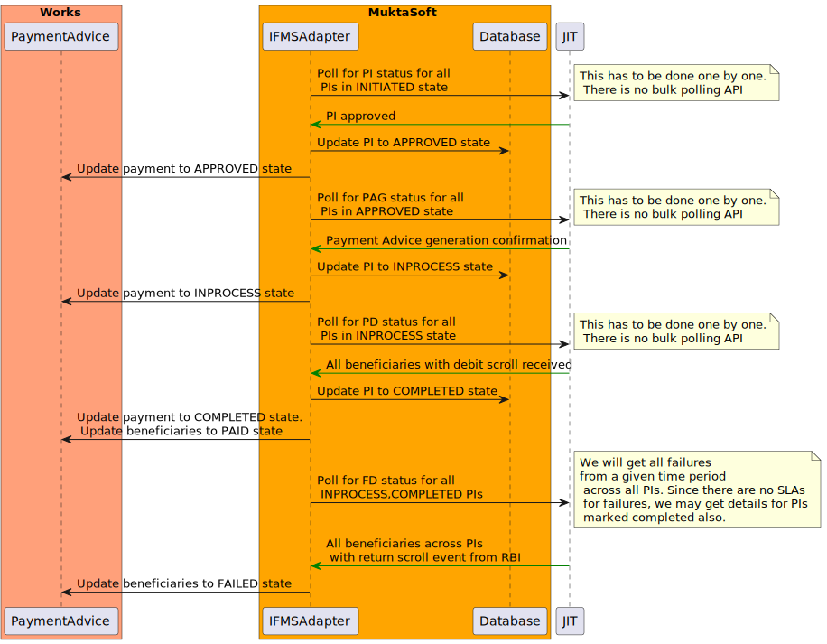
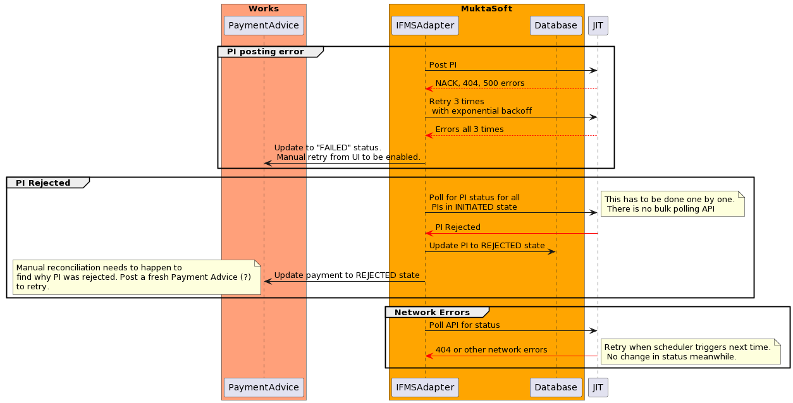

# IFMS Adapter

## Overview

Integration with Odisha IFMS is via the Just-in-Time (JIT) APIs provided by the Odisha treasury.

## Components

<figure><figcaption></figcaption></figure>

## Sequence Diagram

#### Happy path



<figure><figcaption></figcaption></figure>



<figure><figcaption>
Checking PI status
</figcaption></figure>



#### Errors

<figure><figcaption>
Handling errors
</figcaption></figure>

## API specifications



